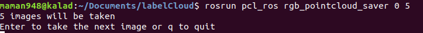
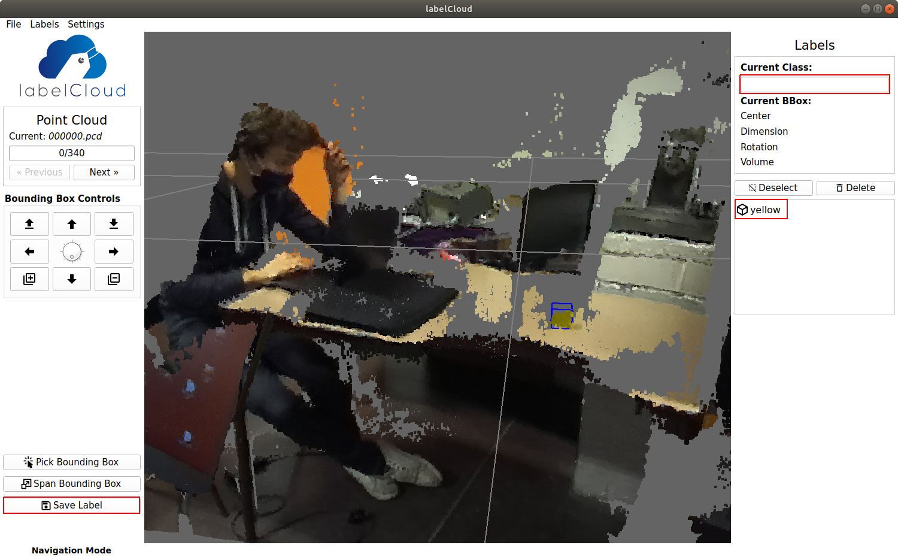
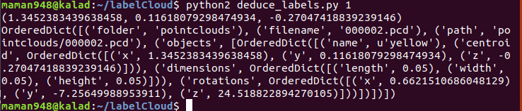

.. _Data:

Saving the data
===============

.. role:: raw-html(raw)
    :format: html

Here we will explain how to save the data you need in order to train the AI.

Hardware and software needed
----------------------------

.. _label:

*   For saving the data, you will need :

    *  A computer with an Nvidia GPU (the Jetson must be ok only for grabbing data!)
    *  A ZED 2 camera (need to be plug-in a computer with Nvidia)
    *  The  `labelCloud <https://github.com/ch-sa/labelCloud.git>`_ tool

    .. code-block:: bash

        git clone https://github.com/ch-sa/labelCloud.git
        cd labelCloud
        pip install -r requirements.txt

    *  The  `Frustum PointNets <https://github.com/ch-sa/labelCloud.git>`_ software.

    We are currently using a modified version of this repository four our purpose

    .. code-block:: bash

        git clone https://github.com/panda-brubotics/object_detection.git

ime from A to Z
----------------

* Saving data (rgb images, pointclouds and transformation files)

    The time need for this step depend on your setup (camera and object placement) / how fast you are to move the camera between two photo shoots and how many shoots you want to take.
    It took us approximately 15 minutes to grab 100 pictures.

* Labeling part:

    This part is the longest and the hardest one. The time required to label depends on the quality of the pointcloud since we have to identify the object we want to label in it.
    If we can not clearly see the object in the pointcloud then we will have to use the 2D image that corresponds to it to estimate his position in the pointcloud.

    .. image:: ./images/pcd_rgb.png
        :width: 600

    For our first 100 images, it took us 2h20 to label 50 images person. We managed to reduce the time to label 100 images per person to approximately 1h. If you do not want to waste a lot of times with labeling here some :ref:`tips<advice>` to have a good start.

* Training part:

    The training part takes 4 hours for 8000 images

How to save images with the camera
----------------------------------

.. _advice:

Advice:
*******

Before starting to save your data with the ZED2, use a tripod to position the camera.
Put the camera at least 50cm from where you are going to take the picture.
The camera has to be in an horizontal direction during the whole process (try not to lean the camera when you take pictures of the objects for easier labeling).
Between two picture move the camera slightly (by 5cm or 10cm).
During the process DO NOT MOVE YOUR OBJECTS OR IT WILL BE HARDER FOR LABELING.
Follow this step will reduce significantly the time spent on labeling.

Saving data:
************

To save the data with the ZED 2 camera, you have to clone the perception_pcl from this `repository <https://github.com/panda-brubotics/rgb_pointcloud_saver.git>`_ which contains the rgb_pointcloud_saver code you will use to save your data.

.. code-block:: bash

    cd path/to/catkin_ws/src
    git clone https://github.com/panda-brubotics/rgb_pointcloud_saver.git
    cd ..
    catkin_make

In order to launch the file, execute these two lines in two different terminals. In the first terminal you will have to launch the zed_wrapper. You can get it :ref:`here<wrapper>`.
But before that go to the zed wrapper configuration directory and open the common.yaml file

.. code-block:: bash

    cd path/to/catkin_ws/src/zed-ros-wrapper/zed_wrapper/params
    gedit common.yaml

At line 32 set ``self_calib`` to *false* to disable the camera calibration.
Now you can execute the wrapper

.. code-block:: bash

    roslaunch zed_wrapper zed2.launch

It is better if you save all the data in the labelCloud directory. To do this make sure you have cloned the :ref:`labelCloud<label>` repository.
Now open a second terminal and go in the labelCloud directory to run the rgb_pointcloud_saver code.

.. code-block:: bash

    cd path/to/labelCloud
    rosrun pcl_ros rgb_pointcloud_saver number_of_the_first_image_to_take number_of_images_to_take

Every time you press enter, the program will take a new picture and display how many picture you took. You can quit whenever you want by pressing q.

* Here are the outputs of rgb_pointcloud_saver:

   * 2 .jpg files:

	   the left and right images from ZED2 camera.

   * 1 .pcd file:

	   a colored 3D binary point cloud from ZED2 camera

   * 1 .json file:

	   a transformation file which contains the transformation made by the camera between two camera shoots.

.. note:: Do not forget to move the camera between two pictures, but when taking a picture do not move the camera or the picture will be blurry.

Label the data
--------------

We created a program named deduce_labels.py that helps us to label the pointclouds. :download:`Download it<doc/deduce_labels.py>` and put it in the labelCloud directory.

.. code-block:: bash

    cp /path/to/Downloads/deduce_labels.py /path/to/labelCloud/

Before starting to label your data you can take a look at the config.ini file. In this file you can configure your keyboard and mouse setting. This will help you to be more efficient while labeling your pointcloud.

.. code-block:: bash

    cd path/to/labelCloud
    gedit config.ini

Here a :download:`configuration file<doc/config.ini>` we used.
Now you can label your data. For this go in your labelCloud directory and run the labelCloud.py code.

.. code-block:: bash

    cd path/to/labelCloud
    python3 labelCloud.py

Make sure to perfectly label the object you want to detect in the pointcloud (do your best).
Do not forget to change the name of the object you label on the right of the software. Press "save label" on the bottom left of the software once you finished to label the object.

Now in an other terminal go in your labelCloud directory and run the deduce_label.py code.
This code will deduce the position of the future bounding box based on the labels from the previous pointcloud and the transformation file (this transformation file contains the translation and the rotation made by the camera between two pictures).

.. code-block:: bash

    cd path/to/labelCloud
    python2 deduce_label.py number_of_the_image_you_labeled 0 #(0 for the first image) precise the current pointcloud

Now click next on the upper left corner, and you will see the next pointcloud with the predicted bounding box using the camera movement. So now you can adjust the bounding box.
Repeat this process for every pointcloud.

.. note:: deduce_label.py does not predict at 100% the bounding box should be. 70% of the time the predicted bounding box does not fit the object so you will have to adjust it manually.

.. raw:: html

    <video width="720" height="480" controls>
        <source src="../../../source/AI/videos/vid_label.mp4" type="video/mp4">
    Your browser does not support the video tag.
    </video>

Convert data for training
-------------------------

Now that you have all the data needed for training, we need to convert them and put them into the frustum pointnets directory . So we created a little script for you to use to convert your data. You can get everything from this `github repository <https://github.com/A-Kouassi/3d-object-detection.git>`_. This repository also include the frustum pointnets software.
Here the `link  <https://github.com/charlesq34/frustum-pointnets.git>`_  to the frustum pointnets github repository if you want to take a look at it.

Now that you have clone this repository, there are still some change to make. First of all, you have to get the ZED2 camera calibration file, which is located here :

.. code-block:: bash

    cd /usr/local/zed/settings

Open the .conf file, and in the LEFT_CAM_HD section, copy the cx, cy, fx and fy (line 46, 47, 48, 49) and replace the cx, cy, fx, fy variable in the calib.py in the convert folder.
Go in the convert directory execute the convert.sh script. This script will convert in the right format every files needed for the AI trining.

.. code-block:: bash

    cd path/to/3d-object-detection/frustum-pointnets-master/convert
    bash convert.sh path/to/labelCloud ../dataset/KITTI

* This script will generate:
    * the calibration files
    * convert .pcd to .bin file
    * convert label
    * copy the rgb images
    * image_sets files
    * create rgb_detection files

Changing files in frustum-pointnets
------------------------------------

As explained before, we changed files in `the frustum pointnets github  <https://github.com/charlesq34/frustum-pointnets.git>`_ in order to make it work.

* Here are the files which were changed :
    * kitti/kitti_object.py
    * kitti/kitti_util.py
    * kitti/prepare_data.py
    * mayavi/test_drawline.py
    * models/frustum_pointnets_v1.py
    * models/model_util.py
    * models/tf_util.py
    * train/box_util.py
    * train/provider.py
    * train/test.py
    * train/train.py
    * train/train_util.py

If you want to train a custom model, you have to change some files from the frustum directories. Search for yellow, green and purple to replace them with your object names
