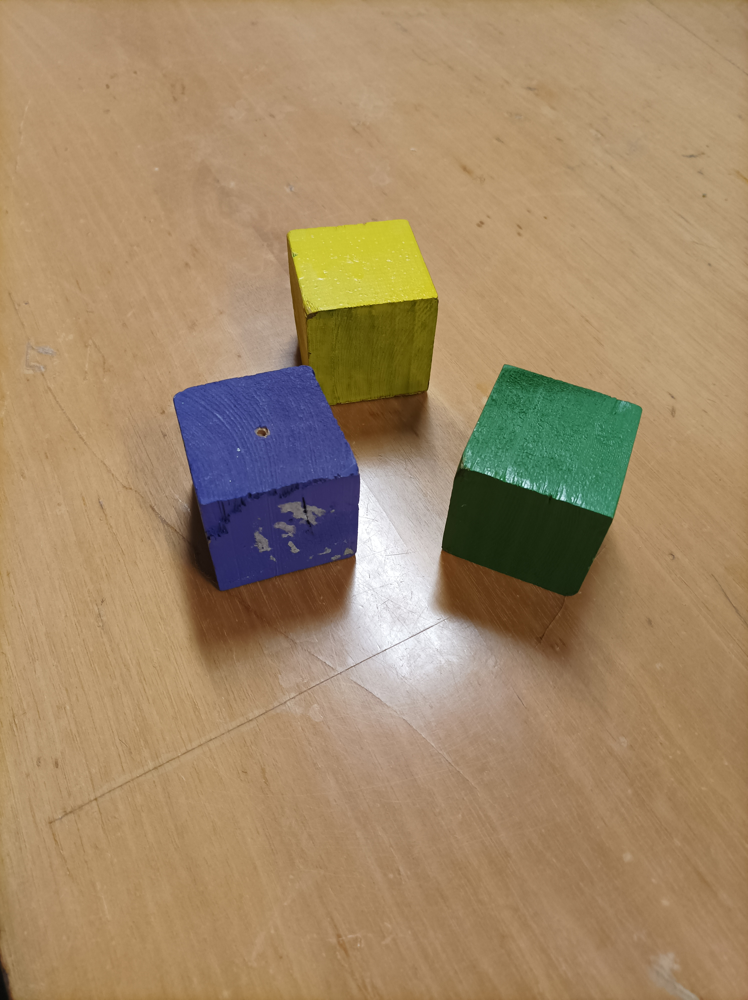
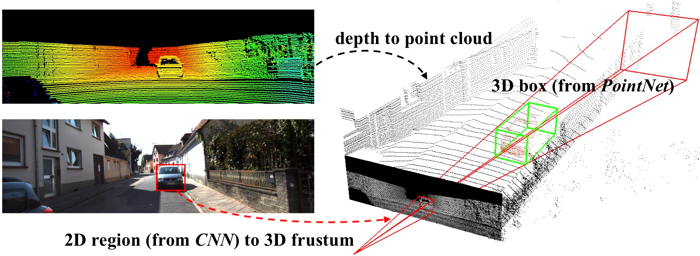

.. _Purpose:

Purpose of the object detection
===============================

.. role:: raw-html(raw)
    :format: html

Here we will explain why we need a custom 3D object detection AI and which model we use.

The need of an 3D object detection
----------------------------------

One task for the robot arm is to grab objects and to move them from a location to an other one. So we can specify in the code the position of the objects in order to grab them, but we want to get the position automatically with a camera. So we need object detection.
Stereolabs has already implemented a 3D object detection with its ZED camera, but the objects detected are limited and the code is close so we can't customize it. We need to detect some cubes, so we need our own object detection.

AI model
--------

In order to detect object, we need to find a pre-existing model which allows us to do 3D object detection.
We choose the frustrum-pointnets model, which first perform 2D object detection, and then 3D object detection using the 2D object detection.

We tried the code with the KITTI database and it worked well, so we decided to create our own data with the same convention as the KITTI database, and then train the model.
We need the RGB image, the pointcloud and the label file to train the model.
