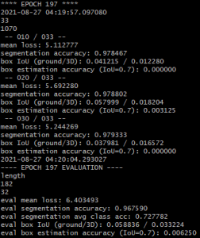

=================
Archive
=================

.. role:: raw-html(raw)
    :format: html

.. note:: The following things should be restructered when updating the whole tutorial. 

-----------------------------
Octomap on External Computer
-----------------------------
.. _ZED_ROS_Octomap:

.. role:: raw-html(raw)
    :format: html
    
This page will help you to make and save an Octomap on your external computer. 

Requirements
------------

* You have to be able to run rviz on your external computer. 

* Clone the franka_constrained_control project or |make_new_catkin-ws-2| on your external computer. 

* Install the ROS Octomap packages on your external computer

  .. code-block:: bash

      sudo apt-get update
      sudo apt-get install ros-melodic-octomap ros-melodic-octomap-server ros-melodic-octomap-mapping ros-melodic-octomap-ros ros-melodic-octomap-msgs

* Create a package for the Octomap on the external computer

  * :raw-html:`  Why not clone zed-interfaces and zed-ros-examples in catkin_ws/src on external computer??   `
  
  * Download the folowing zip file:

        :download:`octomap_tools package <doc/octomap_tools.zip>` 

  * Unzip and drag the files in your ``catkin_ws/src`` directory

  * build your catkin workspace

    .. code-block:: bash

      cd ~/catkin_ws
      catkin_make

.. |make_new_catkin-ws-2| raw:: html

    <a href="http://wiki.ros.org/ROS/Tutorials/InstallingandConfiguringROSEnvironment" target="_blank">make a new catkin workspace</a>

Vizualize the Octomap in rviz
-------------------------------

You can first modify the Octomap parameters to your requirements. 

* Go to the launch directory in the octomap_tools package, which you can find in 

  .. code-block:: bash

      cd path/to/catkin_ws/src/octomap_tools/launch

* In the file ``save_octomap_from_pointcloud.launch`` you can modify the |ros-octomap-parameters| that are explained in Section 2.2.4.

.. |ros-octomap-parameters| raw:: html

    <a href="http://wiki.ros.org/octomap_server" target="_blank">Octomap parameters</a>
 
Once the ROS network is established, vizualize the Octomap in rviz. 

* Open a new terminal on the **external computer** and run

  .. code-block:: bash

      roscore

* Open a new terminal on the **Jetson** and run 

  .. code-block:: bash

      roslaunch zed_wrapper zed2.launch

* Open another terminal on the **external computer** and run

  .. code-block:: bash

      cd path/to/catkin_ws
      source devel/setup.sh
      roslaunch octomap_tools save_octomap_from_pointcloud.launch

Finally you should see something like this:

.. image:: images/save_octomap.png
    :align: center
    :width: 700px

Save an Octomap and visualize an existing Octomap
-------------------------------------------------

You can save the Octomap vizualized in rviz while rviz is still running. 
Therefore you have to go to the directory where you want to save the Octomap and run the *octomap_saver* server with the name you want to give to the Octomap. 

.. code:: bash

  cd path/to/octomap-directory/
  rosrun octomap_server octomap_saver -f <octomap-name>.bt

To vizualize a saved Octomap, you have to run on your external computer

.. code-block:: bash

    roslaunch octomap_tools load_octomap.launch path:=path/to/octomap-directory/<octomap-name>.bt rviz_octomap:=true

--------------------------------------
Setup the ZED camera with Panda Arm
--------------------------------------

Ethernet connection between Panda Arm's computer and Jetson
-----------------------------------------------------------

Make a ros network between the Jetson and the panda computer
but with the IPs 192.168.4.65 for the computer
and 192.168.4.66 for the Jetson
otherwise the robot would not work.

Download and build the ROS package
----------------------------------

Clone the ROS package we made on the computer in the directory you want:

.. code-block:: bash

    cd path/to/your/directory
    git clone https://github.com/panda-brubotics/franka_constrained_control.git

Do the steps in the README file to build it.

-----------------------------------------------------------
Objects detection with ZED2 in Panda arm environnement
-----------------------------------------------------------

What does this program ?
------------------------

| This pogram uses the zed camera's object detection module, you can set the object you want to detect in the launch file.
| Once the camera detects an object it will track it and the robot can plan a trajectory to the object.
| If the object is lost, the camera will look for another same type object.

Modify parameters in the launch file
------------------------------------

* Go to the zed_franka_planner package, in the launch directory open the file ``grab_detected_object_test.launch`` with your favorite editor
* From here you can change some parameters
* The parameter ``object_to_be_detected`` can be `one of the listed here <https://www.stereolabs.com/docs/api/group__Object__group.html#ga13b0c230bc8fee5bbaaaa57a45fa1177>`_

Launch the program
------------------

* On the computer run ``roscore``
* On the jetson run ``roslaunch zed_wrapper zed2.launch``
* On the computer and in another shell source the workspace and launch the program

  .. code-block:: bash
    
    cd path/to/your/folder/franka_constrained_control/catkin_ws
    source devel/setup.sh
    roslaunch zed_franka_planner grab_detected_object_test.launch

* Once rviz is launched, load the parameters saved in the file ``path/to/the/package/zed_franka_planner/rviz/zed_panda_object_tracking.rviz``

Modify the camera transformation parameters
-------------------------------------------

* The panda robot's axis are:

.. image:: images/panda_axis.png
    :width: 300

* The map frame's origin is the position of the camera when you launch the zed_wrapper node on the jetson and its axis are:

.. image:: images/zed_map_axis.png
    :width: 300

* To modify the transformation between the camera and the robot:

  * Go to rviz

  * From the display ``Static Transform Publisher`` you can set the map and robot frames and the transformation parameters:
    
    .. .. image:: images/agni_tf_tools.png
   
-----------------------
Octomap for Panda arm
-----------------------

This section will help you to make and save an octomap of the panda arm environnement

Parameters for the octomap
--------------------------

Set parameters to filter the pointcloud
***************************************

In this section we will set the parameters used to filter the point cloud so we can create an octomap from the filtered point cloud
In the filterd point cloud, the robot is removed

* When you are in your ``catkin_ws`` directory go to ``src/franka_ros/panda_moveit_config/config`` 
* Open the file ``sensors_kinect_pointcloud.yaml``
* From this file, you can change some parameters (source : `Perception Pipeline Tutorial <http://docs.ros.org/en/melodic/api/moveit_tutorials/html/doc/perception_pipeline/perception_pipeline_tutorial.html>`_):

  * The general parameters are:
  
    * *sensor_plugin:* The name of the plugin that we are using.
    * *max_update_rate:* The octomap representation will be updated at rate less than or equal to this value.

  * Parameters specific to the Point cloud updater are:
  
    * *point_cloud_topic:* This specifies the topic to listen on for a point cloud.
    * *max_range:* (in m) Points further than this will not be used.
    * *point_subsample:* Choose one of every point_subsample points.
    * *padding_offset:* The size of the padding (in cm).
    * *padding_scale:* The scale of the padding.
    * *filtered_cloud_topic:* The topic on which the filtered cloud will be published (mainly for debugging). The filtering cloud is the resultant cloud after self-filtering has been performed.

Set the octomap parameters:
***************************
  
* Go to the octomap_tools package
* Go to the launch directory
* Open the file ``save_panda_octomap.launch``
* From this file you can change some parameters (lines 22 to 25)
* The parameters are listed and explained `here in the section 2.2.4 <http://wiki.ros.org/octomap_server>`_

Create and save the octomap
---------------------------

* Go to your catkin_ws source your workspace and run the program

.. code-block:: bash

  cd path/to/your/workspace
  source devel/setup.sh
  roslaunch octomap_tools save_panda_octomap.launch

* In rviz load the config localized in the package ``zed_franka_planner`` in rviz/zed_panda_save_octomap.rviz
* Adjust the transformation between the camera and the robot by using the ``Static Transform Publisher`` in rviz
* Write down the transformation in quaternion
* Once you get a satisfying octomap, you can save it:

  * Go to the directory where you want to save the octomap
  * Open a terminal there
  * Run ``rosrun octomap_server octomap_saver -f panda_robot_octomap.bt``

Plan in the octomap environnement
---------------------------------
| Set your work space like this: 

.. image:: images/plan_in_octomap_workspace.jpg
  :width: 600

| Save an octomap of your workspace
| This program is a demo of planning in the octomap

* Go to your catkin_ws source your workspace and run the program

.. code-block:: bash

  cd path/to/your/workspace
  source devel/setup.sh
  roslaunch zed_franka_planner plan_in_octomap.launch path:=path/to/your/saved/octomap panda_to_map_transfo:="1.3 0.06 0.38 0 0 1 0"
  # "1.3 0.06 0.38 0 0 1 0" is the transformation in quaternion between the camera and the robot when you saved the octomap

* In rviz load the config ``plan_in_octomap.rviz`` (same directory as earlier)

----------------------------------------------
Training a Neural Network for Object Detection
----------------------------------------------

Purpose of the object detection
--------------------------------

.. _Purpose:

.. role:: raw-html(raw)
    :format: html

Here we will explain why we need a custom 3D object detection AI and which model we use.

The need of an 3D object detection
^^^^^^^^^^^^^^^^^^^^^^^^^^^^^^^^^^^^^^^^^^^^^^^^

One task for the robot arm is to grab objects and to move them from a location to an other one. So we can specify in the code the position of the objects in order to grab them, but we want to get the position automatically with a camera. So we need object detection.
Stereolabs has already implemented a 3D object detection with its ZED camera, but the objects detected are limited and the code is close so we can't customize it. We need to detect some cubes, so we need our own object detection.

AI model
^^^^^^^^^^^^^^^^

In order to detect object, we need to find a pre-existing model which allows us to do 3D object detection.
We choose the frustrum-pointnets model, which first perform 2D object detection, and then 3D object detection using the 2D object detection.

.. image:: ./images/fst.jpg
    :width: 600

We tried the code with the KITTI database and it worked well, so we decided to create our own data with the same convention as the KITTI database, and then train the model.
We need the RGB image, the pointcloud and the label file to train the model.

Saving the data
--------------------------------
.. _Data:

Here we will explain how to save the data you need in order to train the AI.

Hardware and software needed
^^^^^^^^^^^^^^^^^^^^^^^^^^^^^^^^
.. _label:

*   For saving the data, you will need :

    *  A computer with an Nvidia GPU (the Jetson must be ok only for grabbing data!)
    *  A ZED 2 camera (need to be plug-in a computer with Nvidia)
    *  The  `labelCloud <https://github.com/ch-sa/labelCloud.git>`_ tool

    .. code-block:: bash

        git clone https://github.com/ch-sa/labelCloud.git
        cd labelCloud
        pip install -r requirements.txt

    *  The  `Frustum PointNets <https://github.com/ch-sa/labelCloud.git>`_ software.

    We are currently using a modified version of this repository four our purpose

    .. code-block:: bash

        git clone https://github.com/panda-brubotics/object_detection.git

ime from A to Z
^^^^^^^^^^^^^^^^

* Saving data (rgb images, pointclouds and transformation files)

    The time need for this step depend on your setup (camera and object placement) / how fast you are to move the camera between two photo shoots and how many shoots you want to take.
    It took us approximately 15 minutes to grab 100 pictures.

* Labeling part:

    This part is the longest and the hardest one. The time required to label depends on the quality of the pointcloud since we have to identify the object we want to label in it.
    If we can not clearly see the object in the pointcloud then we will have to use the 2D image that corresponds to it to estimate his position in the pointcloud.

    .. image:: ./images/pcd_rgb.png
        :width: 600

    For our first 100 images, it took us 2h20 to label 50 images person. We managed to reduce the time to label 100 images per person to approximately 1h. If you do not want to waste a lot of times with labeling here some :ref:`tips<advice>` to have a good start.

* Training part:

    The training part takes 4 hours for 8000 images

How to save images with the camera
^^^^^^^^^^^^^^^^^^^^^^^^^^^^^^^^^^^^^^^^^^^^^^^^

.. _advice:

Advice:
*******

Before starting to save your data with the ZED2, use a tripod to position the camera.
Put the camera at least 50cm from where you are going to take the picture.
The camera has to be in an horizontal direction during the whole process (try not to lean the camera when you take pictures of the objects for easier labeling).
Between two picture move the camera slightly (by 5cm or 10cm).
During the process DO NOT MOVE YOUR OBJECTS OR IT WILL BE HARDER FOR LABELING.
Follow this step will reduce significantly the time spent on labeling.

Saving data:
************

To save the data with the ZED 2 camera, you have to clone the perception_pcl from this `repository <https://github.com/panda-brubotics/rgb_pointcloud_saver.git>`_ which contains the rgb_pointcloud_saver code you will use to save your data.

.. code-block:: bash

    cd path/to/catkin_ws/src
    git clone https://github.com/panda-brubotics/rgb_pointcloud_saver.git
    cd ..
    catkin_make

In order to launch the file, execute these two lines in two different terminals. In the first terminal you will have to launch the zed_wrapper. You can get it in the wrapper.
But before that go to the zed wrapper configuration directory and open the common.yaml file

.. code-block:: bash

    cd path/to/catkin_ws/src/zed-ros-wrapper/zed_wrapper/params
    gedit common.yaml

At line 32 set ``self_calib`` to *false* to disable the camera calibration.
Now you can execute the wrapper

.. code-block:: bash

    roslaunch zed_wrapper zed2.launch

It is better if you save all the data in the labelCloud directory. To do this make sure you have cloned the :ref:`labelCloud<label>` repository.
Now open a second terminal and go in the labelCloud directory to run the rgb_pointcloud_saver code.

.. code-block:: bash

    cd path/to/labelCloud
    rosrun pcl_ros rgb_pointcloud_saver number_of_the_first_image_to_take number_of_images_to_take

Every time you press enter, the program will take a new picture and display how many picture you took. You can quit whenever you want by pressing q.

.. image:: ./images/rgb_pointcloud_0.png
    :width: 600

* Here are the outputs of rgb_pointcloud_saver:

   * 2 .jpg files:

	   the left and right images from ZED2 camera.

   * 1 .pcd file:

	   a colored 3D binary point cloud from ZED2 camera

   * 1 .json file:

	   a transformation file which contains the transformation made by the camera between two camera shoots.

.. note:: Do not forget to move the camera between two pictures, but when taking a picture do not move the camera or the picture will be blurry.

Label the data
^^^^^^^^^^^^^^^^
We created a program named deduce_labels.py that helps us to label the pointclouds. :download:`Download it<doc/deduce_labels.py>` and put it in the labelCloud directory.

.. code-block:: bash

    cp /path/to/Downloads/deduce_labels.py /path/to/labelCloud/

Before starting to label your data you can take a look at the config.ini file. In this file you can configure your keyboard and mouse setting. This will help you to be more efficient while labeling your pointcloud.

.. code-block:: bash

    cd path/to/labelCloud
    gedit config.ini

Here a :download:`configuration file<doc/config.ini>` we used.
Now you can label your data. For this go in your labelCloud directory and run the labelCloud.py code.

.. code-block:: bash

    cd path/to/labelCloud
    python3 labelCloud.py

Make sure to perfectly label the object you want to detect in the pointcloud (do your best).
Do not forget to change the name of the object you label on the right of the software. Press "save label" on the bottom left of the software once you finished to label the object.

.. image:: ./images/first_label_pointcloud.png
    :width: 600

Now in an other terminal go in your labelCloud directory and run the deduce_label.py code.
This code will deduce the position of the future bounding box based on the labels from the previous pointcloud and the transformation file (this transformation file contains the translation and the rotation made by the camera between two pictures).

.. code-block:: bash

    cd path/to/labelCloud
    python2 deduce_label.py number_of_the_image_you_labeled 0 #(0 for the first image) precise the current pointcloud

.. image:: ./images/deduce_labels_0.png
    :width: 600

Now click next on the upper left corner, and you will see the next pointcloud with the predicted bounding box using the camera movement. So now you can adjust the bounding box.
Repeat this process for every pointcloud.

.. note:: deduce_label.py does not predict at 100% the bounding box should be. 70% of the time the predicted bounding box does not fit the object so you will have to adjust it manually.

.. raw:: html

    <video width="720" height="480" controls>
        <source src="../../../source/AI/videos/vid_label.mp4" type="video/mp4">
    Your browser does not support the video tag.
    </video>

Convert data for training
^^^^^^^^^^^^^^^^^^^^^^^^^^^^^^^^

Now that you have all the data needed for training, we need to convert them and put them into the frustum pointnets directory . So we created a little script for you to use to convert your data. You can get everything from this `github repository <https://github.com/A-Kouassi/3d-object-detection.git>`_. This repository also include the frustum pointnets software.
Here the `link  <https://github.com/charlesq34/frustum-pointnets.git>`_  to the frustum pointnets github repository if you want to take a look at it.

Now that you have clone this repository, there are still some change to make. First of all, you have to get the ZED2 camera calibration file, which is located here :

.. code-block:: bash

    cd /usr/local/zed/settings

Open the .conf file, and in the LEFT_CAM_HD section, copy the cx, cy, fx and fy (line 46, 47, 48, 49) and replace the cx, cy, fx, fy variable in the calib.py in the convert folder.
Then now go in the convert directory execute the convert.sh script. This script will convert in the right format every files needed for the AI training.

.. code-block:: bash

    cd path/to/3d-object-detection/frustum-pointnets-master/convert
    bash convert.sh path/to/labelCloud ../dataset/KITTI

* This script will generate:
    * the calibration files
    * convert .pcd to .bin file
    * convert label
    * copy the rgb images
    * image_sets files
    * create rgb_detection files

Changing files in frustum-pointnets
^^^^^^^^^^^^^^^^^^^^^^^^^^^^^^^^^^^^^^^^^^^^^^^^

As explained before, we changed files in `the frustum pointnets github  <https://github.com/charlesq34/frustum-pointnets.git>`_ in order to make it work.

* Here are the files which were changed :
    * kitti/kitti_object.py
    * kitti/kitti_util.py
    * kitti/prepare_data.py
    * mayavi/test_drawline.py
    * models/frustum_pointnets_v1.py
    * models/model_util.py
    * models/tf_util.py
    * train/box_util.py
    * train/provider.py
    * train/test.py
    * train/train.py
    * train/train_util.py

If you want to train a custom model, you have to change some files from the frustum directories. Search for yellow, green and purple to replace them with your object names

Training the AI
---------------------
.. _Train:

Here we will explain how to train the neural network.

Train the neural network
^^^^^^^^^^^^^^^^^^^^^^^^^^^^^^^^

Now that everything is set up, we will train our AI.
As it is explained in the Readme of frustum-pointnets, execute the following commands :

.. code-block:: bash

    sh scripts/command_prep_data.sh
    CUDA_VISIBLE_DEVICES=0 sh scripts/command_train_v1.sh

You will see a window like this one appear :

The training will try to reduce the mean loss. The loss represents the error between the prediction and the label. So the lower it is, the better it is. At a certain moment, you will see that the loss does not move : the algorithm can't learn more, you can stop it.

Also, take a look at the IoU (which represents the the intersection divided by the union of the label and the predicted bounding box from the AI). It varies from 0 to 1. If it is 0, the two boxes do not overlap. If it is 1, the two boxes exactly match.

Also, if you want to upgrade the number of data, you can update the convert.sh script by taking in account the right images, so you can double the data you have

Test the neural network
^^^^^^^^^^^^^^^^^^^^^^^^^^^^^^^^

Now, you just try to predict the labels :

.. code-block:: bash

    sh scripts/command_test_v1.sh

The results of this command will be stored in the train/detection_results_v1/data/ folder
You can visualize the results by swapping the labels files in the dataset/KITTI/object/training/label_2/ folder with those in the train/detection_results_v1/data/ folder.
Then, execute :

.. code-block:: bash

    python3 scripts/kitti_object.py

You can see if the network performs well on the data it trained on

