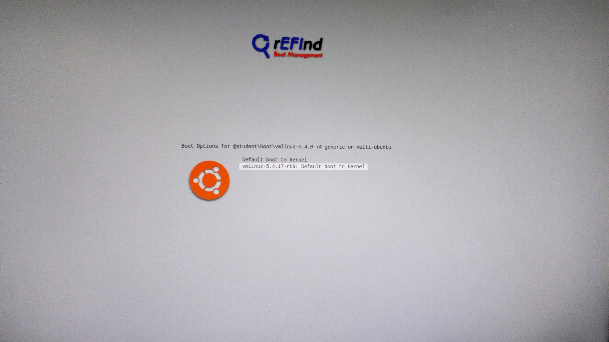
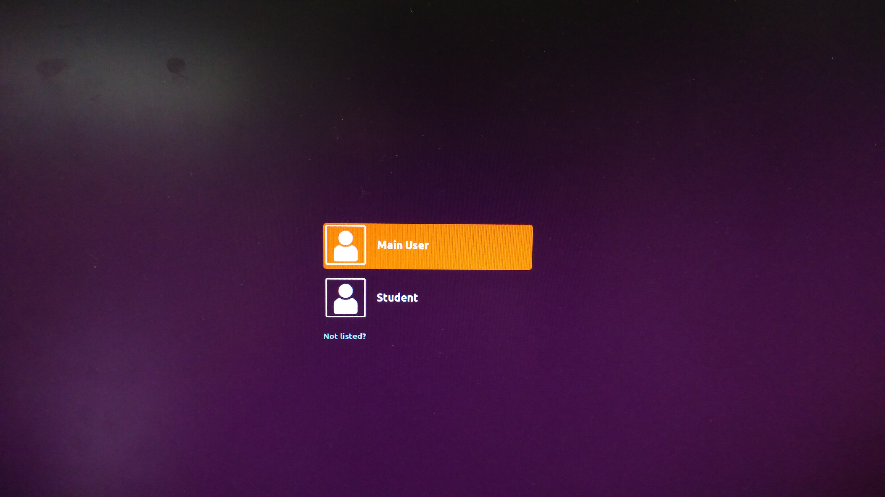

Franka Control Interface (FCI)
================================

.. role:: raw-html(raw)
    :format: html

.. |frankaemika-requirements| raw:: html

    <a href="https://frankaemika.github.io/docs/requirements.html" target="_blank">the minimum system and network requirements</a>

.. |frankaemika-real-time-kernel| raw:: html

    <a href="https://frankaemika.github.io/docs/installation_linux.html#setting-up-the-real-time-kernel" target="_blank">setting up a real-time kernel</a>

.. _MinimumSystemRequirements:

Minimum system requirements
----------------------------------------------------

For this part we refer to |frankaemika-requirements| written by Franka Emika.  

.. _SettingUpDesktop:

Setting up a real-time kernel
------------------------------

For this part we refer to |frankaemika-real-time-kernel| written by Franka Emika. 

.. _Start_Desktop:

Boot VUB desktop with correct kernel
^^^^^^^^^^^^^^^^^^^^^^^^^^^^^^^^^^^^^ 

.. note:: This section describes how to boot the desktop that is already set up to work 
          with the *Panda 2* robot in the R&MM lab at Vrije Universiteit Brussel. 

When you start up the desktop, you will get the following screen. 
Navigate with the arrow keys to the **student** boot and press ``F2`` for more boot options. 

.. image:: img/start_desktop_1.jpg
    :align: center
    :width: 700px

In order to control the Panda robot later on using ``libfranka``, the controller program on the desktop must run with *real-time priority* under a ``PREEMPT_RT`` kernel. 
Since a real-time kernel is already set up on the desktop, 
we can now navigate with the arrow keys to the rt9 version as shown in the figure below and press ``Enter``. 

Afterwards, you can choose the Main User account and enter the password ``MainUser``. 

.. _Robot_Network:

Set up the robot network
-------------------------

Hardware connections
^^^^^^^^^^^^^^^^^^^^

In the figure below you can see the official hardware connection documentation from Franka Emika
which you can find in the :download:`Franka Emika Panda manual  <FrankaPandaManual.pdf>`. 

.. image:: img/panda-set-up.png
    :align: center
    :width: 700px

In our setup we have the following connections:

*  desktop to Panda Arm with ethernet cable

*  desktop to Panda Control with ethernet cable

*  Panda Arm to Panda Control with connection cable

*  external activation device to Panda Arm

*  Panda Control to Panda Arm with earth cable

*  Panda Control to power supply

*  dekstop to an ethernet port with an ethernet cable (if there is no Wi-Fi)

Set up the network connections
^^^^^^^^^^^^^^^^^^^^^^^^^^^^^^^

Turn on the Panda Control via the On-Off switch at the back of the Panda Control.

After the Control has been switched on, or supplied with energy, Panda boots up.
In this process, the safety locking system is activated, movements are thus locked mechanically.
The display lights on the base and the pilot **flash yellow**.

As soon as Panda has booted up, the display lights are lit **yellow continuously**.

.. note:: The part below is specifically written for the use of robot *Panda 2* in the R&MM lab at Vrije Universiteit Brussel
          with the desktop that is already set up to work with this robot. 
          This robot has shop floor IP address 192.168.2.106 and Netmask 255.255.255.0. 
          
          .. image:: img/Panda2_shopfloor_network.png
            :width: 350px

          For the general version of this documentation we refer to |frankaemika-setting-up-robot-network| for the Franka Emika Panda robot.

.. |frankaemika-setting-up-robot-network| raw:: html

    <a href="https://frankaemika.github.io/docs/getting_started.html#setting-up-the-network" target="_blank">setting up the network</a>

In case there is no Wi-Fi connection, you should see three ethernet connections:

*  a connection to ``FrankaControl``

   .. image:: img/connection_FrankaControl.png
    :width: 450px

*  a connection to ``FrankaArm``

   .. image:: img/connection_FrankaArm.png
    :width: 450px

*  a connection to ``Internet connection``

   Note that this is the personal static IP address that is assigned to Kelly Merckaert at Vrije Universiteit Brussel. 
   At VUB, they work with static IP addresses, so if you need internet via an ethernet connection, you have to ask for your own IP address. 

   .. image:: img/connection_internet.png
    :width: 450px

Depending on which ethernet ports you have connected, you have to select the right ethernet connections.
In the example below we have connected port enp10s0f0 to ``FrankaControl``,
port enp10s0f1 to ``FrankaArm``, and port enp12s0 to ``Internet connection``.

   .. image:: img/ethernetport_FrankaControl.png
    :align: left
    :width: 180px

   .. image:: img/ethernetport_FrankaArm.png
    :align: left
    :width: 180px

   .. image:: img/ethernetport_internet.png
    :align: left
    :width: 172px

.. _Franka_Desk:

Start and shut down the robot via Franka Desk
----------------------------------------------
    
.. note:: To follow this section for another robot than the *Panda 2* in the R&MM lab at Vrije Universiteit Brussel, 
          you will have to replace ``192.168.2.106`` with the shop floor IP address of your own Panda robot
          and change the username and password required to enter Franka Desk. 

Start Franka Desk
^^^^^^^^^^^^^^^^^^

Once the Panda has booted up, you can start Franka Desk. 
Open your web browser and type ``192.168.2.106`` in the search bar. 
You will see a window where you will have to give your username and password to enter Franka Desk. 
The username is *admin* and the password is *franka123*. 

.. image:: img/franka_desk_login.png
    :align: center
    :width: 400px

When the robot is well connected and you have signed in, you should obtain the following window:

.. image:: img/franka_desk.png
    :align: center
    :width: 700px

Settings
^^^^^^^^^

You can go to the settings window in Franka Desk by clicking on the two lines in the right upper corner. 
Like that you can go to the settings menu, but you can also download the User Manual and the Cobot Pump Manual. 

   .. image:: img/FrankaDesk_Settings.png
    :align: center
    :width: 250px
    

In the settings menu, you can see in the **Dashboard** tab the system, robot, and network settings. 
In the **Network** tab, you can change the robot and the shop floor network. 
In the **System** tab, you can install features like the Franka Control Interface, do a system update, download log files, etc. 

In the **End-Effector** tab, you can select the standard ``Franka Hand`` or select ``Other``. 

*  If you are using the standard Franka Hand end-effector, then select the ``Franka Hand``. 
   In case the Franka Hand is *uninitialized* in the Dashboard tab, you can re-initialize the hand by clicking on ``HOMING``. 
   Afterwards the hand should be *initialized* in the Dashboard tab. 

   .. image:: img/FrankaDesk_EndEffector_FrankaHand.png
    :width: 700px

*  If you detach the Franka Hand end-effector and want to attach another end-effector, then you have to select ``Other``. 
   Like that, you will be able to give the properties of your new end-effector, as in the example below. 

   .. image:: img/FrankaDesk_EndEffector_Other.png
    :width: 700px

To go back to the **Desk**, click again on the lines in the upper right corner and click on Desk. 

Unlock the joints
^^^^^^^^^^^^^^^^^^

At this point, the display lights of the Panda Arm should be lit **yellow continuously**.
This means that the Panda has booted up and that the safety locking system is activated, whereby movements are locked mechanically. 

Make sure that the external activation device is in the closed state (pressed down). 

The safety locking system can now be opened with the button ``click to unlock joints`` in the sidebar of Franka Desk. 

.. image:: img/unlock.png
    :align: center
    :width: 700px

After you have clicked on ``open``, you should hear seven clicks of the seven joints that are being unlocked. 

The display lights should now be lit **white continuously**. 
Desks’s sidebar shows now ``joints unlocked``. 
Panda is now in the monitored stop state.

Shut down the robot 
^^^^^^^^^^^^^^^^^^^^

When you are done using the robot, don't forget to put the external activation device in the closed state (pressed down) 
and lock the joints before shutting down the Franka Control and the desktop. 

The safety locking system can be closed with the button ``click to lock joints`` in the sidebar of Franka Desk. 
You will here one click which means that all the seven robot joints are locked and afterwards the display lights should be lit **yellow continuously**. 

.. _Robot_operating_states:

Robot Operating States
----------------------

There are status lights on both sides of the base which take on the corresponding color.
These status lights will only flash during boot up,
during other processes the lights will glow continuously in the corresponding color of the status Panda is in.

On this page we will explain the states you can get in during this work.
For the explanation about the other states, we refer to the :download:`Franka Emika Panda manual  <FrankaPandaManual.pdf>`. 

.. image:: img/panda_states.png
    :align: center
    :width: 700px

Locked
^^^^^^

After the Panda has booted up, the display lights are lit **yellow continuously**, which means that the safety locking system is activated.

After you have unlocked the joints, the display lights should be lit **white** in case the external activation device is in a closed state (pressed down),
the robot is now in the interactive state.

Interactive
^^^^^^^^^^^^

When the display lights are lit **white**, Panda is in the *monitored stop* state, which means that the Panda Arm is ready for interaction.

By simultaneous pressing of the enabling button and the guiding button at the Arm’s grip, it is possible to guide the Arm manually.
In this state, the Arm can also record the positions it passed when it was guided manually by a human.

When the two buttons are released, Panda goes back to the *monitored stop* condition.

.. image:: img/panda_arm_top_view.png
    :width: 70%

.. image:: img/IMG_20210615_175002.jpg
    :width: 24%

Activated
^^^^^^^^^^^^

When the display lights are lit **blue**, Panda is in the *activated* state, which means that an automatic program can be started.
In other words, the robot can now be controlled with commands send by your own program.

In what follows, we will go in detail on how to run a program on the Panda robot.

Conflict
^^^^^^^^^

A conflict can occur when the robot is in the activated (blue) state and you try to manually guide the arm.
In that case, the display lights will be lit **pink**.

To solve this conflict, you have to press down the external activation device such that it is again in the interactive (white) state.

Error
^^^^^^

When an error occurs, the display lights will be lit **red**.
This can occur when the robot moved close to one of its hardware limits, e.g. when it moved too fast, too brisk, or close to one of the joint angle limits.
This can happen when you are manually guiding the robot in interactive (white) state or because of the commands send by your program in the activated (blue) state.

To solve this kind of problem you can try the following things.
We have listed the possible solutions in chronological order, so if the first solution doesn't work, then you have to try the next solution, and so on.

*  | If the external activation device is in the open state (pulled up), put it in the closed state (pressed down), and back in the open state (pulled up).
   | Vice versa, if the external activation device is in the closed state (pressed down), put it in the open state (pulled up), and back in the closed state (pressed down).
*  Lock and unlock the joints via Franka Desk.
*  Shut down Franka Control with the On-Off switch at the back of the Panda Control, wait for a minute, and restart it.

.. _FCI_Project:

Franka Control Interface (FCI)
---------------------------------------------

.. note:: For the *Panda 2* robot in the R&MM lab at Vrije Universiteit Brussel we replace <fci-ip> with ``192.168.2.106``

The Franka Control Interface (FCI) allows a fast and direct low-level bidirectional connection to the Arm and Hand.
It provides the current status of the robot and enables its direct real-time control at 1 kHz with an external workstation PC (our desktop) connected via Ethernet.
We refer to the |frankaemika-fci-overview| for more information about its specifications.

.. |frankaemika-fci-overview| raw:: html

    <a href="https://frankaemika.github.io/docs/overview.html" target="_blank">Franka Emika FCI documentation</a>

Clone an existing project
^^^^^^^^^^^^^^^^^^^^^^^^^^^^^^^^^^^^^^^^^^^^^

Clone the project and build ``libfranka`` and ``franka_ros``:

.. code-block:: bash

   git clone https://github.com/panda-brubotics/franka_constrained_control.git
   cd path/to/franka_constrained_control/libfranka
   mkdir build
   cd build
   cmake -DCMAKE_BUILD_TYPE=Release ..
   cmake --build .
   cd ../../catkin_ws/src/franka_ros
   catkin_make -DCMAKE_BUILD_TYPE=Release -DFranka_DIR:PATH=/path/to/libfranka/build

.. warning::

   The path of ``-DFranka_DIR:PATH`` MUST be an absolute path to the libfranka's build directory.

Now that the project is built, you can use catkin_make without specifying the build type or the build directory, i.e.

.. code-block:: bash

   cd path/to/franka_constrained_control/catkin_ws
   catkin_make

Create your own project
^^^^^^^^^^^^^^^^^^^^^^^

.. note :: If you want to make an extension or improvement to the franka_constrained_control project,
           it is better to clone the existing project as is explained in the previous section.
           However, if you like to make a new project with the same libfranka and ros version as we used,
           then you have to follow this section.

This tutorial is an adapted version of the official |frankaemika-linux-installation|.

.. |frankaemika-linux-installation| raw:: html

    <a href="https://frankaemika.github.io/docs/installation_linux.html" target="_blank">Franka Emika installation tutorial</a>

First of all make sure that ROS is installed :

.. code-block:: bash

   sudo apt install ros-melodic-libfranka ros-melodic-franka-ros

Before building from source, please uninstall existing installations of ``libfranka`` and ``franka_ros`` to avoid conflicts:

.. code-block:: bash

   sudo apt remove "*libfranka*"

Create a directory (or a git directory if you want to make a git repository) before installing ``libfranka`` and ``franka_ros``.

Install libfranka
*****************

To build libfranka, install the following dependencies from Ubuntu’s package manager:

.. code-block:: bash

   sudo apt install build-essential cmake git libpoco-dev libeigen3-dev

Then, download the source code by cloning |frankaemika-libfranka-github| in your directory (or git repository):

.. |frankaemika-libfranka-github| raw:: html

    <a href="https://github.com/frankaemika/libfranka" target="_blank">libfranka</a>

.. code-block:: bash

   git clone --recursive https://github.com/frankaemika/libfranka
   cd libfranka

By default, this will check out the newest release of ``libfranka``.
However, we want to use the version *0.7.1*, so we have to change the branch:

.. code-block:: bash

   git checkout 0.7.1
   git submodule update

In the libfranka directory, create a build directory and run CMake:

.. code-block:: bash

   mkdir build
   cd build
   cmake -DCMAKE_BUILD_TYPE=Release ..
   cmake --build .

Try to launch files in the ``build/examples`` directory to see if the installation is completed.

.. code-block:: bash

   cd build/examples
   ./echo_robot_state <fci-ip>
   ./print_joint_poses <fci-ip>

When you can run the examples, ``libfranka`` is installed properly, so you are ready to install ``franka_ros``.

Install franka_ros
*******************

Go to your directory (or git repository) and create a catkin workspace :

.. code-block:: bash

   mkdir -p catkin_ws/src
   cd catkin_ws
   source /opt/ros/melodic/setup.sh
   catkin_init_workspace src

Then clone the |frankaemika-franka_ros-github| repository by executing the following command:

.. |frankaemika-franka_ros-github| raw:: html

    <a href="https://github.com/frankaemika/franka_ros" target="_blank">franka_ros</a>

.. code-block:: bash

   git clone --recursive https://github.com/frankaemika/franka_ros src/franka_ros

By default, this will check out the newest release of ``franka_ros``.
However, we want to use the version *0.6.0* since with the latest version there are some problems such that even the franka_example_controllers cannot be launched.
So we have to change the branch:

.. code-block:: bash

   cd src/franka_ros
   git checkout 0.6.0

Install any missing dependencies and build the packages:

.. code-block:: bash

   rosdep install --from-paths src --ignore-src --rosdistro melodic -y --skip-keys libfranka
   catkin_make -DCMAKE_BUILD_TYPE=Release -DFranka_DIR:PATH=/path/to/libfranka/build
   source devel/setup.sh

.. warning ::

   The path of ``-DFranka_DIR:PATH`` MUST be an absolute path to the libfranka's build directory.

.. note ::

   Once the problems with the latest franka_ros version are solved, we can try this latest franka_ros and accompanying libfranka version.

Since we don't want to work with git submodules, we remove all the submodules by following these steps: 

* Delete the relevant line from the .gitmodules file.
* Delete the relevant section from .git/config.
* Run git rm --cached path_to_submodule (no trailing slash).

.. _Robot_Control:

Control the robot with ROS
-----------------------------

.. note:: For the *Panda 2* robot in the R&MM lab at Vrije Universiteit Brussel we replace <fci-ip> with ``192.168.2.106``

Here we will explain how to test the ``franka_ros`` examples and how to make your own controller.

Test franka_example_controllers
^^^^^^^^^^^^^^^^^^^^^^^^^^^^^^^^

To test that libfranka and franka_ros are installed properly, you can run the franka_example_controllers.

Open a terminal, go to the catkin_ws, source the setup.bash, and build the project.

.. code-block:: bash

   cd path/to/your_project/catkin_ws
   source devel/setup.bash
   catkin_make

You will have to source the setup.bash everytime you open a new terminal and you have to build the project everytime you change a cpp file.

model_example_controller
************************

To run the *model_example_controller* example, the robot can stay in the **interactive (white)** state,
since this example doesn't send any commands to the robot, but only gets access to e.g. measured joint data and robot dynamics.

.. code-block:: bash

   roslaunch franka_example_controllers model_example_controller.launch

After executing this line, rviz will open and will show the robot in its current configuration.
When you manually guide the robot to another configuration and release the enabling and guiding button,
you will see that the robot configuration in rviz is updated to the configuration you manually guided the robot to.
In the meanwhile you can see the updated values of e.g. the fourth joint pose and the joint angles in the terminal.

.. admonition:: todo

	Replace image below with printscreen of default output from the model_example_controller.

.. image:: ./images/joints.png
    :align: center

move_to_start
******************

To run the *move_to_start* example, put the robot in the **interactive (white)** state and manually guide the robot to an arbitrary configuration.
Then set the robot in the **activated (blue)** state before executing move_to_start.

.. code-block:: bash

   roslaunch franka_example_controllers move_to_start.launch robot_ip:=<fci-ip> load_gripper:=true

The robot should normally return in the following configuration that is required to start from for most of the franka_example_controllers.

.. admonition:: todo

	Replace gif below. Make video of move_to_start example and add gif of it in the tutorial. 

.. image:: ./videos/move_to_start.gif
    :align: center

joint_impedance_example_controller
************************************

To run the *joint_impedance_example_controller*, you have to put the robot in the **activated (blue)** state and
you have to execute *move_to_start*, such that the robot is in its start configuration.
Then execute the following.

.. code-block:: bash

   roslaunch franka_example_controllers joint_impedance_example_controller.launch robot_ip:=<fci-ip> load_gripper:=true

.. admonition:: todo

	Explain what you should see with a video or gif below. Make video of joint_impedance_example_controller and add gif of it in the tutorial. 

.. note :: If the robot briskly stopts because of a problem or because you have stopped the robot with the ``CTRL+C`` command,
           you will not be able to run another program although the display lights didn't change color.
           To be able to run another program, you will have to close the external activation device (press down) and open it again (pull up).

cartesian_impedance_example_controller
**************************************

To run the *cartesian_impedance_example_controller*, you have to put the robot in the **activated (blue)** state and
you have to execute *move_to_start*, such that the robot is in its start configuration.
Then execute the following.

.. code-block:: bash

   roslaunch franka_example_controllers cartesian_impedance_example_controller.launch robot_ip:=<fci-ip> load_gripper:=true

.. admonition:: todo

	Explain what you should see with a video or gif below. Make video of cartesian_impedance_example_controller and do screen capture of RViz. Trim both videos and add gif of it in the tutorial. 

Make your own controller
^^^^^^^^^^^^^^^^^^^^^^^^^^

To create your own controller in an existing project, we follow the tutorial *Starting to Write a New Controller* that is written on the |frankaemika-community| website.
You have to make an account if you want to see posts in this community. We encourage you to do this!

.. |frankaemika-community| raw:: html

    <a href="https://www.franka-community.de" target="_blank">Franka Community</a>

What follows is copied from the Franka Community website and can help you whenever you want to make a new controller or want to adapt the name of an existing controller.

1) In catkin_ws/src, you will see franka_example_controllers.
   In catkin_ws/src create a new folder and name it whatever you like (new_controllers).
   This is where you will keep your new controllers.

2) Create a **src** folder in new_controllers.
   Copy an example controller into here (I copied the joint_impedance_example_controller.cpp from catkin_ws/src/franka_example_controllers/src).
   Rename it to anything you want (new_controller_1.cpp). In new_controller_1.cpp, wherever you see:

   *  franka_example_controllers, change it to new_controllers
   *  joint_impedance_example_controller, change it to new_controller_1
   *  JointImpedanceExampleController, change it to NewController1

3) Create an **include** folder in new_controllers.
   Create a new_controllers folder in include.
   Copy the joint_impedance_example_controller.h file from franka_example_controllers/include/franka_example_controller into new_controllers/include/new_controllers
   and rename it to new_controller_1.h. In new_controller_1.h, wherever you see:

   *  franka_example_controllers, change it to new_controllers
   *  JointImpedanceExampleController, change it to NewController1

4) Create a **launch** folder in new_controllers.
   Copy robot.rviz from franka_example_controller/launch into new_controllers/launch.
   Also copy joint_impedance_example_controller.launch into here and rename it to new_controller_1.launch.
   In this launch file, wherever you see:

   *  franka_example_controllers, change it to new_controllers
   *  joint_impedance_example_controller, change it to new_controller_1

5) Create a **config** folder in new_controllers. Copy the franka_example_controllers.yalm file from franka_example_controllers/config into new_controllers/config.
   Rename it to new_controllers.yaml. Only keep joint_impedance_example_controller and its parameters.
   Delete all other controllers and their parameters. Next, wherever you see:

   *  franka_example_controllers, change it to new_controllers
   *  joint_impedance_example_controller, change it to new_controller_1
   *  JointImpedanceExampleController, change it to NewController1

6) Copy these folders (and the files in them): **cfg**, **msg**, **scripts** from franka_example_controllers into new_controllers.

7) Copy the **package.xml** file from franka_example_controllers to new_controllers. Next, wherever you see:

   *  franka_example_controllers, change it to new_controllers

8) Copy the **franka_example_controllers_plugin.xml** file from franka_example_controllers to new_controllers.
   Only keep the JointImpedanceExampleController class and delete the rest. Next, wherever you see:

   *  franka_example_controllers, change it to new_controllers
   *  JointImpedanceExampleController, change it to NewController1

9) Copy the **CMakeList.txt** from franka_example_controller to new_controller. Next, wherever you see:

   *  franka_example_controllers, change it to new_controllers
   *  joint_impedance_example_controller, change it to new_controller_1
   *  In the add_library part, delete the other controllers (we only need ours).

.. _Path_Planning:

Plan and Follow a Trajectory with MoveIt
-----------------------------------------

.. note:: For the *Panda 2* robot in the R&MM lab at Vrije Universiteit Brussel we replace <fci-ip> with ``192.168.2.106``

Here we will explain how to add obstacles in the MoveIt planning environment, how to make a plan and (asynchronously) execute this plan with MoveIt. 

Getting started with MoveIt
^^^^^^^^^^^^^^^^^^^^^^^^^^^^^

First of all, we advice you to follow the tutorials on the |moveit-melodic-tutorials| where you will work with the Panda robot in RViz. 

.. |moveit-melodic-tutorials| raw:: html

    <a href="http://docs.ros.org/en/melodic/api/moveit_tutorials/html/index.html" target="_blank">MoveIt website</a>

.. admonition:: todo

	Add links with explanation of different planner in OMPL in MoveIt. 

Make your own planner 
^^^^^^^^^^^^^^^^^^^^^^^

.. admonition:: todo

	Explain how to make your own planner. Which cpp files? What to add to the CMakeList? 

The moveit_static_move program explained
^^^^^^^^^^^^^^^^^^^^^^^^^^^^^^^^^^^^^^^^^

.. admonition:: todo

	Explain how to run it and what it does. Show video/gif of what robot does. Make screencapture of RViz. 

.. admonition:: todo

	Explain parts of the code. 

The constrained_base_planning_controller
**************************************************

This controller adds obstacles to the simulation. For instance, this controller adds the table on which the arm is based, and a virtual wall between the arm and the computer's screen in order to prevent the arm to hit the screen. If you want to use it, execute this line :

.. code-block:: bash

   roslaunch new_controllers constrained_base_planning_controller.launch

You have to way a little at first for the initialisation (till the terminal prints ``Ready to play !``). Then, you will have to click next on the bottom left in order to create the different obstacles and to move the arm.

You can see on the next image the wall and the table (and also an other obstacle in the middle)

.. image:: ./images/constrained.png
    :align: center

So the planner will take into account the obstacles in the environment and will create a path which avoid the obstacles if it is possible.

How to use other planners
^^^^^^^^^^^^^^^^^^^^^^^^^^^

.. _Change_planner :

Changing planner
*********************

The command in c++ to change the planner is :

.. code-block:: bash

    move_group.setPlannerId("PRMkConfigDefault");

Here, the planner is ``PRMkConfigDefault``, which is the PRM planner. A list of all the planner with their characteristics can be found `here <https://planners-benchmarking.readthedocs.io/en/latest/user_guide/2_motion_planners.html>`_

You can find the list of names for setPlannerId in the file located at this place : ``panda_moveit_config/config/ompl_planning.yaml``

.. _Differences :

Differences between the planners
***********************************

We wanted to try several planners in order to see the differences between them. So we executed the same path with different planners to see their differences. The main problem is that every planner is random, so for the same path and planner, we obtain different results.

.. _PRM :

Planner PRM
*******************

.. figure:: images/PRM1.png
    :align: center

    Time to find the path : undefined                Time to execute : undefined

.. figure:: images/PRM2.png
    :align: center

    Time to find the path : undefined                Time to execute : undefined

.. _RRT_Connect :

Planner RRT Connect
***********************

.. figure:: ./images/RRTconnect1.png
    :align: center

    Time to find the path : undefined                Time to execute : undefined

.. figure:: ./images/RRTconnect2.png
    :align: center

    Time to find the path : undefined                Time to execute : undefined

.. _RRT* :

Planner RRT*
********************

.. figure:: ./images/RRTstar1.png
    :align: center

    Time to find the path : undefined                Time to execute : undefined

.. figure:: ./images/RRTstar2.png
    :align: center

    Time to find the path : undefined                Time to execute : undefined

.. figure:: ./images/RRTstar3.png
    :align: center

    Time to find the path : undefined                Time to execute : undefined

.. figure:: ./images/RRTstar4.png
    :align: center

    Time to find the path : undefined                Time to execute : undefined

.. figure:: ./images/RRTstar5.png
    :align: center

    Time to find the path : undefined                Time to execute : undefined

.. _TRRT :

Planner TRRT
************************

.. raw:: html

    <video width="" height="" controls>
        <source src="../../../source/robot_arm_start/videos/cup.mp4" type="video/mp4">
    Your browser does not support the video tag.
    </video>

