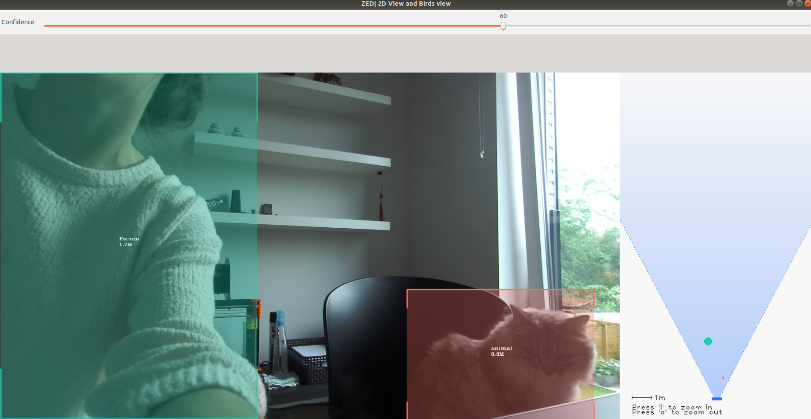
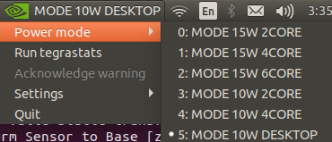

=================
Hardware
=================

.. role:: raw-html(raw)
    :format: html

------------------------
Franka Emika Panda Arm
------------------------

.. |frankaemika-requirements| raw:: html

    <a href="https://frankaemika.github.io/docs/requirements.html" target="_blank">the minimum system and network requirements</a>

.. |frankaemika-real-time-kernel| raw:: html

    <a href="https://frankaemika.github.io/docs/installation_linux.html#setting-up-the-real-time-kernel" target="_blank">setting up a real-time kernel</a>

Minimum system requirements
----------------------------------------------------

For this part we refer to |frankaemika-requirements| written by Franka Emika.  

Setting up a real-time kernel
------------------------------

For this part we refer to |frankaemika-real-time-kernel| written by Franka Emika. 

Boot VUB desktop with correct kernel
^^^^^^^^^^^^^^^^^^^^^^^^^^^^^^^^^^^^^ 

.. note:: This section describes how to boot the desktop that is already set up to work 
          with the *Panda 2* robot in the R&MM lab at Vrije Universiteit Brussel. 

When you start up the desktop, you will get the following screen. 
Navigate with the arrow keys to the **student** boot and press ``F2`` for more boot options. 

.. image:: img/start_desktop_1.jpg
    :align: center
    :width: 350px

In order to control the Panda robot later on using ``libfranka``, the controller program on the desktop must run with *real-time priority* under a ``PREEMPT_RT`` kernel. 
Since a real-time kernel is already set up on the desktop, 
we can now navigate with the arrow keys to the rt9 version as shown in the figure below and press ``Enter``. 

.. image:: img/start_desktop_2.jpg
    :align: center
    :width: 350px

Afterwards, you can choose the Main User account and enter the password ``MainUser``. 

Set up the robot network
-------------------------

Hardware connections
^^^^^^^^^^^^^^^^^^^^

In the figure below you can see the official hardware connection documentation from Franka Emika
which you can find in the :download:`Franka Emika Panda manual  <FrankaPandaManual.pdf>`. 

.. image:: img/panda-set-up.png
    :align: center
    :width: 700px

In our setup we have the following connections:

*  desktop to Panda Arm with ethernet cable

*  desktop to Panda Control with ethernet cable

*  Panda Arm to Panda Control with connection cable

*  external activation device to Panda Arm

*  Panda Control to Panda Arm with earth cable

*  Panda Control to power supply

*  dekstop to an ethernet port with an ethernet cable (if there is no Wi-Fi)

Set up the network connections
^^^^^^^^^^^^^^^^^^^^^^^^^^^^^^^

Turn on the Panda Control via the On-Off switch at the back of the Panda Control.

After the Control has been switched on, or supplied with energy, Panda boots up.
In this process, the safety locking system is activated, movements are thus locked mechanically.
The display lights on the base and the pilot **flash yellow**.

As soon as Panda has booted up, the display lights are lit **yellow continuously**.

.. note:: The part below is specifically written for the use of robot *Panda 2* in the R&MM lab at Vrije Universiteit Brussel
          with the desktop that is already set up to work with this robot. 
          This robot has shop floor IP address 192.168.2.106 and Netmask 255.255.255.0. 
          
          .. image:: img/Panda2_shopfloor_network.png
            :width: 350px

          For the general version of this documentation we refer to |frankaemika-setting-up-robot-network| for the Franka Emika Panda robot.

.. |frankaemika-setting-up-robot-network| raw:: html

    <a href="https://frankaemika.github.io/docs/getting_started.html#setting-up-the-network" target="_blank">setting up the network</a>

In case there is no Wi-Fi connection, you should see three ethernet connections:

*  a connection to ``FrankaControl``

   .. image:: img/connection_FrankaControl.png
    :width: 450px

*  a connection to ``FrankaArm``

   .. image:: img/connection_FrankaArm.png
    :width: 450px

*  a connection to ``Internet connection``

   Note that this is the personal static IP address that is assigned to Kelly Merckaert at Vrije Universiteit Brussel. 
   At VUB, they work with static IP addresses, so if you need internet via an ethernet connection, you have to ask for your own IP address. 

   .. image:: img/connection_internet.png
    :width: 450px

Depending on which ethernet ports you have connected, you have to select the right ethernet connections.
In the example below we have connected port enp10s0f0 to ``FrankaControl``,
port enp10s0f1 to ``FrankaArm``, and port enp12s0 to ``Internet connection``.

.. image:: img/ethernetport_connnections.png
    :width: 700px
    

Start and shut down the robot via Franka Desk
----------------------------------------------
    
.. note:: To follow this section for another robot than the *Panda 2* in the R&MM lab at Vrije Universiteit Brussel, 
          you will have to replace ``192.168.2.106`` with the shop floor IP address of your own Panda robot
          and change the username and password required to enter Franka Desk. 

Start Franka Desk
^^^^^^^^^^^^^^^^^^

Once the Panda has booted up, you can start Franka Desk. 
Open your web browser and type ``192.168.2.106`` in the search bar. 
You will see a window where you will have to give your username and password to enter Franka Desk. 
The username is *admin* and the password is *franka123*. 

.. image:: img/franka_desk_login.png
    :align: center
    :width: 400px

When the robot is well connected and you have signed in, you should obtain the following window:

Settings
^^^^^^^^^

You can go to the settings window in Franka Desk by clicking on the two lines in the right upper corner. 
Like that you can go to the settings menu, but you can also download the User Manual and the Cobot Pump Manual. 

   .. image:: img/FrankaDesk_Settings.png
    :align: center
    :width: 250px
    

In the settings menu, you can see in the **Dashboard** tab the system, robot, and network settings. 
In the **Network** tab, you can change the robot and the shop floor network. 
In the **System** tab, you can install features like the Franka Control Interface, do a system update, download log files, etc. 

In the **End-Effector** tab, you can select the standard ``Franka Hand`` or select ``Other``. 

*  If you are using the standard Franka Hand end-effector, then select the ``Franka Hand``. 
   In case the Franka Hand is *uninitialized* in the Dashboard tab, you can re-initialize the hand by clicking on ``HOMING``. 
   Afterwards the hand should be *initialized* in the Dashboard tab. 

   .. image:: img/FrankaDesk_EndEffector_FrankaHand.png
    :width: 700px

*  If you detach the Franka Hand end-effector and want to attach another end-effector, then you have to select ``Other``. 
   Like that, you will be able to give the properties of your new end-effector, as in the example below. 

   .. image:: img/FrankaDesk_EndEffector_Other.png
    :width: 700px

To go back to the **Desk**, click again on the lines in the upper right corner and click on Desk. 

Unlock the joints
^^^^^^^^^^^^^^^^^^

At this point, the display lights of the Panda Arm should be lit **yellow continuously**.
This means that the Panda has booted up and that the safety locking system is activated, whereby movements are locked mechanically. 

Make sure that the external activation device is in the closed state (pressed down). 

The safety locking system can now be opened with the button ``click to unlock joints`` in the sidebar of Franka Desk. 

After you have clicked on ``open``, you should hear seven clicks of the seven joints that are being unlocked. 

The display lights should now be lit **white continuously**. 
Desks’s sidebar shows now ``joints unlocked``. 
Panda is now in the monitored stop state.

Shut down the robot 
^^^^^^^^^^^^^^^^^^^^

When you are done using the robot, don't forget to put the external activation device in the closed state (pressed down) 
and lock the joints before shutting down the Franka Control and the desktop. 

The safety locking system can be closed with the button ``click to lock joints`` in the sidebar of Franka Desk. 
You will here one click which means that all the seven robot joints are locked and afterwards the display lights should be lit **yellow continuously**. 

Robot Operating States
----------------------

There are status lights on both sides of the base which take on the corresponding color.
These status lights will only flash during boot up,
during other processes the lights will glow continuously in the corresponding color of the status Panda is in.

On this page we will explain the states you can get in during this work.
For the explanation about the other states, we refer to the :download:`Franka Emika Panda manual  <FrankaPandaManual.pdf>`. 

.. image:: img/panda_states.png
    :align: center
    :width: 700px

Locked
^^^^^^

After the Panda has booted up, the display lights are lit **yellow continuously**, which means that the safety locking system is activated.

After you have unlocked the joints, the display lights should be lit **white** in case the external activation device is in a closed state (pressed down),
the robot is now in the interactive state.

Interactive
^^^^^^^^^^^^

When the display lights are lit **white**, Panda is in the *monitored stop* state, which means that the Panda Arm is ready for interaction.

By simultaneous pressing of the enabling button and the guiding button at the Arm’s grip, it is possible to guide the Arm manually.
In this state, the Arm can also record the positions it passed when it was guided manually by a human.

When the two buttons are released, Panda goes back to the *monitored stop* condition.

.. image:: img/panda_arm_top_view.png
    :width: 70%

Activated
^^^^^^^^^^^^

When the display lights are lit **blue**, Panda is in the *activated* state, which means that an automatic program can be started.
In other words, the robot can now be controlled with commands send by your own program.

In what follows, we will go in detail on how to run a program on the Panda robot.

Conflict
^^^^^^^^^

A conflict can occur when the robot is in the activated (blue) state and you try to manually guide the arm.
In that case, the display lights will be lit **pink**.

To solve this conflict, you have to press down the external activation device such that it is again in the interactive (white) state.

Error
^^^^^^

When an error occurs, the display lights will be lit **red**.
This can occur when the robot moved close to one of its hardware limits, e.g. when it moved too fast, too brisk, or close to one of the joint angle limits.
This can happen when you are manually guiding the robot in interactive (white) state or because of the commands send by your program in the activated (blue) state.

To solve this kind of problem you can try the following things.
We have listed the possible solutions in chronological order, so if the first solution doesn't work, then you have to try the next solution, and so on.

*  | If the external activation device is in the open state (pulled up), put it in the closed state (pressed down), and back in the open state (pulled up).
   | Vice versa, if the external activation device is in the closed state (pressed down), put it in the open state (pulled up), and back in the closed state (pressed down).
*  Lock and unlock the joints via Franka Desk.
*  Shut down Franka Control with the On-Off switch at the back of the Panda Control, wait for a minute, and restart it.

-------------------------
Vicon Motion Capture
-------------------------

Here we explain how to use the Vicon motion capture system in general, how to make subjects with Vicon Nexus, how to make objects with Vicon Tracker, and how to use the Vicon information for reference object and obstacle recognition with the Panda robot. 

Reading material
----------------

In :download:`this internship report <louis-lefevre-internship.pdf>` you can find a more detailed explanation of the Vicon motion capture room and Vicon Nexus. 
It explains how to define objects in Vicon Nexus for three different robots and for multiple scenarios. 

In :download:`this internship report <Harry_Report_2.pdf>` you can find some general info about the Vicon motion capture 
and also how to define objects in Vicon Nexus for some specific scenarios with the Panda robot. 

In :download:`this report <FrankaPanda_UseWithFCIandVicon.pdf>` the use of the Panda robot in the Vicon room is explained. 
It explains how to establish the ethernet connection and how to receive data from the Vicon motion capture system. 
It also explains how to make objects in Vicon Tracker (but currently we have Vicon Nexus as software in the lab). 

Possible problems
-----------------

Last year there were some problems with Vicon Nexus. 

Firewall 
^^^^^^^^ 
If the cameras and the Lock Sync Box don't light up blue when you start up Nexus, then it's highly probable that there is a firewall problem. 

To solve this issue, you have to enter the Vicon desktop.  

*  Go to Windows --> control panel --> all control panel items --> Windows Defender Firewall --> Allowed Apps 
   
   .. image:: img/WindowsDefenderFirewallControlPanel.png
        :width: 650px
        
   and check all Nexus applications 

   .. image:: img/WindowsDefenderFirewallAllowedApps.png
        :width: 650px

*  Go to Windows --> Windows Firewall --> Inbound rules --> enable and allow connection for all Nexus applications 

   .. image:: img/WindowsFirewallInboundRules.PNG
        :width: 650px

Update the Vicon Firmware
^^^^^^^^^^^^^^^^^^^^^^^^^

Problems can occur when the Vicon Firmware is not updated. 
You can do this via the Vicon Firmware Update Utility. 

Vicon Datastreak SDK
^^^^^^^^^^^^^^^^^^^^^

Last year there was also a problem with the Vicon Datastream SDK. 

.. |vicon_bridge| raw:: html

    <a href="https://github.com/ethz-asl/vicon_bridge" target="_blank">vicon_bridge</a>

When the |vicon_bridge| is giving occlusions when you clearly see the subject in Nexus, do the following checks.

*  Navigate in Windows to 

   .. code-block:: bash

     cd C:\Program Files\Vicon\DataStream SDK\Win64\CPP
   
   (you don't have to do this via the terminal) and double click ``ViconDataStreamSDK_CPPTest``

*  When you get the standard non-overwritten values with zeros and ones (zero position, unity matrix for orientation) 
   in the Global and Local Translation/Rotation as in the Static Translation/Rotation, 

   .. image:: img/vicon_nexus_datastream.PNG
        :width: 650px
   
   then probably the Processing Output Level is not **Kinematic Fit**.
   Change it to Kinematic Fit as shown in the figure below. 

   .. image:: img/ProcessingOutputLevel.png
        :width: 300px

*  Try the ``ViconDataStreamSDK_CPPTest`` again, when you now see the correct values of the subject in the Global and Local Translation/Rotation.  

*  Run the vicon_bridge: you shouldn't see the *occlusion* warning again in the terminal, which means you can call the subject position and orientation

Extra things that can be done if it still doesn't work: 

*  install the newest version of the Datastream SDK 

   .. image:: img/DatastreamSDK.jpg
        :width: 650px
    
*  install python 

   .. image:: img/Python.jpg
        :width: 650px
    
*  run ViconDatastreanSDK_CPP test and check again if the processing output level is kinematic fit 

-------------------------
Stereolabs ZED2
-------------------------

.. |Stereolabs_ZED2_general| raw:: html

   <a href="https://www.stereolabs.com/zed-2/" target="_blank">ZED 2 stereo camera</a>

.. |Stereolabs_ZED2_SDK| raw:: html

   <a href="https://www.stereolabs.com/developers/" target="_blank">ZED SDK</a>

.. |Stereolabs_ZED2_SDK_intro| raw:: html

   <a href="https://www.stereolabs.com/docs/ " target="_blank">introduction</a>

   
Read the general information about the |Stereolabs_ZED2_general| from Stereolabs
to know for which problems this camera can be a solution and what its technical specification are. 

The ZED 2 camera comes with a Software Development Kit (SDK). 
Read the |Stereolabs_ZED2_SDK| documentation to know with which third-party libraries and environments it can be interfaced
and on which platforms you can run it.  

After reading the general information about the camera and the ZED SDK, we recommend to read the |Stereolabs_ZED2_SDK_intro| before continuing. 

Getting started with ZED 2
---------------------------

.. |Stereolabs_ZED2_SDK_GettingStarted| raw:: html

   <a href="https://www.stereolabs.com/docs/installation/" target="_blank">quick start guide</a>

.. |NVIDIA_CUDA| raw:: html

   <a href="https://developer.nvidia.com/cuda-zone" target="_blank">CUDA</a>

.. |NVIDIA_Jetson_Xavier_NX| raw:: html

   <a href="https://www.nvidia.com/en-us/autonomous-machines/embedded-systems/jetson-xavier-nx/" target="_blank">Nvidia Jetson Xavier NX</a>
   
.. |Stereolabs_RecommendedSpecificationsZedSdk| raw:: html

   <a href="https://www.stereolabs.com/docs/installation/specifications/" target="_blank">recommended specifications for ZED SDK</a>
   
.. |Nvidia_JetsonModules| raw:: html

   <a href="https://developer.nvidia.com/embedded/jetson-modules" target="_blank">Jetson Modules</a>
   

First go through the |Stereolabs_ZED2_SDK_GettingStarted|. 

As you can read, the ZED SDK is available for Windows, Linux, and Nvidia Jetson platforms.
However, you need an NVIDIA graphics card to run |NVIDIA_CUDA|. 
In what follows, we will use the |NVIDIA_Jetson_Xavier_NX| platform to run the ZED SDK. 
We explain below why we have chosen this embedded platform.  

*  We don't have any laptop or desktop with an NVIDIA graphics card, so an embedded platform as the Jetson is the cheapest solution. 
*  The controller programs on the desktop that send commands to the Panda robot must run with *real-time priority* under a PREEMPT_RT kernel. 
   Since NVIDIA binary drivers are not supported on PREEMPT_RT kernels, buying an NVIDIA graphics card is not a solution. 
*  We tried first with an NVIDIA Jetson Nano, but this platform was not powerful enough. 
   The obtained point cloud and depth map were not as detailed as shown in the examples on the Stereolabs website
   and the skeleton display was lagging a lot with respect to the real human body dysplay in the body tracking example of the SDK tutorials. 
   Stereolabs told us that the camera resolution could be raised and the depth mode could be changed to ULTRA to improve the point cloud and depth map quality,
   but at the cost of a consequently lower frame rate when using the Jetson Nano. 
   According to Stereolabs, the Jetson Nano can run the ZED SDK in real-time, but with big compromises in terms of performance.
   If good performances are a requirement for the project, Stereolabs suggested to switch to a Jetson Xavier NX that is on another level.
*  Check also the |Stereolabs_RecommendedSpecificationsZedSdk| and the differences between the |Nvidia_JetsonModules|. 

*Side note.* We advise you to put back the ZED 2 camera back in the box when you are not using it. 
To do this, be careful to put first the built-in USB 3.0 cable in it before putting in the ZED 2 camera. 
Then you don't have to pull the USB 3.0 cable to get the camera out of the box. 

ZED SDK overview
-----------------

.. |Stereolabs_ZED2_SDK_overview_camera| raw:: html

   <a href="https://www.stereolabs.com/docs/video/" target="_blank">camera</a>

.. |Stereolabs_ZED2_SDK_overview_sensors| raw:: html

   <a href="https://www.stereolabs.com/docs/sensors/" target="_blank">sensors</a>   

.. |Stereolabs_ZED2_SDK_overview_depth_sensing| raw:: html

   <a href="https://www.stereolabs.com/docs/depth-sensing/" target="_blank">depth sensing</a>  
   
.. |Stereolabs_ZED2_SDK_overview_positional_tracking| raw:: html

   <a href="https://www.stereolabs.com/docs/positional-tracking/" target="_blank">positional tracking</a>  
   
.. |Stereolabs_ZED2_SDK_overview_spatial_mapping| raw:: html

   <a href="https://www.stereolabs.com/docs/spatial-mapping/" target="_blank">spatial mapping</a> 
   
.. |Stereolabs_ZED2_SDK_overview_body_tracking| raw:: html

   <a href="https://www.stereolabs.com/docs/body-tracking/" target="_blank">body tracking</a> 
   
It is really important to read through the SDK overview and find specific information about the |Stereolabs_ZED2_SDK_overview_camera|,
|Stereolabs_ZED2_SDK_overview_sensors|, |Stereolabs_ZED2_SDK_overview_depth_sensing|,
|Stereolabs_ZED2_SDK_overview_positional_tracking|, |Stereolabs_ZED2_SDK_overview_spatial_mapping|, 
and |Stereolabs_ZED2_SDK_overview_body_tracking|. 

.. _Install_ZED_SDK_JetsonXavierNX:

Install the ZED SDK on NVIDIA Jetson Xavier NX
------------------------------------------------------------

.. |Stereolabs_ZED2_SDK_NvidiaJetson| raw:: html

   <a href="https://www.stereolabs.com/docs/installation/jetson/" target="_blank">install ZED SDK on NVIDIA Jetson</a>

.. |Nvidia_JetPack| raw:: html

   <a href="https://developer.nvidia.com/embedded/jetpack" target="_blank">JetPack SDK</a>

.. |Nvidia_JetsonXavierNX_GettingStarted| raw:: html

   <a href="https://developer.nvidia.com/embedded/learn/get-started-jetson-xavier-nx-devkit" target="_blank">getting started with Jetson Xavier NX developer kit</a>

.. |RS_components_SanDisk_MicroSD| raw:: html

   <a href="https://benl.rs-online.com/web/p/micro-sd-cards/1747339/" target="_blank">SanDisk Ultra 64GB microSD card class 10 UHS-1 U1</a>

Follow the Stereolabs guide to |Stereolabs_ZED2_SDK_NvidiaJetson|. 

Download and install JetPack
^^^^^^^^^^^^^^^^^^^^^^^^^^^^

.. |Stereolabs_ZED2_SDK_DownloadInstallJetpack| raw:: html

   <a href="https://www.stereolabs.com/docs/installation/jetson/#download-and-install-jetpack" target="_blank">download and install JetPack</a>

.. note:: 
     VUB researchers who want to use this for their own research, should have their own microSD card, 
     such that they don't mess us my installations and 
     such that they are forced to test the install procedure and give comments on it to improve this tutorial. 
     
To download and install JetPack, you are redirected from the |Stereolabs_ZED2_SDK_DownloadInstallJetpack| section to NVIDIA's |Nvidia_JetPack|. 
There the SD Card Image method is explained to install the JetPack on a Jetson Xavier NX Developer Kit. 
Follow the |Nvidia_JetsonXavierNX_GettingStarted| tutorial, which explains the required hardware, 
the steps to write an image to the microSD card (I have followed the instructions for Windows), 
and how to setup and boot the Jetson.  

.. |repartition_sdcard_link| raw:: html

   <a href="https://www.instructables.com/Repartition-SD-Card-Windows/" target="_blank">Repartition-SD-Card-in-Windows</a>

.. |unlock_sd_card| raw:: html

   <a href="https://forum.dexterindustries.com/t/solved-etcher-says-sd-card-is-locked/2143" target="_blank">physically unlock the SD card</a>

.. |NVIDIA_Jetson_Linux_Developer_Guide| raw:: html

   <a href="https://docs.nvidia.com/jetson/l4t/index.html#page/Tegra%20Linux%20Driver%20Package%20Development%20Guide/power_management_jetson_xavier.html#wwpID0E0VO0HA" target="_blank">NVIDIA Jetson Linux Developer Guide</a>

.. |NVIDIA_forum_sd_card_problem| raw:: html

   <a href="https://forums.developer.nvidia.com/t/nvidia-jetson-xavier-nx-boot-fail/182229" target="_blank">NVIDIA forum</a>

.. |WiFi_USB_adapter| raw:: html

   <a href="https://learn.sparkfun.com/tutorials/adding-wifi-to-the-nvidia-jetson/all#hardware-overview-and-assembly" target="_blank">WiFi USB adapter</a>

.. |WiFi_USB_adapter_problem| raw:: html

   <a href="https://forums.developer.nvidia.com/t/jetson-nano-wifi-usb-adapter/73157" target="_blank">problem</a>

.. |WiFi_USB_adapter_solution| raw:: html

   <a href="https://forums.developer.nvidia.com/t/jetson-nano-wifi/72269" target="_blank">solution</a>

Below you can find some extra info on top of the NVIDIA tutorial *Write Image to the microSD Card*. 

*  NVIDIA proposes to use a microSD card with minmimum 16GB UHS-1. 
   We are using a |RS_components_SanDisk_MicroSD|. 

   .. warning:: 
       It is very important to use an microSD card with the right specifications. 
       We were using a premium high speed microSD card (check correct specs, add link), 
       but we had the problem that the Jetson crashed a lot of times. 
       Afterwards the Jetson always restarted automatically, but then everything on the microSD card was erased. 
       According to the contributors on the |NVIDIA_forum_sd_card_problem|, 
       this could be because the file system over the SD was broken or because the SD card itself was broken.
       We could solve this problem by using the |RS_components_SanDisk_MicroSD|.  

*  In case the microSD card you want to use for this project is not empty (and you don't want to use it for another project), 
   then you will have to format it first. 
   When your microSD card has multiple partitions, then you first have to repartition the microSD card before formatting. 
   Therefore, you can use *DiskPart* which is included on Windows. 
   See |repartition_sdcard_link| for more information. 
   After you have repartitioned the microSD card, you have to format it before usage.  
*  When you select the microSD card drive on which you want to write the image, you can get the message that the *microSD card is locked*. 
   Usually that means that the microSD card is physically locked and that you have to |unlock_sd_card|. 

Below you can find some extra info on top of the NVIDIA tutorial *Setup and First Boot*. 

*  Since the Jetson Xavier NX reference carrier board includes 802.11 plug-in WLAN & BT module preinstalled with antenna,
   it can automatically connect to a *Wireless Network*, which is not the case for the Jetson Nano. 
   For the **Jetson Nano** a |WiFi_USB_adapter| is required to connect to WiFi. 
   If that doesn't work, check this |WiFi_USB_adapter_problem| and its |WiFi_USB_adapter_solution|. 
*  The name, computer's name, username, and password we have used to log in at VUB are:

   *  name: JetsonXavier1 / JetsonXavier2 
   *  computer's name: xavier1-desktop / xavier2-desktop
   *  username: xavier1 / xavier2 
   *  password: JetsonXavier

*  When you are asked to choose the *APP Partition Size*, it is recommended to choose the maximum accepted size. 
*  When you select the *Nvpmodel Mode*, keep at the beginning the default settings, which is MODE_10W_DESKTOP - (Default). 
   We refer to the |NVIDIA_Jetson_Linux_Developer_Guide| for further information.
*  When you *log in* onto the Jetson Xavier NX, be careful that you sign in on the Ubuntu version.

   .. image:: img/jetson_signin_settings.jpg
       :align: center
       :width: 450px

.. |NVIDIA_forum| raw:: html

   <a href="https://developer.nvidia.com/login" target="_blank">NVIDIA forum</a>

.. note:: 
     Register to the |NVIDIA_forum| to ask questions in case you have problems with the NVIDIA Jetson Xavier NX. 

Download and install ZED SDK
^^^^^^^^^^^^^^^^^^^^^^^^^^^^^^^^^

.. |Stereolabs_ZED2_SDK_DownloadInstallZedSdk| raw:: html

   <a href="https://www.stereolabs.com/docs/installation/jetson/#download-and-install-the-zed-sdk" target="_blank">download and install the ZED SDK</a>

For this part, we followed the instructions from the |Stereolabs_ZED2_SDK_DownloadInstallZedSdk| section on the Stereolabs website. 

We have downloaded the ZED SDK for Jetpack 4.6 and installed it in silent mode. 
Silent mode enables you to perform an installation in a non-interactive mode, 
so in this mode you don't have to answer questions on dependenies, tools, and samples installation in the terminal during the installation procedure. 

Check also which python3 version and pip3 version is installed on the Jetson. 
We have executed the described experiments with python 3.6.9 and pip 9.0.1. 

.. code-block:: bash

   python3 --version
   pip3 --version 

ZED SDK tools
--------------------

.. |Stereolabs_ZED2_SDK_RunZedExplorer| raw:: html

   <a href="https://www.stereolabs.com/docs/installation/#run-zed-explorer" target="_blank">run the ZED Explorer</a>

.. |Stereolabs_ZED2_SDK_RunZedDepthViewer| raw:: html

   <a href="https://www.stereolabs.com/docs/installation/#run-zed-depth-viewer" target="_blank">ZED_Depth_Viewer</a>
      

After downloading and installing the ZED SDK, the next step in the |Stereolabs_ZED2_SDK_GettingStarted| 
is to |Stereolabs_ZED2_SDK_RunZedExplorer|, which is a good way to check that the ZED SDK is properly installed. 

*  Connect the ZED 2 camera to a USB port of the Jetson Xavier NX. 
*  Go to the terminal on the Jetson Xavier and navigate to the ZED tools folder
   where you can run the ZED Explorer: 
   
   .. code-block:: bash

        cd /usr/local/zed/tools/
        ./ZED_Explorer

*  If the ZED SDK is properly installed and the ZED 2 camera is recognized by the Jetson, you should see a 3D video from the left and right camera.  

   .. image:: img/zed_explo.png
        :width: 600
        :alt: ZED_Explorer

In the ZED tools folder you can also find |Stereolabs_ZED2_SDK_RunZedDepthViewer|, ZED_Diagnostic, ZEDfu, ZED_Sensor_viewer, and ZED_SVO_Editor
that you can run in a similar way as the ZED Explorer. 

.. |Stereolabs_ZED2_SDK_calibration_tool| raw:: html

   <a href="https://www.stereolabs.com/docs/video/camera-calibration/#calibration-tool" target="_blank">here</a>

.. warning:: 
      Although it is possible to **recalibrate the camera manually** using the ZED Calibration tool, i.e. ZED_Calibration, 
      it is **totally not recommended** for the ZED 2 cameras as is mentioned |Stereolabs_ZED2_SDK_calibration_tool|! 

ZED SDK tutorials and samples
-------------------------------

.. |Stereolabs_ZED2_building_C++application_linuxjetson| raw:: html

   <a href="https://www.stereolabs.com/docs/app-development/cpp/linux/" target="_blank">build a C++ application on Jetson</a> 

.. |ZED_Tutorials| raw:: html

    <a href="https://www.stereolabs.com/docs/tutorials/" target="_blank">tutorials</a>

.. |ZED_Samples| raw:: html

    <a href="https://www.stereolabs.com/docs/code-samples/#samples" target="_blank">samples</a>

To play around with the ZED tutorials and samples, you first have to download the example code
in the directory of your choice. 

.. code-block:: bash

    git clone https://github.com/stereolabs/zed-examples.git

There are C++ and python examples, we will use the C++ examples. 
Before you can run a C++ example, you will have to read how to |Stereolabs_ZED2_building_C++application_linuxjetson|
which is explained for the first tutorial that publishes the serial number of the ZED 2 camera. 

Try out all the |ZED_Tutorials| to familiarise with the ZED SDK.
All the tutorials give a text output printed in the terminal. 

Try also all the |ZED_Samples|. 
Building the C++ samples is done similarly as for the tutorials. 
Below you can find some results. 

.. |askubuntu_canberra_gtk_module| raw:: html

    <a href="https://askubuntu.com/questions/342202/failed-to-load-module-canberra-gtk-module-but-already-installed" target="_blank">install this module </a>

.. note:: 
      If you get the Gtk-Message: *Failed to load module "canberra-gtk-module"*, 
      then you have to |askubuntu_canberra_gtk_module| by running the following in the terminal. 

      .. code-block:: bash

         sudo apt install libcanberra-gtk-module libcanberra-gtk3-module

Camera control
^^^^^^^^^^^^^^

To change the camera settings, click on the camera control window such that your cursor is not in the terminal. 
Push ``s`` and you will see in the terminal which setting you can change. 
Push ``s`` again if you want to adapt another camera setting. 
Whereas my numlock was turned off, I couldn't use the ``+`` and ``-`` keys that are on the right side of my keyboard, 
but I could use the ``+`` and  ``-`` keys of my main keyboard. 

.. image:: img/zed_cam_control.png
   :width: 500px
   :align: center

Depth sensing
^^^^^^^^^^^^^

This sample shows how to retreive the current point cloud. 

Body tracking
^^^^^^^^^^^^^

This sample display a skeleton over the live image and shows hot to detect and track 3D human bodies in space. 

.. image:: img/body_tracking_rgb.png
   :width: 500px
   :align: center

Object detection (birds eye viewer)
^^^^^^^^^^^^^^^^^^^^^^^^^^^^^^^^^^^^^^^^^
In the object detection (birds eye viewer) sample, detected objects are displayed in a 3D view with the current point cloud.
You have to press ``c`` to clear filters such that the program can detect objects from all the available |ZED_SDK_object_classes|.
Without clearing the filters, the program can only detect people and vehicles.

.. |ZED_SDK_object_classes| raw:: html

   <a href="https://www.stereolabs.com/docs/api/group__Object__group.html#ga13b0c230bc8fee5bbaaaa57a45fa1177" target="_blank">object classes</a>

.. image:: img/zed-objectdetection-animal-electronics.png
    :align: center
    :width: 500px

Avoid crashing and latency issues
---------------------------------

You can try the following things in case you have crashing and latency issues with the NVIDIA Jetson Xavier NX. 
If the following things don't solve your issues, then it is best to contact Stereolabs or Nvidia. 

Change power mode
^^^^^^^^^^^^^^^^^
You can switch the power mode of the NVIDIA Jetson to *MODE 15W 6CORE*, as depicted in the figure below.

Turn on the fan manually
^^^^^^^^^^^^^^^^^^^^^^^^
In order to reduce lags on the Jetson turn on the fan to 100%, by doing the following steps. 

* Install jetson-stats:

  .. code:: bash

      git clone https://github.com/rbonghi/jetson_stats
      sudo apt-get update
      sudo apt-get install python3-pip  # install pip3 if you don't have this yet installed
      cd jetson_stats
      sudo -H pip3 install -U jetson-stats

* Restart your Jetson and run :

  .. code:: bash

    jtop  # start jtop

* The following window will open with all the information of the Jetson

  .. image:: img/jtop.png
    :width: 500px

* Navigate with the arrow keys to tab ``5CTRL``. 
  You can set the fan method to manual by clicking with your mouse on ``manual``. 
  In the manual fan mode, you can increase the fan speed by pressing the ``p`` key and decrease the fan speed by pressing the ``m`` key. 

  .. image:: img/jtop_fan.png
    :width: 500px

If you don't have any crashing or latency issues, you can put the fan mode on ``default`` as we did to execute our programs. 