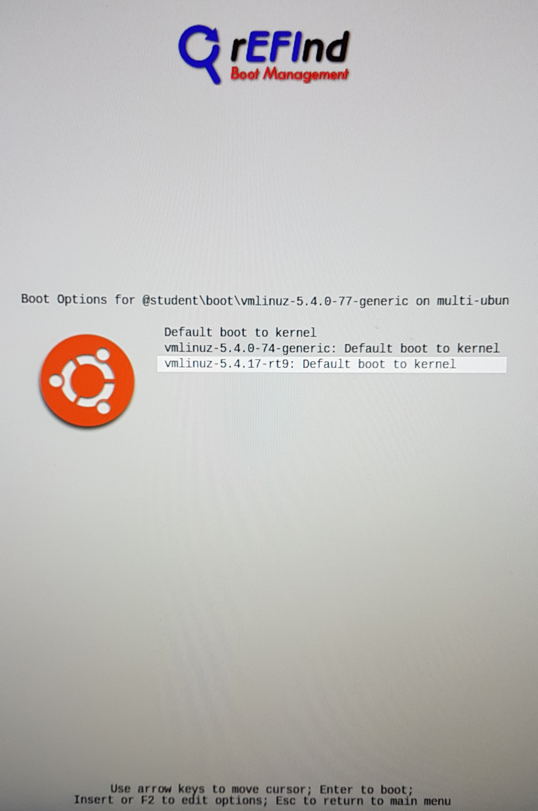
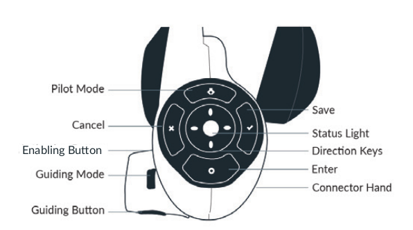

Franka Emika Panda Arm
=======================

.. role:: raw-html(raw)
    :format: html

.. |frankaemika-requirements| raw:: html

    <a href="https://frankaemika.github.io/docs/requirements.html" target="_blank">the minimum system and network requirements</a>

.. |frankaemika-real-time-kernel| raw:: html

    <a href="https://frankaemika.github.io/docs/installation_linux.html#setting-up-the-real-time-kernel" target="_blank">setting up a real-time kernel</a>

Minimum system requirements
----------------------------------------------------

For this part we refer to |frankaemika-requirements| written by Franka Emika.  

Setting up a real-time kernel
------------------------------

For this part we refer to |frankaemika-real-time-kernel| written by Franka Emika. 

Boot VUB desktop with correct kernel
^^^^^^^^^^^^^^^^^^^^^^^^^^^^^^^^^^^^^ 

.. note:: This section describes how to boot the desktop that is already set up to work 
          with the *Panda 2* robot in the R&MM lab at Vrije Universiteit Brussel. 

When you start up the desktop, you will get the following screen. 
Navigate with the arrow keys to the **student** boot and press ``F2`` for more boot options. 

In order to control the Panda robot later on using ``libfranka``, the controller program on the desktop must run with *real-time priority* under a ``PREEMPT_RT`` kernel. 
Since a real-time kernel is already set up on the desktop, 
we can now navigate with the arrow keys to the rt9 version as shown in the figure below and press ``Enter``. 

Afterwards, you can choose the Main User account and enter the password ``MainUser``. 

Set up the robot network
-------------------------

Hardware connections
^^^^^^^^^^^^^^^^^^^^

In the figure below you can see the official hardware connection documentation from Franka Emika
which you can find in the :download:`Franka Emika Panda manual  <FrankaPandaManual.pdf>`. 

In our setup we have the following connections:

*  desktop to Panda Arm with ethernet cable

*  desktop to Panda Control with ethernet cable

*  Panda Arm to Panda Control with connection cable

*  external activation device to Panda Arm

*  Panda Control to Panda Arm with earth cable

*  Panda Control to power supply

*  dekstop to an ethernet port with an ethernet cable (if there is no Wi-Fi)

Set up the network connections
^^^^^^^^^^^^^^^^^^^^^^^^^^^^^^^

Turn on the Panda Control via the On-Off switch at the back of the Panda Control.

After the Control has been switched on, or supplied with energy, Panda boots up.
In this process, the safety locking system is activated, movements are thus locked mechanically.
The display lights on the base and the pilot **flash yellow**.

As soon as Panda has booted up, the display lights are lit **yellow continuously**.

.. note:: The part below is specifically written for the use of robot *Panda 2* in the R&MM lab at Vrije Universiteit Brussel
          with the desktop that is already set up to work with this robot. 
          This robot has shop floor IP address 192.168.2.106 and Netmask 255.255.255.0. 
          
          .. image:: img/Panda2_shopfloor_network.png
            :width: 350px

          For the general version of this documentation we refer to |frankaemika-setting-up-robot-network| for the Franka Emika Panda robot.

.. |frankaemika-setting-up-robot-network| raw:: html

    <a href="https://frankaemika.github.io/docs/getting_started.html#setting-up-the-network" target="_blank">setting up the network</a>

In case there is no Wi-Fi connection, you should see three ethernet connections:

*  a connection to ``FrankaControl``

   .. image:: img/connection_FrankaControl.png
    :width: 450px

*  a connection to ``FrankaArm``

   .. image:: img/connection_FrankaArm.png
    :width: 450px

*  a connection to ``Internet connection``

   Note that this is the personal static IP address that is assigned to Kelly Merckaert at Vrije Universiteit Brussel. 
   At VUB, they work with static IP addresses, so if you need internet via an ethernet connection, you have to ask for your own IP address. 

   .. image:: img/connection_internet.png
    :width: 450px

Depending on which ethernet ports you have connected, you have to select the right ethernet connections.
In the example below we have connected port enp10s0f0 to ``FrankaControl``,
port enp10s0f1 to ``FrankaArm``, and port enp12s0 to ``Internet connection``.

    

Start and shut down the robot via Franka Desk
----------------------------------------------
    
.. note:: To follow this section for another robot than the *Panda 2* in the R&MM lab at Vrije Universiteit Brussel, 
          you will have to replace ``192.168.2.106`` with the shop floor IP address of your own Panda robot
          and change the username and password required to enter Franka Desk. 

Start Franka Desk
^^^^^^^^^^^^^^^^^^

Once the Panda has booted up, you can start Franka Desk. 
Open your web browser and type ``192.168.2.106`` in the search bar. 
You will see a window where you will have to give your username and password to enter Franka Desk. 
The username is *admin* and the password is *franka123*. 

When the robot is well connected and you have signed in, you should obtain the following window:

.. image:: img/franka_desk.png
    :align: center
    :width: 700px

Settings
^^^^^^^^^

You can go to the settings window in Franka Desk by clicking on the two lines in the right upper corner. 
Like that you can go to the settings menu, but you can also download the User Manual and the Cobot Pump Manual. 

   .. image:: img/FrankaDesk_Settings.png
    :align: center
    :width: 250px
    

In the settings menu, you can see in the **Dashboard** tab the system, robot, and network settings. 
In the **Network** tab, you can change the robot and the shop floor network. 
In the **System** tab, you can install features like the Franka Control Interface, do a system update, download log files, etc. 

In the **End-Effector** tab, you can select the standard ``Franka Hand`` or select ``Other``. 

*  If you are using the standard Franka Hand end-effector, then select the ``Franka Hand``. 
   In case the Franka Hand is *uninitialized* in the Dashboard tab, you can re-initialize the hand by clicking on ``HOMING``. 
   Afterwards the hand should be *initialized* in the Dashboard tab. 

   .. image:: img/FrankaDesk_EndEffector_FrankaHand.png
    :width: 700px

*  If you detach the Franka Hand end-effector and want to attach another end-effector, then you have to select ``Other``. 
   Like that, you will be able to give the properties of your new end-effector, as in the example below. 

   .. image:: img/FrankaDesk_EndEffector_Other.png
    :width: 700px

To go back to the **Desk**, click again on the lines in the upper right corner and click on Desk. 

Unlock the joints
^^^^^^^^^^^^^^^^^^

At this point, the display lights of the Panda Arm should be lit **yellow continuously**.
This means that the Panda has booted up and that the safety locking system is activated, whereby movements are locked mechanically. 

Make sure that the external activation device is in the closed state (pressed down). 

The safety locking system can now be opened with the button ``click to unlock joints`` in the sidebar of Franka Desk. 

.. image:: img/unlock.png
    :align: center
    :width: 700px

After you have clicked on ``open``, you should hear seven clicks of the seven joints that are being unlocked. 

The display lights should now be lit **white continuously**. 
Desks’s sidebar shows now ``joints unlocked``. 
Panda is now in the monitored stop state.

Shut down the robot 
^^^^^^^^^^^^^^^^^^^^

When you are done using the robot, don't forget to put the external activation device in the closed state (pressed down) 
and lock the joints before shutting down the Franka Control and the desktop. 

The safety locking system can be closed with the button ``click to lock joints`` in the sidebar of Franka Desk. 
You will here one click which means that all the seven robot joints are locked and afterwards the display lights should be lit **yellow continuously**. 

Robot Operating States
----------------------

There are status lights on both sides of the base which take on the corresponding color.
These status lights will only flash during boot up,
during other processes the lights will glow continuously in the corresponding color of the status Panda is in.

On this page we will explain the states you can get in during this work.
For the explanation about the other states, we refer to the :download:`Franka Emika Panda manual  <FrankaPandaManual.pdf>`. 

.. image:: img/panda_states.png
    :align: center
    :width: 700px

Locked
^^^^^^

After the Panda has booted up, the display lights are lit **yellow continuously**, which means that the safety locking system is activated.

After you have unlocked the joints, the display lights should be lit **white** in case the external activation device is in a closed state (pressed down),
the robot is now in the interactive state.

Interactive
^^^^^^^^^^^^

When the display lights are lit **white**, Panda is in the *monitored stop* state, which means that the Panda Arm is ready for interaction.

By simultaneous pressing of the enabling button and the guiding button at the Arm’s grip, it is possible to guide the Arm manually.
In this state, the Arm can also record the positions it passed when it was guided manually by a human.

When the two buttons are released, Panda goes back to the *monitored stop* condition.

.. image:: img/IMG_20210615_175002.jpg
    :width: 24%

Activated
^^^^^^^^^^^^

When the display lights are lit **blue**, Panda is in the *activated* state, which means that an automatic program can be started.
In other words, the robot can now be controlled with commands send by your own program.

In what follows, we will go in detail on how to run a program on the Panda robot.

Conflict
^^^^^^^^^

A conflict can occur when the robot is in the activated (blue) state and you try to manually guide the arm.
In that case, the display lights will be lit **pink**.

To solve this conflict, you have to press down the external activation device such that it is again in the interactive (white) state.

Error
^^^^^^

When an error occurs, the display lights will be lit **red**.
This can occur when the robot moved close to one of its hardware limits, e.g. when it moved too fast, too brisk, or close to one of the joint angle limits.
This can happen when you are manually guiding the robot in interactive (white) state or because of the commands send by your program in the activated (blue) state.

To solve this kind of problem you can try the following things.
We have listed the possible solutions in chronological order, so if the first solution doesn't work, then you have to try the next solution, and so on.

*  | If the external activation device is in the open state (pulled up), put it in the closed state (pressed down), and back in the open state (pulled up).
   | Vice versa, if the external activation device is in the closed state (pressed down), put it in the open state (pulled up), and back in the closed state (pressed down).
*  Lock and unlock the joints via Franka Desk.
*  Shut down Franka Control with the On-Off switch at the back of the Panda Control, wait for a minute, and restart it.
