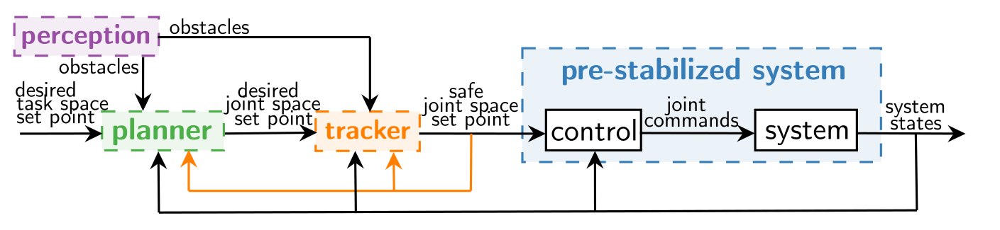

=================
The Panda System
=================

.. role:: raw-html(raw)
    :format: html

   
   The Panda system architecture. 

panda_managers
--------------
The panda_managers package consists of ROS nodes that manage some overall tasks such as time, robot states, and constraints.

*   When the time manager is launched, the clock starts and the time is published such that all other nodes that subscribe to this topic, are synchronized to the same time.
*   The odometry manager, on its turn, receives the robot state data.
*   The data logger receives all data that should be synchronized for post-processing purposes. For example, to take the difference between two different references such as the desired set point qr and the applied set point qv, these references should be synchronously saved at the same time stamps.
*   The robot constraint manager publishes all the robot input and state constraints that can be adapted and saved via a yaml file.
*   The obstacle constraint manager receives all the obstacles (i.e., primitive shapes, OctoMaps) that should be considered by the constrained control algorithm and loaded into the MoveIt planning scene if MoveIt functionalities are employed.
*   The octopoint generator subscribes to the MoveIt planning scene and generates the octopoint list.

panda_commanders
-----------------
The panda_commanders package includes ROS nodes that can publish commands to the Franka Emika Panda robot.

One of the nodes currently available in this package, puts the robot in gravity compensation mode, which is useful to manually test separate packages, e.g., visualization of the nearest obstacle points, while one can move the robot hand.

The other ROS node that is currently available, publishes torque commands to the robot, which we employ when testing our control algorithms. This node runs at 1kHz and if it encounters too many delays, the robot will stop its execution.

It is possible to extend this package with position and velocity commanders, but they were not considered in this work.

panda_controllers
-------------------
The panda_controllers package currently consists of a ROS node that computes the to-be-commanded torques via a PD controller with gravity compensation. This controller is used to pre-stabilize the robot.

It is of course possible to add other controller nodes to this package, as long as they output position, velocity, or torques to be commanded to the robot.

panda_trackers
----------------
The panda_trackers package includes ROS nodes that transform a desired set point reference to a safe set point reference.

This package currently consists of a bypass tracker (returning the reference it receives as an input), a trajectory-based ERG tracker, and a trajectory-based ERG planning scene tracker. The latter has the extra functionality that it makes a planning scene monitor object that is necessary for collision checking between a MoveIt planningscene and the robot. If MoveIt is not used, then the former ROS node can be employed. 

This package has also a C++ Explicit Reference Governor library that includes all the NF and DSM functionalities that can be called from the different packages.

panda_planners
---------------
The panda_planners package has ROS nodes related to the planning level.

It has a bypass planner node that returns the reference it receives as an input, an inverse kinematics node that transforms the desired task space reference to the desired joint space reference which uses the Kinematics and Dynamics Library (KDL) under the hood, and an RRT Connect planner node from the Open Motion Planning Library (OMPL) provided by MoveIt.

This package also includes the reference selector node that publishes the selected joint space reference.

The planning scene node receives the obstacle data that should be loaded into the MoveIt planning scene by subscribing to the topic the obstacle constraint manager publishes its data to.

panda_lib
----------
The panda_lib package consists of multiple C++ libraries.

It has a library with functions to compute the forward robot kinematics, to do pseudo-inversion, and to do general vector and matrix conversions. It also has two libraries with all the functions required to compute the nearest points between the robot and the MoveIt planning scene on the one hand, and the primitive-shaped obstacles not added to the MoveIt planning scene (e.g., human skeleton and octopoints) on the other hand.

panda_tasks
------------
The panda_tasks package consists of several ROS nodes with a variety of tasks that publish joint and task space references in function of the time stamp they receive. This package makes it easy for the user to define a new task by adding a new ROS node.

panda_perception
-----------------
The panda_perception package includes ROS nodes that subscribe to perception system topics.

Currently, it has a ROS node that subscribes to the ZED2 topic that publishes the human skeleton data. This node transforms the ZED data into a readable format for the tracker and visualization nodes. It also has two nodes that subscribe to the point cloud topic from the ZED2 camera of which one node transforms the data in an OctoMap including the Panda robot and another node transforms it into an OctoMap out of which the Panda robot is filtered.

Another ROS node subscribes to the Vicon motion capture topic and receives the positions of the reflective markers and the poses of the objects defined in the Vicon software.

If other perception systems would be employed, then new ROS nodes that subscribe to the corresponding topics should be added to this package.

panda_visualization
--------------------
The panda_visualization package consists of ROS nodes that are responsible
for different visualizations in RViz.

The reference visualization node visualizes the reference frames such as the desired and safe task space references, the trajectories planned by the planner, and the paths made by saving the previously computed references from the reference selector and trajectory-based ERG.

Primitive-shaped obstacles that are not included to the MoveIt planning scene are visualized in RViz. The skeleton list node visualizes the skeleton data received from the corresponding node in the perception package. On the other hand, the octopoint list node visualizes the data received from the octopoint generator node in the managers package.

The nearest points between the current robot state and the objects in the planning scene, the octopoints, and the skeletons are visualized through the three respective ROS nodes in this package.

This package has also two C++ libraries: one with some general RViz functionalities and another one with some general MoveIt planning scene functionalities, both adapted for our specific purposes.

panda_msgs
-----------
The panda_msgs package consists of custom ROS messages and services that
are required to log and publish specific data between all the ROS nodes.

panda_tests
-------------
The panda_tests package is based on tmux, which is a terminal multiplexer. Via a yaml file, we can define all the nodes that should be launched for a specific test. By using tmux, we can easily see and switch between the several programs running in one terminal. Per test case, we make a folder that include the yaml file denoting the programs that should be launched, a custom config folder where the custom tracker and controller gains can be defined, and a results folder where the ROS bag files can be stored. This structure makes it easy for other users to test example code, since they just have to run one line that starts up all required programs.

In this package, we have also included some generic matlab plots for post-processing purposes. It has MATLAB scripts that help to convert ROS bag files to MAT files and scripts to make graphs of the saved data. 