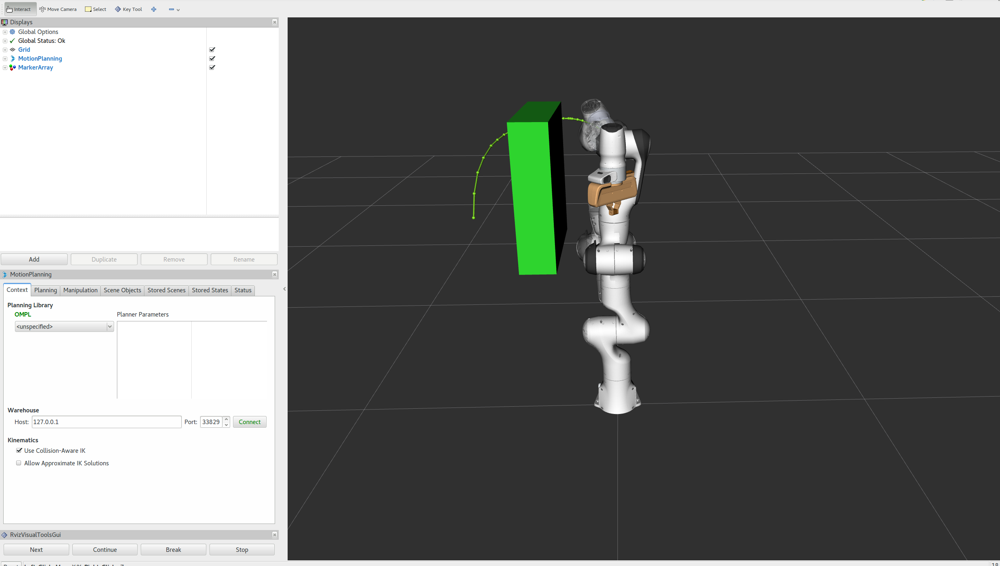
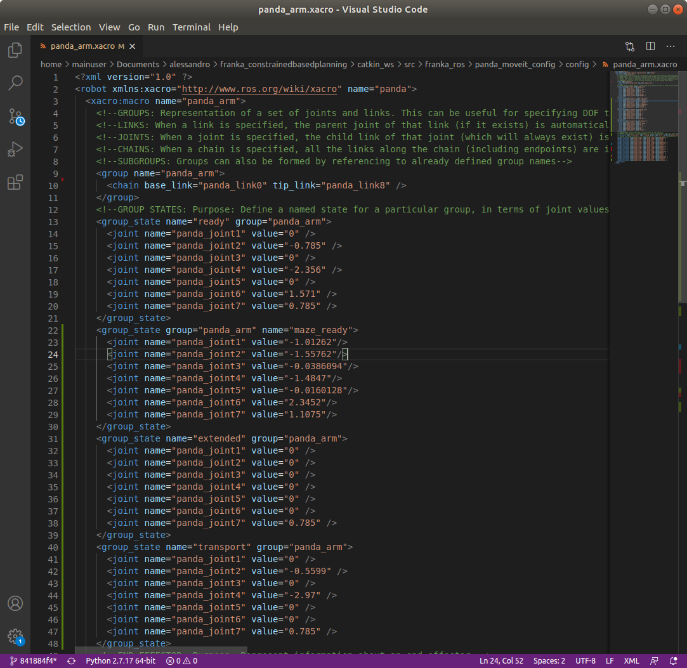

=================
Software
=================

.. role:: raw-html(raw)
    :format: html

---------------------------------
Franka Control Interface (FCI)
---------------------------------

.. note:: For the *Panda 2* robot in the R&MM lab at Vrije Universiteit Brussel we replace <fci-ip> with ``192.168.2.106`` at this page. 

The Franka Control Interface (FCI) allows a fast and direct low-level bidirectional connection to the Arm and Hand.
It provides the current status of the robot and enables its direct real-time control at 1 kHz with an external workstation PC (our desktop) connected via Ethernet.
We refer to the |frankaemika-fci-overview| for more information about its specifications.

.. |frankaemika-fci-overview| raw:: html

    <a href="https://frankaemika.github.io/docs/overview.html" target="_blank">Franka Emika FCI documentation</a>

Clone an existing project
--------------------------

Clone the project and build ``libfranka`` and ``franka_ros``:

.. code-block:: bash

   git clone https://github.com/panda-brubotics/franka_constrained_control.git
   cd path/to/franka_constrained_control/libfranka
   mkdir build
   cd build
   cmake -DCMAKE_BUILD_TYPE=Release ..
   cmake --build .
   cd ../../catkin_ws/src/franka_ros
   catkin_make -DCMAKE_BUILD_TYPE=Release -DFranka_DIR:PATH=/path/to/libfranka/build

.. warning::

   The path of ``-DFranka_DIR:PATH`` MUST be an absolute path to the libfranka's build directory.

Now that the project is built, you can use catkin_make without specifying the build type or the build directory, i.e.

.. code-block:: bash

   cd path/to/franka_constrained_control/catkin_ws
   catkin_make

Create your own project
-----------------------

.. note :: If you want to make an extension or improvement to the franka_constrained_control project,
           it is better to clone the existing project as is explained in the previous section.
           However, if you like to make a new project with the same libfranka and ros version as we used,
           then you have to follow this section.

This tutorial is an adapted version of the official |frankaemika-linux-installation|.

.. |frankaemika-linux-installation| raw:: html

    <a href="https://frankaemika.github.io/docs/installation_linux.html" target="_blank">Franka Emika installation tutorial</a>

First of all make sure that ROS is installed :

.. code-block:: bash

   sudo apt install ros-melodic-libfranka ros-melodic-franka-ros

Before building from source, please uninstall existing installations of ``libfranka`` and ``franka_ros`` to avoid conflicts:

.. code-block:: bash

   sudo apt remove "*libfranka*"

Create a directory (or a git directory if you want to make a git repository) before installing ``libfranka`` and ``franka_ros``.

Install libfranka
^^^^^^^^^^^^^^^^^^^^^

To build libfranka, install the following dependencies from Ubuntu’s package manager:

.. code-block:: bash

   sudo apt install build-essential cmake git libpoco-dev libeigen3-dev

Then, download the source code by cloning |frankaemika-libfranka-github| in your directory (or git repository):

.. |frankaemika-libfranka-github| raw:: html

    <a href="https://github.com/frankaemika/libfranka" target="_blank">libfranka</a>

.. code-block:: bash

   git clone --recursive https://github.com/frankaemika/libfranka
   cd libfranka

By default, this will check out the newest release of ``libfranka``.
However, we want to use the version *0.7.1*, so we have to change the branch:

.. code-block:: bash

   git checkout 0.7.1
   git submodule update

In the libfranka directory, create a build directory and run CMake:

.. code-block:: bash

   mkdir build
   cd build
   cmake -DCMAKE_BUILD_TYPE=Release ..
   cmake --build .

Try to launch files in the ``build/examples`` directory to see if the installation is completed.

.. code-block:: bash

   cd build/examples
   ./echo_robot_state <fci-ip>
   ./print_joint_poses <fci-ip>

When you can run the examples, ``libfranka`` is installed properly, so you are ready to install ``franka_ros``.

Install franka_ros
^^^^^^^^^^^^^^^^^^^^^

Go to your directory (or git repository) and create a catkin workspace :

.. code-block:: bash

   mkdir -p catkin_ws/src
   cd catkin_ws
   source /opt/ros/melodic/setup.sh
   catkin_init_workspace src

Then clone the |frankaemika-franka_ros-github| repository by executing the following command:

.. |frankaemika-franka_ros-github| raw:: html

    <a href="https://github.com/frankaemika/franka_ros" target="_blank">franka_ros</a>

.. code-block:: bash

   git clone --recursive https://github.com/frankaemika/franka_ros src/franka_ros

By default, this will check out the newest release of ``franka_ros``.
However, we want to use the version *0.6.0* since with the latest version there are some problems such that even the franka_example_controllers cannot be launched.
So we have to change the branch:

.. code-block:: bash

   cd src/franka_ros
   git checkout 0.6.0

Install any missing dependencies and build the packages:

.. code-block:: bash

   rosdep install --from-paths src --ignore-src --rosdistro melodic -y --skip-keys libfranka
   catkin_make -DCMAKE_BUILD_TYPE=Release -DFranka_DIR:PATH=/path/to/libfranka/build
   source devel/setup.sh

.. warning ::

   The path of ``-DFranka_DIR:PATH`` MUST be an absolute path to the libfranka's build directory.

.. note ::

   Once the problems with the latest franka_ros version are solved, we can try this latest franka_ros and accompanying libfranka version.

Since we don't want to work with git submodules, we remove all the submodules by following these steps: 

* Delete the relevant line from the .gitmodules file.
* Delete the relevant section from .git/config.
* Run git rm --cached path_to_submodule (no trailing slash).

Control the robot with ROS
-----------------------------

.. note:: For the *Panda 2* robot in the R&MM lab at Vrije Universiteit Brussel we replace <fci-ip> with ``192.168.2.106``

Here we will explain how to test the ``franka_ros`` examples and how to make your own controller.

Test franka_example_controllers
^^^^^^^^^^^^^^^^^^^^^^^^^^^^^^^^

To test that libfranka and franka_ros are installed properly, you can run the franka_example_controllers.

Open a terminal, go to the catkin_ws, source the setup.bash, and build the project.

.. code-block:: bash

   cd path/to/your_project/catkin_ws
   source devel/setup.bash
   catkin_make

You will have to source the setup.bash everytime you open a new terminal and you have to build the project everytime you change a cpp file.

model_example_controller
************************

To run the *model_example_controller* example, the robot can stay in the **interactive (white)** state,
since this example doesn't send any commands to the robot, but only gets access to e.g. measured joint data and robot dynamics.

.. code-block:: bash

   roslaunch franka_example_controllers model_example_controller.launch

After executing this line, rviz will open and will show the robot in its current configuration.
When you manually guide the robot to another configuration and release the enabling and guiding button,
you will see that the robot configuration in rviz is updated to the configuration you manually guided the robot to.
In the meanwhile you can see the updated values of e.g. the fourth joint pose and the joint angles in the terminal.

.. admonition:: todo

	Replace image below with printscreen of default output from the model_example_controller.

move_to_start
******************

To run the *move_to_start* example, put the robot in the **interactive (white)** state and manually guide the robot to an arbitrary configuration.
Then set the robot in the **activated (blue)** state before executing move_to_start.

.. code-block:: bash

   roslaunch franka_example_controllers move_to_start.launch robot_ip:=<fci-ip> load_gripper:=true

The robot should normally return in the following configuration that is required to start from for most of the franka_example_controllers.

.. admonition:: todo

	Replace gif below. Make video of move_to_start example and add gif of it in the tutorial. 

joint_impedance_example_controller
************************************

To run the *joint_impedance_example_controller*, you have to put the robot in the **activated (blue)** state and
you have to execute *move_to_start*, such that the robot is in its start configuration.
Then execute the following.

.. code-block:: bash

   roslaunch franka_example_controllers joint_impedance_example_controller.launch robot_ip:=<fci-ip> load_gripper:=true

.. admonition:: todo

	Explain what you should see with a video or gif below. Make video of joint_impedance_example_controller and add gif of it in the tutorial. 

.. note :: If the robot briskly stopts because of a problem or because you have stopped the robot with the ``CTRL+C`` command,
           you will not be able to run another program although the display lights didn't change color.
           To be able to run another program, you will have to close the external activation device (press down) and open it again (pull up).

cartesian_impedance_example_controller
**************************************

To run the *cartesian_impedance_example_controller*, you have to put the robot in the **activated (blue)** state and
you have to execute *move_to_start*, such that the robot is in its start configuration.
Then execute the following.

.. code-block:: bash

   roslaunch franka_example_controllers cartesian_impedance_example_controller.launch robot_ip:=<fci-ip> load_gripper:=true

.. admonition:: todo

	Explain what you should see with a video or gif below. Make video of cartesian_impedance_example_controller and do screen capture of RViz. Trim both videos and add gif of it in the tutorial. 

Make your own controller
^^^^^^^^^^^^^^^^^^^^^^^^^^

To create your own controller in an existing project, we follow the tutorial *Starting to Write a New Controller* that is written on the |frankaemika-community| website.
You have to make an account if you want to see posts in this community. We encourage you to do this!

.. |frankaemika-community| raw:: html

    <a href="https://www.franka-community.de" target="_blank">Franka Community</a>

What follows is copied from the Franka Community website and can help you whenever you want to make a new controller or want to adapt the name of an existing controller.

1) In catkin_ws/src, you will see franka_example_controllers.
   In catkin_ws/src create a new folder and name it whatever you like (new_controllers).
   This is where you will keep your new controllers.

2) Create a **src** folder in new_controllers.
   Copy an example controller into here (I copied the joint_impedance_example_controller.cpp from catkin_ws/src/franka_example_controllers/src).
   Rename it to anything you want (new_controller_1.cpp). In new_controller_1.cpp, wherever you see:

   *  franka_example_controllers, change it to new_controllers
   *  joint_impedance_example_controller, change it to new_controller_1
   *  JointImpedanceExampleController, change it to NewController1

3) Create an **include** folder in new_controllers.
   Create a new_controllers folder in include.
   Copy the joint_impedance_example_controller.h file from franka_example_controllers/include/franka_example_controller into new_controllers/include/new_controllers
   and rename it to new_controller_1.h. In new_controller_1.h, wherever you see:

   *  franka_example_controllers, change it to new_controllers
   *  JointImpedanceExampleController, change it to NewController1

4) Create a **launch** folder in new_controllers.
   Copy robot.rviz from franka_example_controller/launch into new_controllers/launch.
   Also copy joint_impedance_example_controller.launch into here and rename it to new_controller_1.launch.
   In this launch file, wherever you see:

   *  franka_example_controllers, change it to new_controllers
   *  joint_impedance_example_controller, change it to new_controller_1

5) Create a **config** folder in new_controllers. Copy the franka_example_controllers.yalm file from franka_example_controllers/config into new_controllers/config.
   Rename it to new_controllers.yaml. Only keep joint_impedance_example_controller and its parameters.
   Delete all other controllers and their parameters. Next, wherever you see:

   *  franka_example_controllers, change it to new_controllers
   *  joint_impedance_example_controller, change it to new_controller_1
   *  JointImpedanceExampleController, change it to NewController1

6) Copy these folders (and the files in them): **cfg**, **msg**, **scripts** from franka_example_controllers into new_controllers.

7) Copy the **package.xml** file from franka_example_controllers to new_controllers. Next, wherever you see:

   *  franka_example_controllers, change it to new_controllers

8) Copy the **franka_example_controllers_plugin.xml** file from franka_example_controllers to new_controllers.
   Only keep the JointImpedanceExampleController class and delete the rest. Next, wherever you see:

   *  franka_example_controllers, change it to new_controllers
   *  JointImpedanceExampleController, change it to NewController1

9) Copy the **CMakeList.txt** from franka_example_controller to new_controller. Next, wherever you see:

   *  franka_example_controllers, change it to new_controllers
   *  joint_impedance_example_controller, change it to new_controller_1
   *  In the add_library part, delete the other controllers (we only need ours).

Plan and Follow a Trajectory with MoveIt
-----------------------------------------

.. note:: For the *Panda 2* robot in the R&MM lab at Vrije Universiteit Brussel we replace <fci-ip> with ``192.168.2.106``

Here we will explain how to add obstacles in the MoveIt planning environment, how to make a plan and (asynchronously) execute this plan with MoveIt. 

Getting started with MoveIt
^^^^^^^^^^^^^^^^^^^^^^^^^^^^^

First of all, we advice you to follow the tutorials on the |moveit-melodic-tutorials| where you will work with the Panda robot in RViz. 

.. |moveit-melodic-tutorials| raw:: html

    <a href="http://docs.ros.org/en/melodic/api/moveit_tutorials/html/index.html" target="_blank">MoveIt website</a>

.. admonition:: todo

	Add links with explanation of different planner in OMPL in MoveIt. 

Make your own planner 
^^^^^^^^^^^^^^^^^^^^^^^

.. admonition:: todo

	Explain how to make your own planner. Which cpp files? What to add to the CMakeList? 

The moveit_static_move program explained
^^^^^^^^^^^^^^^^^^^^^^^^^^^^^^^^^^^^^^^^^

.. admonition:: todo

	Explain how to run it and what it does. Show video/gif of what robot does. Make screencapture of RViz. 

.. admonition:: todo

	Explain parts of the code. 

some issues
^^^^^^^^^^^^^^^

During the utilisation of the panda arm, we went through different problems that we will list here.

Problem of visualisation of the trajectory
**************************************************

This problem was discover by the fact that in the first example of the `MoveIt! tutorial <http://docs.ros.org/en/melodic/api/moveit_tutorials/html/index.html>`_, 
the trajectory of the robot is shown, like in the next image, but not in our projects :

In order to solve this problem, we had to update ``panda_moveit_config`` and also add the gripper on the robot. 
Actually, we used the robot without the gripper and that's why we did not see the trajectory.

Problem with VisualTools.prompt function
*******************************************

On the constrained_base_planning_controller example,
the terminal print a text and waits for you to press the ``next`` button. 
But when we execute the code, the terminal does not print the phrase it should. 
This problem was just a missing output=screen in the node of path_planner_thomas.

Problem with copying move_to_start
**************************************

In order to test some planners, we wanted to set the arm in a defined position. 
So we think about copying the move_to_start files, and changing the position of the robot, 
but it did not work and gave us errors we can't fix. So we had to change in the move_to_start.py file the line :

.. code-block:: python

   commander.set_named_target('name_of_the_group_state')

Replace the ``'name_of_the_group_state'`` by a relevant name.

Then open the ``panda_arm.xacro`` in the ``panda_moveit_config`` folder, and then define another move_group 
with the name you put in the move_to_start.py (the ``'name_of_the_group_state'``), and with the joint angular position you want. 
Then you have just to execute move_to_start.

    You can see that ``group`` is always equal to "panda_arm" and you can choose the name of the group_state

------------------------------
ZED 2 with ROS Integration
------------------------------

In the *ZED 2 Stereo Camera* chapter you will learn to run the ZED 2 camera, which is a stereo camera from Stereolabs, on the Nvidia Jetson Xavier NX. It is also possible to use a computer which has an Nvidia graphics card and Nvidia drivers. Note that a real-time kernel is required for the real-time control of the Panda robot and that Nvidia binary drivers are not supported on real-time kernels, which is why we use these small embedded computers. At the end you will learn how to receive the ZED 2 camera data via ROS.

Getting started with ROS and ZED
---------------------------------------------

.. |Stereolabs_ZED2_ROS_integration| raw:: html

   <a href="https://www.stereolabs.com/docs/ros/" target="_blank">getting started with ROS and ZED </a>

.. |Nvidia_JetPack_ubuntu| raw:: html

   <a href="https://developer.nvidia.com/embedded/jetpack" target="_blank">JetPack 4.6</a>

.. |Nvidia_Jetson_Xavier_NX_upgrade_Ubuntu20| raw:: html

   <a href="https://carlosedp.medium.com/upgrading-your-nvidia-jetson-xavier-nx-to-latest-ubuntu-focal-fossa-20-04-5e92ccc5a66" target="_blank">this article</a>

.. |ROS_Melodic_installation| raw:: html

   <a href="http://wiki.ros.org/melodic/Installation/Ubuntu" target="_blank">ROS Melodic</a>

.. |Stereolabs_github_zed_ros_wrapper| raw:: html

   <a href="https://github.com/stereolabs/zed-ros-wrapper" target="_blank">zed-ros-wrapper</a>

.. |Stereolabs_github_zed_ros_interfaces| raw:: html

   <a href="https://github.com/stereolabs/zed-ros-interfaces" target="_blank">zed-ros-interfaces</a>

.. |Stereolabs_github_zed_ros_examples| raw:: html

   <a href="https://github.com/stereolabs/zed-ros-examples" target="_blank">zed-ros-examples</a>

.. |Stereolabs_ZED_ROS_integration_buildpackages| raw:: html

   <a href="https://www.stereolabs.com/docs/ros/#build-the-packages " target="_blank">build the packages</a>

Read and follow the |Stereolabs_ZED2_ROS_integration| tutorial.

Below you will find some extra information on top of what the tutorial explains. 

*  We have installed |Nvidia_JetPack_ubuntu| on our NVIDIA Jetson Xavier NX and because this filesystem is based on Ubuntu 18.04, 
   we will follow the ROS installation procedure for Ubuntu 18.04, as such we have to install ROS Melodic. 
   If you want to upgrade the NVIDIA Jetson Xavier NX to Ubuntu 20.04, you can read |Nvidia_Jetson_Xavier_NX_upgrade_Ubuntu20|. 
   We didn't do this upgrade and worked on Ubuntu 18.04. 
*  For the installation of the ZED SDK for JetPack 4.6, we refer to :ref:`Install the ZED SDK on NVIDIA Jetson Xavier NX <Install_ZED_SDK_JetsonXavierNX>`. 
*  Follow the ROS tutorial to install |ROS_Melodic_installation|. 
   We have installed the *Desktop Install* version instead of the *Desktop-Full Install* version. 

   .. note::
       “ROS Desktop Full” is a more complete package, however it is not recommended for embedded platforms; 
       2D/3D simulators will be installed, requiring increased storage space and compute power.

*  To build the ZED ROS packages (|Stereolabs_github_zed_ros_wrapper|, |Stereolabs_github_zed_ros_interfaces|, and |Stereolabs_github_zed_ros_examples|)
   we have followed the |Stereolabs_ZED_ROS_integration_buildpackages| section. 

   .. note::
       If you install the |Stereolabs_github_zed_ros_wrapper| package, 
       then the |Stereolabs_github_zed_ros_interfaces| package is already included as a submodule. 
       As such, you will get an error *Rosdep experienced an error: Multiple packages found with the same name "zed_interfaces"*:
       zed-ros-interfaces and zed-ros-wrapper/zed-ros-interfaces.
       So on the Jetson Xavier NX you only have to install the |Stereolabs_github_zed_ros_wrapper| and |Stereolabs_github_zed_ros_examples| packages. 

*  When you display ZED data using RViz on the Jetson Xavier NX, it is highly probable that you will get latency problems. 
   Although the Jetson Xavier NX is a powerful embedded board, it is still an *embedded* board,
   that's why it cannot handle all the tasks that you normally perform on a desktop or laptop PC.

   The main problem with RVIZ for example is that it is a highly demanding application.
   Therefore it can correctly display the data directly on the Xavier *only* by reducing the publishing rate of the point cloud and its resolution.
   You can find :download:`an example of a parameter configuration <common.yaml>` that will allow you to display a point cloud on the Jetson Xavier NX, but not at full rate.

   Go to the directory with the original common.yaml file, rename it to common-original.yaml and add the new common.yaml file.

   .. code-block:: bash

       cd path/to/catkin_ws/src/zed-ros-wrapper/zed_wrapper/params/
       mv ./common.yaml ./common-original.yaml # rename the original commong.yaml file
       mv ~/Downloads/common.yaml ~/catkin_ws/src/zed-ros-wrapper/zed_wrapper/params/common.yaml # move the newly downloaded common.yaml to the directory

   When launching again the display rviz program again, there should be less latency problems. 

Make a ROS network via an ethernet connection
---------------------------------------------------

To correctly display the point cloud data without reducing the publishing rate of the point cloud and its resolution, 
we suggest you to **run RViz on an external machine connected by an ethernet cable**.

Setup the external computer with |install-ubuntu-18| and |install-ros-melodic|.  

.. |install-ubuntu-18| raw:: html

        <a href="https://ubuntu.com/download/alternative-downloads" target="_blank">Ubuntu 18.04</a>

.. |install-ros-melodic| raw:: html

        <a href="http://wiki.ros.org/melodic/Installation/Ubuntu" target="_blank">ROS Melodic</a>

.. |ROS_MultipleMachines| raw:: html

        <a href="http://wiki.ros.org/ROS/Tutorials/MultipleMachines" target="_blank">running ROS across multiple machines</a>

.. |ROS_NetworkSetup| raw:: html

        <a href="http://wiki.ros.org/ROS/NetworkSetup" target="_blank">ROS network setup</a>

ROS can run across multiple machines via a WiFi connection or via an ethernet connection. 
We will explain the method via an ethernet connections, since it is more efficient to use an ethernet connection for data transmission. 
You can also take a look at |ROS_MultipleMachines|, |ROS_NetworkSetup|, and :download:`ROS on multiple machines<Politechnico_ROS_on_multiple_machines.pdf>`.

Use the ethernet cable to connect the Jetson Xavier NX with the external computer. 

Network settings
^^^^^^^^^^^^^^^^

Go to the network settings on both computers, make sure the wired connection is turned on, 
and add a new connection profile. 

.. image:: img/add_connection_profile.png
    :align: center
    :width: 500px

Go to the IPv4 section and put the IPv4 Method to Manual on both computers. 
You can choose the IP address you want, but if you set your netmask to 255.255.255.0, 
then on both computers the three first numbers must be the same. 
For example, we have set the IP address of the external computer to 169.254.99.1 and the IP address of the Jetson to 169.254.99.2.
Don't forget to save these settings. 

.. image:: img/ipv4_computer.png
    :align: center
    :width: 500px

You can now ping both computers to see if they are correctly connected.

* Open a new terminal on the Jetson Xavier NX (with IP 169.254.99.2) and ping to the external computer (with IP 169.254.99.1)

  .. code-block:: bash

    ping 169.254.99.1

  .. image:: img/ping_jetson2external.png
      :width: 400px

* Open a new terminal on the external computer (with IP 169.254.99.1) and ping to the Jetson Xavier NX (with IP 169.254.99.2)

  .. code-block:: bash

    ping 169.254.99.2

  .. image:: img/ping_external2jetson.png
      :width: 400px

ROS node environment variables
^^^^^^^^^^^^^^^^^^^^^^^^^^^^^^^

Via the terminal, you have to add the ROS_IP and ROS_MASTER_URI to the .bashrc of both computers. 

* On the Jetson Xavier NX:

  .. code-block:: bash

    echo "export ROS_IP=169.254.99.2" >> ~/.bashrc  #IP of the Jetson Xavier
    echo "export ROS_MASTER_URI=http://169.254.99.1:11311" >> ~/.bashrc # IP of the ROS master

* On the external computer:

  .. code-block:: bash

    echo "export ROS_IP=169.254.99.1" >> ~/.bashrc  #IP of the ROS master
    echo "export ROS_MASTER_URI=http://169.254.99.1:11311" >> ~/.bashrc # IP of the ROS master

.. note::   Don't forget to remove these ROS_IP and ROS_MASTER_URI specifications in the .bashrc
            when you are using ROS on your external computer without the ZED SDK running on the Jetson Xavier NX.  

Synchonize system clocks
^^^^^^^^^^^^^^^^^^^^^^^^
.. |chrony_tuxfamily| raw:: html

        <a href="https://chrony.tuxfamily.org/" target="_blank">chrony</a>

.. |ROS_answers_chrony| raw:: html

        <a href="https://answers.ros.org/question/11180/chrony-configuration-and-limitations/ " target="_blank">this ROS issue</a>
        
Synchronize the clock of the Jetson and the external computer by running the following command on both devices: 

.. code-block:: bash

    sudo date -s "$(wget -qSO- --max-redirect=0 google.com 2>&1 | grep Date: | cut -d' ' -f5-8)Z"

.. note:: Another way to synchronize the time across multiple machines is to use |chrony_tuxfamily|, see also |ROS_answers_chrony|. 

Visualize ROS data in RViz on external computer
--------------------------------------------------------

.. |create_catkin_ws| raw:: html

    <a href="http://wiki.ros.org/catkin/Tutorials/create_a_workspace" target="_blank">catkin workspace</a>

.. |Stereolabs_github_object_detection_plugin| raw:: html

    <a href="https://github.com/stereolabs/zed-ros-examples/tree/master/rviz-plugin-zed-od" target="_blank">object detection plugin</a>

To visualize ROS data in RViz on your external computer, you first have to create a |create_catkin_ws| on your external computer. 
Once you've created the catkin workspace, you have to install the |Stereolabs_github_zed_ros_interfaces| and the |Stereolabs_github_zed_ros_examples| in the catkin_ws/src folder
according to the explanation in the |Stereolabs_ZED_ROS_integration_buildpackages| section.   

*  We installed the |Stereolabs_github_zed_ros_interfaces| package instead of the |Stereolabs_github_zed_ros_wrapper| package, 
   since the |Stereolabs_github_zed_ros_interfaces| package does not require CUDA hence it can be used to receive the ZED data also on machines not equipped with an NVIDIA GPU, 
   as is explained in |Stereolabs_ZED_ROS_integration_buildpackages|. 
*  In the |Stereolabs_github_zed_ros_examples| package, you can find the ZedOdDisplay plugin which is required for processing the object detection, 
   but if you do not want to install the full |Stereolabs_github_zed_ros_examples| repository on your external computer, 
   you can also only install the source code of the |Stereolabs_github_object_detection_plugin|.  

To avoid opening RViz on the Jetson Xavier NX and to open the *zed2.rviz* file on the external computer, 
you have to comment parts of the code of the *display_zed2.launch* file.
On both computers, you can find this file at the following address:   

.. code-block:: bash

    cd path/to/catkin_ws/src/zed-ros-examples/zed_display_rviz/launch/

On the **Jetson Xavier NX**, you have to comment the rviz node in the *display_zed2.launch* file on the Jetson Xavier.
Therefore you have to comment the line that is highlighted with a red rectangle. 

.. image:: img/zed_jetson.png
    :align: center
    :width: 700px

To open a specific rviz file on the **external computer**, you have to comment de zed_wrapper part and respective arguments
as is highlighted in the figure below with red rectangles. 

.. image:: img/zed_jetson.png
    :align: center
    :width: 700px

For all the examples explained in detail below, you will have to do the following. 

* Open a new terminal on the **external computer** and run

  .. code-block:: bash

      roscore

* Open a new terminal on the **Jetson** and run the adapted *display_zed2.launch*

  .. code-block:: bash

      cd path/to/catkin_ws/
      source devel/setup.bash
      roslaunch zed_display_rviz display_zed2.launch

* Open another terminal on the **external computer** and run the adapted *display_zed2.launch*

  .. code-block:: bash

      cd path/to/catkin_ws/
      source devel/setup.bash
      roslaunch zed_display_rviz display_zed2.launch

Adding video capture in ROS
^^^^^^^^^^^^^^^^^^^^^^^^^^^

.. |Stereolabs_ROS_Video_Capture| raw:: html

    <a href="https://www.stereolabs.com/docs/ros/video/ " target="_blank">adding video capture in ROS</a>

Read |Stereolabs_ROS_Video_Capture|.  

Adding depth perception in ROS
^^^^^^^^^^^^^^^^^^^^^^^^^^^^^^

.. |Stereolabs_ROS_Depth_Perception| raw:: html

    <a href="https://www.stereolabs.com/docs/ros/depth-sensing/ " target="_blank">adding depth perception in ROS</a>
    
Read |Stereolabs_ROS_Depth_Perception|. 

To display the depth map and the point cloud in rviz, you have to add ``Camera`` to the Displays tab.
When added, click on Image Topic and select the topic with *depth* in the name. 
Afterwards, you can add ``PointCloud2``, click on Topic and select the topic with *point_cloud* in the name. 
Finally, you should get something similar as in the figure below. 

Adding positional tracking in ROS
^^^^^^^^^^^^^^^^^^^^^^^^^^^^^^^^^

.. |Stereolabs_ROS_Positional_Tracking| raw:: html

    <a href="https://www.stereolabs.com/docs/ros/positional-tracking/ " target="_blank">adding positional tracking in ROS</a>
    
Read |Stereolabs_ROS_Positional_Tracking|. 

Adding object detection in ROS
^^^^^^^^^^^^^^^^^^^^^^^^^^^^^^
    
.. |Stereolabs_ROS_Object_Detection| raw:: html

    <a href="https://www.stereolabs.com/docs/ros/object-detection/ " target="_blank">adding object detection in ROS</a>

Read |Stereolabs_ROS_Object_Detection| and don't forget to enable the object detection parameter on the Jetson Xavier NX. 

To display the bounding boxes around the detected objects, you have to add ``ZedOdDisplay`` which you can find under *rviz_plugin_zed_od*
and select the */zed2/zed_node/obj_det/objects* topic. 

To have a better idea of the detected objects, you can display the point cloud to the display. Therefore you have to add ``PointCloud2`` 
and select the */zed2/zed_node/point_cloud/cloud_registered* topic. 

Finally you should see something like this:

.. image:: img/object_detection_rviz.png
    :align: center
    :width: 700px
