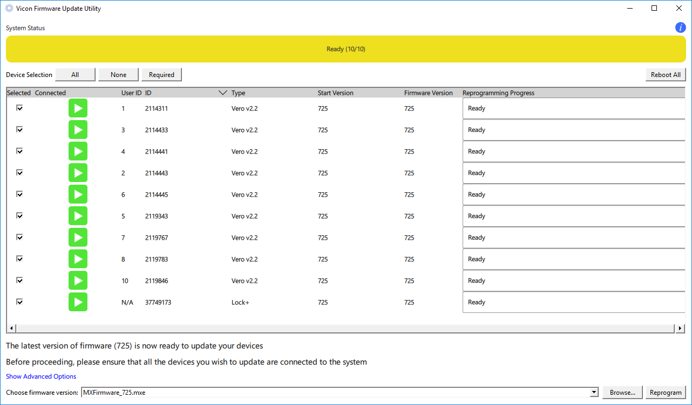

.. _ViconMotionCapture:

Vicon Motion Capture
=======================

.. role:: raw-html(raw)
    :format: html

.. admonition:: todo

  Rewrite based on reading material. 

Reading material
----------------

In :download:`this internship report <louis-lefevre-internship.pdf>` you can find a more detailed explanation of the Vicon motion capture room and Vicon Nexus. 
It explains how to define objects in Vicon Nexus for three different robots and for multiple scenarios. 

In :download:`this internship report <Harry_Report_2.pdf>` you can find some general info about the Vicon motion capture 
and also how to define objects in Vicon Nexus for some specific scenarios with the Panda robot. 

In :download:`this report <FrankaPanda_UseWithFCIandVicon.pdf>` the use of the Panda robot in the Vicon room is explained. 
It explains how to establish the ethernet connection and how to receive data from the Vicon motion capture system. 
It also explains how to make objects in Vicon Tracker (but currently we have Vicon Nexus as software in the lab). 

Possible problems
-----------------

Last year there were some problems with Vicon Nexus. 

Firewall 
^^^^^^^^ 
If the cameras and the Lock Sync Box don't light up blue when you start up Nexus, then it's highly probable that there is a firewall problem. 

To solve this issue, you have to enter the Vicon desktop.  

*  Go to Windows --> control panel --> all control panel items --> Windows Defender Firewall --> Allowed Apps 
   
   .. image:: img/WindowsDefenderFirewallControlPanel.png
        :width: 650px
        
   and check all Nexus applications 

   .. image:: img/WindowsDefenderFirewallAllowedApps.png
        :width: 650px

*  Go to Windows --> Windows Firewall --> Inbound rules --> enable and allow connection for all Nexus applications 

   .. image:: img/WindowsFirewallInboundRules.PNG
        :width: 650px

Update the Vicon Firmware
^^^^^^^^^^^^^^^^^^^^^^^^^

Problems can occur when the Vicon Firmware is not updated. 
You can do this via the Vicon Firmware Update Utility. 

Vicon Datastreak SDK
^^^^^^^^^^^^^^^^^^^^^

Last year there was also a problem with the Vicon Datastream SDK. 

.. |vicon_bridge| raw:: html

    <a href="https://github.com/ethz-asl/vicon_bridge" target="_blank">vicon_bridge</a>

When the |vicon_bridge| is giving occlusions when you clearly see the subject in Nexus, do the following checks.

*  Navigate in Windows to 

   .. code-block:: bash

     cd C:\Program Files\Vicon\DataStream SDK\Win64\CPP
   
   (you don't have to do this via the terminal) and double click ``ViconDataStreamSDK_CPPTest``

*  When you get the standard non-overwritten values with zeros and ones (zero position, unity matrix for orientation) 
   in the Global and Local Translation/Rotation as in the Static Translation/Rotation, 

   .. image:: img/vicon_nexus_datastream.PNG
        :width: 650px
   
   then probably the Processing Output Level is not **Kinematic Fit**.
   Change it to Kinematic Fit as shown in the figure below. 

   .. image:: img/ProcessingOutputLevel.png
        :width: 300px

*  Try the ``ViconDataStreamSDK_CPPTest`` again, when you now see the correct values of the subject in the Global and Local Translation/Rotation.  

*  Run the vicon_bridge: you shouldn't see the *occlusion* warning again in the terminal, which means you can call the subject position and orientation

Extra things that can be done if it still doesn't work: 

*  install the newest version of the Datastream SDK 

   .. image:: img/DatastreamSDK.jpg
        :width: 650px
    
*  install python 

   .. image:: img/Python.jpg
        :width: 650px
    
*  run ViconDatastreanSDK_CPP test and check again if the processing output level is kinematic fit 