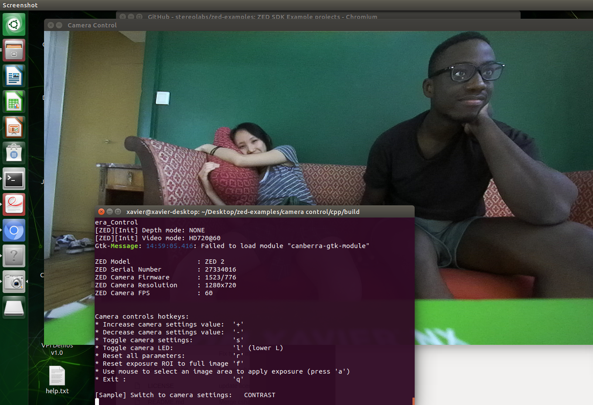
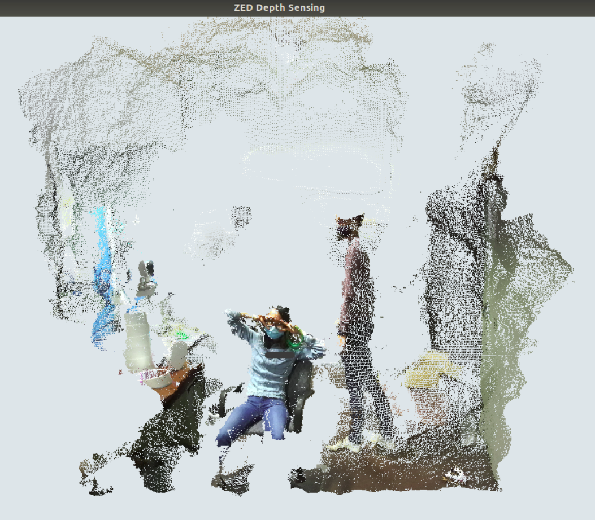
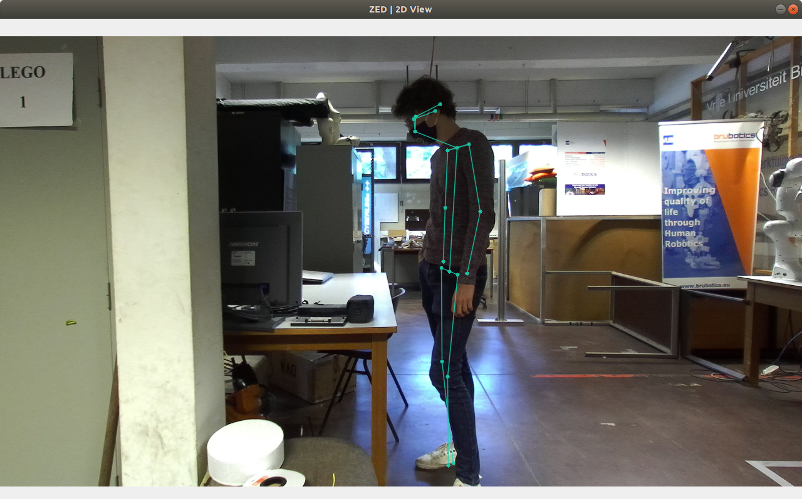
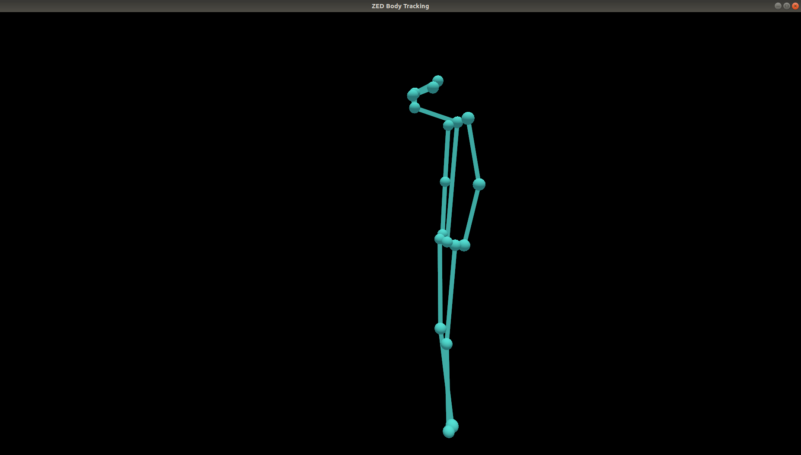
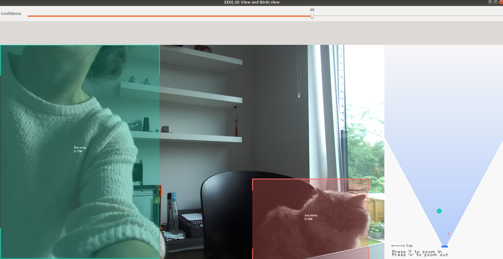
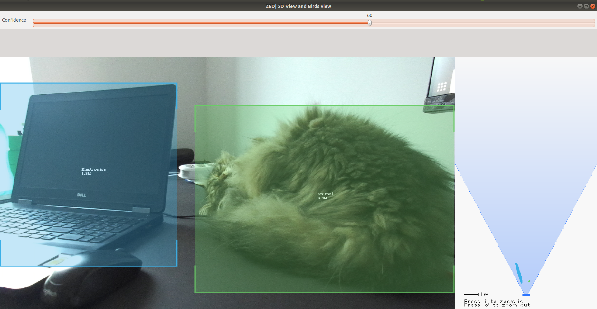

ZED 2 Stereo Camera
=======================

.. role:: raw-html(raw)
    :format: html

.. |Stereolabs_ZED2_general| raw:: html

   <a href="https://www.stereolabs.com/zed-2/" target="_blank">ZED 2 stereo camera</a>

.. |Stereolabs_ZED2_SDK| raw:: html

   <a href="https://www.stereolabs.com/developers/" target="_blank">ZED SDK</a>

.. |Stereolabs_ZED2_SDK_intro| raw:: html

   <a href="https://www.stereolabs.com/docs/ " target="_blank">introduction</a>

   
Read the general information about the |Stereolabs_ZED2_general| from Stereolabs
to know for which problems this camera can be a solution and what its technical specification are. 

The ZED 2 camera comes with a Software Development Kit (SDK). 
Read the |Stereolabs_ZED2_SDK| documentation to know with which third-party libraries and environments it can be interfaced
and on which platforms you can run it.  

After reading the general information about the camera and the ZED SDK, we recommend to read the |Stereolabs_ZED2_SDK_intro| before continuing. 

Getting started with ZED 2
---------------------------

.. |Stereolabs_ZED2_SDK_GettingStarted| raw:: html

   <a href="https://www.stereolabs.com/docs/installation/" target="_blank">quick start guide</a>

.. |NVIDIA_CUDA| raw:: html

   <a href="https://developer.nvidia.com/cuda-zone" target="_blank">CUDA</a>

.. |NVIDIA_Jetson_Xavier_NX| raw:: html

   <a href="https://www.nvidia.com/en-us/autonomous-machines/embedded-systems/jetson-xavier-nx/" target="_blank">Nvidia Jetson Xavier NX</a>
   
.. |Stereolabs_RecommendedSpecificationsZedSdk| raw:: html

   <a href="https://www.stereolabs.com/docs/installation/specifications/" target="_blank">recommended specifications for ZED SDK</a>
   
.. |Nvidia_JetsonModules| raw:: html

   <a href="https://developer.nvidia.com/embedded/jetson-modules" target="_blank">Jetson Modules</a>
   

First go through the |Stereolabs_ZED2_SDK_GettingStarted|. 

As you can read, the ZED SDK is available for Windows, Linux, and Nvidia Jetson platforms.
However, you need an NVIDIA graphics card to run |NVIDIA_CUDA|. 
In what follows, we will use the |NVIDIA_Jetson_Xavier_NX| platform to run the ZED SDK. 
We explain below why we have chosen this embedded platform.  

*  We don't have any laptop or desktop with an NVIDIA graphics card, so an embedded platform as the Jetson is the cheapest solution. 
*  The controller programs on the desktop that send commands to the Panda robot must run with *real-time priority* under a PREEMPT_RT kernel. 
   Since NVIDIA binary drivers are not supported on PREEMPT_RT kernels, buying an NVIDIA graphics card is not a solution. 
*  We tried first with an NVIDIA Jetson Nano, but this platform was not powerful enough. 
   The obtained point cloud and depth map were not as detailed as shown in the examples on the Stereolabs website
   and the skeleton display was lagging a lot with respect to the real human body dysplay in the body tracking example of the SDK tutorials. 
   Stereolabs told us that the camera resolution could be raised and the depth mode could be changed to ULTRA to improve the point cloud and depth map quality,
   but at the cost of a consequently lower frame rate when using the Jetson Nano. 
   According to Stereolabs, the Jetson Nano can run the ZED SDK in real-time, but with big compromises in terms of performance.
   If good performances are a requirement for the project, Stereolabs suggested to switch to a Jetson Xavier NX that is on another level.
*  Check also the |Stereolabs_RecommendedSpecificationsZedSdk| and the differences between the |Nvidia_JetsonModules|. 

*Side note.* We advise you to put back the ZED 2 camera back in the box when you are not using it. 
To do this, be careful to put first the built-in USB 3.0 cable in it before putting in the ZED 2 camera. 
Then you don't have to pull the USB 3.0 cable to get the camera out of the box. 

ZED SDK overview
-----------------

.. |Stereolabs_ZED2_SDK_overview_camera| raw:: html

   <a href="https://www.stereolabs.com/docs/video/" target="_blank">camera</a>

.. |Stereolabs_ZED2_SDK_overview_sensors| raw:: html

   <a href="https://www.stereolabs.com/docs/sensors/" target="_blank">sensors</a>   

.. |Stereolabs_ZED2_SDK_overview_depth_sensing| raw:: html

   <a href="https://www.stereolabs.com/docs/depth-sensing/" target="_blank">depth sensing</a>  
   
.. |Stereolabs_ZED2_SDK_overview_positional_tracking| raw:: html

   <a href="https://www.stereolabs.com/docs/positional-tracking/" target="_blank">positional tracking</a>  
   
.. |Stereolabs_ZED2_SDK_overview_spatial_mapping| raw:: html

   <a href="https://www.stereolabs.com/docs/spatial-mapping/" target="_blank">spatial mapping</a> 
   
.. |Stereolabs_ZED2_SDK_overview_body_tracking| raw:: html

   <a href="https://www.stereolabs.com/docs/body-tracking/" target="_blank">body tracking</a> 
   
It is really important to read through the SDK overview and find specific information about the |Stereolabs_ZED2_SDK_overview_camera|,
|Stereolabs_ZED2_SDK_overview_sensors|, |Stereolabs_ZED2_SDK_overview_depth_sensing|,
|Stereolabs_ZED2_SDK_overview_positional_tracking|, |Stereolabs_ZED2_SDK_overview_spatial_mapping|, 
and |Stereolabs_ZED2_SDK_overview_body_tracking|. 

Install the ZED SDK on Nvidia Jetson Xavier NX
------------------------------------------------------------

.. |Stereolabs_ZED2_SDK_NvidiaJetson| raw:: html

   <a href="https://www.stereolabs.com/docs/installation/jetson/" target="_blank">install ZED SDK on NVIDIA Jetson</a>

.. |Stereolabs_ZED2_SDK_GettingStartedWithJetsonXavierNX| raw:: html

   <a href="https://www.stereolabs.com/blog/getting-started-with-jetson-xavier-nx/" target="_blank">getting started with Jetson Xavier NX</a>

.. |Nvidia_JetPack| raw:: html

   <a href="https://developer.nvidia.com/embedded/jetpack" target="_blank">JetPack SDK</a>

.. |Nvidia_JetsonXavierNX_GettingStarted| raw:: html

   <a href="https://developer.nvidia.com/embedded/learn/get-started-jetson-xavier-nx-devkit" target="_blank">getting started with Jetson Xavier NX developer kit</a>

.. |RS_components_SanDisk_MicroSD| raw:: html

   <a href="https://benl.rs-online.com/web/p/micro-sd-cards/1747339/" target="_blank">SanDisk Ultra 64GB microSD card class 10 UHS-1 U1</a>

Follow the Stereolabs guide to |Stereolabs_ZED2_SDK_NvidiaJetson|
and also read the Stereolabs blog post about |Stereolabs_ZED2_SDK_GettingStartedWithJetsonXavierNX|. 

Download and install JetPack
^^^^^^^^^^^^^^^^^^^^^^^^^^^^

.. |Stereolabs_ZED2_SDK_DownloadInstallJetpack| raw:: html

   <a href="https://www.stereolabs.com/docs/installation/jetson/#download-and-install-jetpack" target="_blank">download and install JetPack</a>

.. note:: 
     VUB researchers who want to use this for their own research, should have their own microSD card, 
     such that they don't mess us my installations and 
     such that they are forced to test the install procedure and give comments on it to improve this tutorial. 
     
To download and install JetPack, you are redirected from the |Stereolabs_ZED2_SDK_DownloadInstallJetpack| section to NVIDIA's |Nvidia_JetPack|. 
There the SD Card Image method is explained to install the JetPack on a Jetson Xavier NX Developer Kit. 
Follow the |Nvidia_JetsonXavierNX_GettingStarted| tutorial, which explains the required hardware, 
the steps to write an image to the microSD card (I have followed the instructions for Windows), 
and how to setup and boot the Jetson.  

.. |repartition_sdcard_link| raw:: html

   <a href="https://www.instructables.com/Repartition-SD-Card-Windows/" target="_blank">Repartition-SD-Card-in-Windows</a>

.. |unlock_sd_card| raw:: html

   <a href="https://forum.dexterindustries.com/t/solved-etcher-says-sd-card-is-locked/2143" target="_blank">physically unlock the SD card</a>

.. |NVIDIA_Jetson_Linux_Developer_Guide| raw:: html

   <a href="https://docs.nvidia.com/jetson/l4t/index.html#page/Tegra%20Linux%20Driver%20Package%20Development%20Guide/power_management_jetson_xavier.html#wwpID0E0VO0HA" target="_blank">NVIDIA Jetson Linux Developer Guide</a>

.. |NVIDIA_forum_sd_card_problem| raw:: html

   <a href="https://forums.developer.nvidia.com/t/nvidia-jetson-xavier-nx-boot-fail/182229" target="_blank">NVIDIA forum</a>

.. |WiFi_USB_adapter| raw:: html

   <a href="https://learn.sparkfun.com/tutorials/adding-wifi-to-the-nvidia-jetson/all#hardware-overview-and-assembly" target="_blank">WiFi USB adapter</a>

.. |WiFi_USB_adapter_problem| raw:: html

   <a href="https://forums.developer.nvidia.com/t/jetson-nano-wifi-usb-adapter/73157" target="_blank">problem</a>

.. |WiFi_USB_adapter_solution| raw:: html

   <a href="https://forums.developer.nvidia.com/t/jetson-nano-wifi/72269" target="_blank">solution</a>

Below you can find some extra info on top of the NVIDIA tutorial *Write Image to the microSD Card*. 

*  NVIDIA proposes to use a microSD card with minmimum 16GB UHS-1. 
   We are using a |RS_components_SanDisk_MicroSD|. 

   .. warning:: 
       It is very important to use an microSD card with the right specifications. 
       We were using a premium high speed microSD card (check correct specs, add link), 
       but we had the problem that the Jetson crashed a lot of times. 
       Afterwards the Jetson always restarted automatically, but then everything on the microSD card was erased. 
       According to the contributors on the |NVIDIA_forum_sd_card_problem|, 
       this could be because the file system over the SD was broken or because the SD card itself was broken.
       We could solve this problem by using the |RS_components_SanDisk_MicroSD|.  

*  In case the microSD card you want to use for this project is not empty (and you don't want to use it for another project), 
   then you will have to format it first. 
   When your microSD card has multiple partitions, then you first have to repartition the microSD card before formatting. 
   Therefore, you can use *DiskPart* which is included on Windows. 
   See |repartition_sdcard_link| for more information. 
   After you have repartitioned the microSD card, you have to format it before usage.  
*  When you select the microSD card drive on which you want to write the image, you can get the message that the *microSD card is locked*. 
   Usually that means that the microSD card is physically locked and that you have to |unlock_sd_card|. 

Below you can find some extra info on top of the NVIDIA tutorial *Setup and First Boot*. 

*  Since the Jetson Xavier NX reference carrier board includes 802.11 plug-in WLAN & BT module preinstalled with antenna,
   it can automatically connect to a *Wireless Network*, which is not the case for the Jetson Nano. 
   For the **Jetson Nano** a |WiFi_USB_adapter| is required to connect to WiFi. 
   If that doesn't work, check this |WiFi_USB_adapter_problem| and its |WiFi_USB_adapter_solution|. 
*  The name, computer's name, username, and password we have used to log in at VUB are:

   *  name: JetsonXavier1 / JetsonXavier2 
   *  computer's name: xavier1-desktop / xavier2-desktop
   *  username: xavier1 / xavier2 
   *  password: JetsonXavier

*  When you are asked to choose the *APP Partition Size*, it is recommended to choose the maximum accepted size. 
*  When you select the *Nvpmodel Mode*, keep at the beginning the default settings, which is MODE_10W_DESKTOP - (Default). 
   We refer to the |NVIDIA_Jetson_Linux_Developer_Guide| for further information.
*  When you *log in* onto the Jetson Xavier NX, be careful that you sign in on the Ubuntu version.

   .. image:: img/jetson_signin_settings.jpg
       :align: center
       :width: 450px

.. |NVIDIA_forum| raw:: html

   <a href="https://developer.nvidia.com/login" target="_blank">NVIDIA forum</a>

.. note:: 
     Register to the |NVIDIA_forum| to ask questions in case you have problems with the NVIDIA Jetson Xavier NX. 

Download and install ZED SDK
^^^^^^^^^^^^^^^^^^^^^^^^^^^^^^^^^

.. |Stereolabs_ZED2_SDK_DownloadInstallZedSdk| raw:: html

   <a href="https://www.stereolabs.com/docs/installation/jetson/#download-and-install-the-zed-sdk" target="_blank">download and install the ZED SDK</a>

For this part, we followed the instructions from the |Stereolabs_ZED2_SDK_DownloadInstallZedSdk| section on the Stereolabs website. 

We have downloaded the ZED SDK for Jetpack 4.6 and installed it in silent mode. 
Silent mode enables you to perform an installation in a non-interactive mode, 
so in this mode you don't have to answer questions on dependenies, tools, and samples installation in the terminal during the installation procedure. 

Check also which python3 version and pip3 version is installed on the Jetson. 
We have executed the described experiments with python 3.6.9 and pip 9.0.1. 

.. code-block:: bash

   python3 --version
   pip3 --version 

ZED SDK tools
--------------------

.. |Stereolabs_ZED2_SDK_RunZedExplorer| raw:: html

   <a href="https://www.stereolabs.com/docs/installation/#run-zed-explorer" target="_blank">run the ZED Explorer</a>

.. |Stereolabs_ZED2_SDK_RunZedDepthViewer| raw:: html

   <a href="https://www.stereolabs.com/docs/installation/#run-zed-depth-viewer" target="_blank">ZED_Depth_Viewer</a>
      

After downloading and installing the ZED SDK, the next step in the |Stereolabs_ZED2_SDK_GettingStarted| 
is to |Stereolabs_ZED2_SDK_RunZedExplorer|, which is a good way to check that the ZED SDK is properly installed. 

*  Connect the ZED 2 camera to a USB port of the Jetson Xavier NX. 
*  Go to the terminal on the Jetson Xavier and navigate to the ZED tools folder
   where you can run the ZED Explorer: 
   
   .. code-block:: bash

        cd /usr/local/zed/tools/
        ./ZED_Explorer

*  If the ZED SDK is properly installed and the ZED 2 camera is recognized by the Jetson, you should see a 3D video from the left and right camera.  

   .. image:: img/zed_explo.png
        :width: 600
        :alt: ZED_Explorer

In the ZED tools folder you can also find |Stereolabs_ZED2_SDK_RunZedDepthViewer|, ZED_Diagnostic, ZEDfu, ZED_Sensor_viewer, and ZED_SVO_Editor
that you can run in a similar way as the ZED Explorer. 

.. |Stereolabs_ZED2_SDK_calibration_tool| raw:: html

   <a href="https://www.stereolabs.com/docs/video/camera-calibration/#calibration-tool" target="_blank">here</a>

.. warning:: 
      Although it is possible to **recalibrate the camera manually** using the ZED Calibration tool, i.e. ZED_Calibration, 
      it is **totally not recommended** for the ZED 2 cameras as is mentioned |Stereolabs_ZED2_SDK_calibration_tool|! 

ZED SDK tutorials and samples
-------------------------------

.. |Stereolabs_ZED2_building_C++application_linuxjetson| raw:: html

   <a href="https://www.stereolabs.com/docs/app-development/cpp/linux/" target="_blank">build a C++ application on Jetson</a> 

.. |ZED_Tutorials| raw:: html

    <a href="https://www.stereolabs.com/docs/tutorials/" target="_blank">tutorials</a>

.. |ZED_Samples| raw:: html

    <a href="https://www.stereolabs.com/docs/code-samples/#samples" target="_blank">samples</a>

To play around with the ZED tutorials and samples, you first have to download the example code
in the directory of your choice. 

.. code-block:: bash

    git clone https://github.com/stereolabs/zed-examples.git

There are C++ and python examples, we will use the C++ examples. 
Before you can run a C++ example, you will have to read how to |Stereolabs_ZED2_building_C++application_linuxjetson|
which is explained for the first tutorial that publishes the serial number of the ZED 2 camera. 

Try out all the |ZED_Tutorials| to familiarise with the ZED SDK.
All the tutorials give a text output printed in the terminal. 

Try also all the |ZED_Samples|. 
Building the C++ samples is done similarly as for the tutorials. 
Below you can find some results. 

.. |askubuntu_canberra_gtk_module| raw:: html

    <a href="https://askubuntu.com/questions/342202/failed-to-load-module-canberra-gtk-module-but-already-installed" target="_blank">install this module </a>

.. note:: 
      If you get the Gtk-Message: *Failed to load module "canberra-gtk-module"*, 
      then you have to |askubuntu_canberra_gtk_module| by running the following in the terminal. 

      .. code-block:: bash

         sudo apt install libcanberra-gtk-module libcanberra-gtk3-module

Camera control
^^^^^^^^^^^^^^

To change the camera settings, click on the camera control window such that your cursor is not in the terminal. 
Push ``s`` and you will see in the terminal which setting you can change. 
Push ``s`` again if you want to adapt another camera setting. 
Whereas my numlock was turned off, I couldn't use the ``+`` and ``-`` keys that are on the right side of my keyboard, 
but I could use the ``+`` and  ``-`` keys of my main keyboard. 

Depth sensing
^^^^^^^^^^^^^

This sample shows how to retreive the current point cloud. 

Body tracking
^^^^^^^^^^^^^

This sample display a skeleton over the live image and shows hot to detect and track 3D human bodies in space. 

Object detection (birds eye viewer)
^^^^^^^^^^^^^^^^^^^^^^^^^^^^^^^^^^^^^^^^^
In the object detection (birds eye viewer) sample, detected objects are displayed in a 3D view with the current point cloud.
You have to press ``c`` to clear filters such that the program can detect objects from all the available |ZED_SDK_object_classes|.
Without clearing the filters, the program can only detect people and vehicles.

.. |ZED_SDK_object_classes| raw:: html

   <a href="https://www.stereolabs.com/docs/api/group__Object__group.html#ga13b0c230bc8fee5bbaaaa57a45fa1177" target="_blank">object classes</a>

Avoid crashing and latency issues
---------------------------------

You can try the following things in case you have crashing and latency issues with the NVIDIA Jetson Xavier NX. 
If the following things don't solve your issues, then it is best to contact Stereolabs or Nvidia. 

Change power mode
^^^^^^^^^^^^^^^^^
You can switch the power mode of the NVIDIA Jetson to *MODE 15W 6CORE*, as depicted in the figure below.

.. image:: img/jetson_power_mode.png
    :align: center
    :width: 300px

Turn on the fan manually
^^^^^^^^^^^^^^^^^^^^^^^^
In order to reduce lags on the Jetson turn on the fan to 100%, by doing the following steps. 

* Install jetson-stats:

  .. code:: bash

      git clone https://github.com/rbonghi/jetson_stats
      sudo apt-get update
      sudo apt-get install python3-pip  # install pip3 if you don't have this yet installed
      cd jetson_stats
      sudo -H pip3 install -U jetson-stats

* Restart your Jetson and run :

  .. code:: bash

    jtop  # start jtop

* The following window will open with all the information of the Jetson

  .. image:: img/jtop.png
    :width: 500px

* Navigate with the arrow keys to tab ``5CTRL``. 
  You can set the fan method to manual by clicking with your mouse on ``manual``. 
  In the manual fan mode, you can increase the fan speed by pressing the ``p`` key and decrease the fan speed by pressing the ``m`` key. 

  .. image:: img/jtop_fan.png
    :width: 500px

If you don't have any crashing or latency issues, you can put the fan mode on ``default`` as we did to execute our programs. 