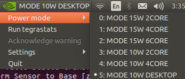

.. _ZED2_general:

ZED 2 Stereo Camera
=======================

.. role:: raw-html(raw)
    :format: html

.. |Stereolabs_ZED2_general| raw:: html

   <a href="https://www.stereolabs.com/zed-2/" target="_blank">ZED 2 stereo camera</a>

.. |Stereolabs_ZED2_SDK| raw:: html

   <a href="https://www.stereolabs.com/developers/" target="_blank">ZED SDK</a>

.. |Stereolabs_ZED2_SDK_intro| raw:: html

   <a href="https://www.stereolabs.com/docs/ " target="_blank">introduction</a>

   
First, read the general information about the |Stereolabs_ZED2_general| from Stereolabs.
It shows with some pictures and videos what it can do and what its technical specification are. 

The ZED 2 camera comes with a Software Development Kit (SDK). 
Read the |Stereolabs_ZED2_SDK| documentation to know with which third-party libraries and environments it can be interfaced
and on which platforms you can run it.  

Afterwards, we recommend to read the |Stereolabs_ZED2_SDK_intro| before continuing. 

.. _ZED2_GettingStarted:

Getting started
----------------

.. |Stereolabs_ZED2_SDK_GettingStarted| raw:: html

   <a href="https://www.stereolabs.com/docs/installation/" target="_blank">quick start guide</a>

.. |NVIDIA_CUDA| raw:: html

   <a href="https://developer.nvidia.com/cuda-zone" target="_blank">CUDA</a>

.. |Stereolabs_RecommendedSpecificationsZedSdk| raw:: html

   <a href="https://www.stereolabs.com/docs/installation/specifications/" target="_blank">recommended specifications for ZED SDK</a>
   
.. |Nvidia_JetsonModules| raw:: html

   <a href="https://developer.nvidia.com/embedded/jetson-modules" target="_blank">Jetson Modules</a>
   

First go through the |Stereolabs_ZED2_SDK_GettingStarted|. 

We advise you to put back the ZED 2 camera back in the box when you are not using it. 
To do this, be careful to put first the built-in USB 3.0 cable in it before putting in the ZED 2 camera. 
Then you don't have to pull the USB 3.0 cable to get the camera out of the box. 

As you can read, the ZED SDK is available for Windows, Linux, and Nvidia Jetson platforms.
However, you need an NVIDIA graphics card to run |NVIDIA_CUDA|. 

In what follows, we will use the Nvidia Jetson Xavier NX platform to run the ZED SDK. 
We explain below why we have chosen this platform.  

*  We don't have any laptop or desktop with an NVIDIA graphics card, so an embedded platform as the Jetson is the cheapest solution. 
*  The controller programs on the desktop that send commands to the Panda robot must run with *real-time priority* under a PREEMPT_RT kernel. 
   Since NVIDIA binary drivers are not supported on PREEMPT_RT kernels, buying an NVIDIA graphics card is not a solution. 
*  We tried first with an NVIDIA Jetson Nano, but it was not powerful enough. 
   For example in the body tracking example of the SDK tutorials, 
   we saw that the skeleton display sometimes lagged with respect to the real human body display. 
   To have a more detailed point cloud and depth map, the camera resolution can be raised and the depth mode can be changed to ULTRA,
   but the frame rate will consequently lower down a lot with the Jetson Nano. 
   According to Stereolabs, the Jetson Nano can run the ZED SDK in real-time, but with big compromises in terms of performance.
   If good performances are a requirement for the project, Stereolabs suggests to switch to a Jetson Xavier NX that is on another level.
*  Check also the |Stereolabs_RecommendedSpecificationsZedSdk| and the differences between the |Nvidia_JetsonModules|. 

.. _ZED2_InstallNvidiaJetsonXavierNX:

Install the ZED SDK on Nvidia Jetson Xavier NX
------------------------------------------------------------

.. |Stereolabs_ZED2_SDK_NvidiaJetson| raw:: html

   <a href="https://www.stereolabs.com/docs/installation/jetson/" target="_blank">install ZED SDK on NVIDIA Jetson</a>

.. |Stereolabs_ZED2_SDK_GettingStartedWithJetsonXavierNX| raw:: html

   <a href="https://www.stereolabs.com/blog/getting-started-with-jetson-xavier-nx/" target="_blank">getting started with Jetson Xavier NX</a>

.. |Nvidia_JetPack| raw:: html

   <a href="https://developer.nvidia.com/embedded/jetpack" target="_blank">JetPack</a>

.. |Nvidia_JetsonXavierNX_GettingStarted| raw:: html

   <a href="https://developer.nvidia.com/embedded/learn/get-started-jetson-xavier-nx-devkit" target="_blank">getting started with Jetson Xavier NX developer kit</a>

.. |RS_components_SanDisk_MicroSD| raw:: html

   <a href="https://benl.rs-online.com/web/p/micro-sd-cards/1747339/" target="_blank">SanDisk Ultra 64GB microSD card class 10 UHS-1 U1</a>

Follow the Stereolabs guide to |Stereolabs_ZED2_SDK_NvidiaJetson|
and also read the Stereolabs blog post about |Stereolabs_ZED2_SDK_GettingStartedWithJetsonXavierNX|. 

Download an install JetPack
^^^^^^^^^^^^^^^^^^^^^^^^^^^^
To download and install JetPack, you are redirected to |Nvidia_JetPack|. 
There the SD Card Image method is explained to install the JetPack on a Jetson Xavier NX Developer Kit. 
Follow the |Nvidia_JetsonXavierNX_GettingStarted| tutorial, which explains the required hardware, 
the steps to write an image to the microSD card, and how to setup and boot the Jetson.  
Below you can find some extra info on top of the NVIDIA tutorial. 

.. note:: 
     VUB researchs who want to use this for their own research, should have their own microSD card, 
     such that they don't mess us my installations and 
     such that they are forced to test the install procedure and give comments on it to improve this tutorial. 

.. |repartition_sdcard_link| raw:: html

   <a href="https://www.instructables.com/Repartition-SD-Card-Windows/" target="_blank">Repartition-SD-Card-in-Windows</a>

.. |unlock_sd_card| raw:: html

   <a href="https://forum.dexterindustries.com/t/solved-etcher-says-sd-card-is-locked/2143" target="_blank">physically unlock the SD card</a>

.. |NVIDIA_Jetson_Linux_Developer_Guide| raw:: html

   <a href="https://docs.nvidia.com/jetson/l4t/index.html#page/Tegra%20Linux%20Driver%20Package%20Development%20Guide/power_management_jetson_xavier.html#wwpID0E0VO0HA" target="_blank">NVIDIA Jetson Linux Developer Guide</a>

.. |NVIDIA_forum_sd_card_problem| raw:: html

   <a href="https://forums.developer.nvidia.com/t/nvidia-jetson-xavier-nx-boot-fail/182229" target="_blank">NVIDIA forum</a>

.. |WiFi_USB_adapter| raw:: html

   <a href="https://learn.sparkfun.com/tutorials/adding-wifi-to-the-nvidia-jetson/all#hardware-overview-and-assembly" target="_blank">WiFi USB adapter</a>

.. |WiFi_USB_adapter_problem| raw:: html

   <a href="https://forums.developer.nvidia.com/t/jetson-nano-wifi-usb-adapter/73157" target="_blank">problem</a>

.. |WiFi_USB_adapter_solution| raw:: html

   <a href="https://forums.developer.nvidia.com/t/jetson-nano-wifi/72269" target="_blank">solution</a>

*  NVIDIA proposes to use a microSD card with minmimum 16GB UHS-1. 
   We are using a |RS_components_SanDisk_MicroSD|. 

   .. warning:: 
       It is very important to use an microSD card with the right specifications. 
       We were using a premium high speed microSD card (check correct specs, add link), 
       but we had the problem that the Jetson crashed a lot of times. 
       Afterwards the Jetson always restarted automatically, but then everything on the microSD card was erased. 
       According to the contributors on the |NVIDIA_forum_sd_card_problem|, 
       this could be because the file system over the SD was broken or because the SD card itself was broken.
       We could solve this problem by using the |RS_components_SanDisk_MicroSD|.  

*  In case the microSD card you want to use for this project is not empty (and you don't want to use it for another project), 
   then you will have to format it first. 
   When your microSD card has multiple partitions, then you first have to repartition the microSD card before formatting. 
   Therefore, you can use *DiskPart* which is included on Windows. 
   See |repartition_sdcard_link| for more information. 
   After you have repartitioned the microSD card, you have to format it before usage.  
*  When you select the microSD card drive on which you want to write the image, you can get the message that the *microSD card is locked*. 
   Usually that means that the microSD card is physically locked and that you have to |unlock_sd_card|. 
*  When you are asked to choose the *APP Partition Size*, it is recommended to choose the maximum accepted size. 
*  When you select the *Nvpmodel Mode*, keep at the beginning the default settings, which is MODE_10W_DESKTOP - (Default). 
   Refer to |NVIDIA_Jetson_Linux_Developer_Guide| for further information. 
*  The username and password we have used to log in at VUB are:

   *  username: xavier1 / xavier2 
   *  password: JetsonXavier

*  Since the Jetson Xavier NX reference carrier board includes 802.11 plug-in WLAN & BT module preinstalled with antenna,
   it can automatically connect to a *Wireless Network*, which is not the case for the Jetson Nano. 
   For the **Jetson Nano** a |WiFi_USB_adapter| is required to connect to WiFi. 
   If that doesn't work, check this |WiFi_USB_adapter_problem| and its |WiFi_USB_adapter_solution|. 
*  You can avoid a *core dumped error* by adding "export OPENBLAS_CORETYPE=ARMV8" in the .bashrc file, 
   which is one of the hidden files that you can see by ``CTRL+h`` in the GUI of the home directory or ``ls -a`` in the terminal of the home directory. 

   .. code-block:: bash

        echo "export OPENBLAS_CORETYPE=ARMV8" >> ~/.bashrc
*  When you *log in* onto the Jetson Xavier NX, be careful that you sign in on the Ubuntu version.

   .. image:: img/jetson_signin_settings.jpg
       :width: 650px

Download and install the ZED SDK
^^^^^^^^^^^^^^^^^^^^^^^^^^^^^^^^^

ROS integration
----------------

.. |Stereolabs_ZED2_SDK_GettingStartedWithROSonJetsonXavierNX| raw:: html

   <a href="https://www.stereolabs.com/blog/ros-and-nvidia-jetson-xavier-nx/" target="_blank">getting started with ROS on Jetson Xavier NX</a>

|Stereolabs_ZED2_SDK_GettingStartedWithROSonJetsonXavierNX|

Avoid crashing and latency issues
---------------------------------

.. warning:: 
     Rewrite this part later on. 

You only have to try the following things in case you have crashing and latency issues with the NVIDIA Jetson Xavier NX. 
If the following things don't solve your issues, then it is best to contact Stereolabs or Nvidia. 

Change power mode
^^^^^^^^^^^^^^^^^
You can switch the power mode of the NVIDIA Jetson to *MODE 15W 6CORE*, as depicted in the figure below.

Turn on the fan manually
^^^^^^^^^^^^^^^^^^^^^^^^
In order to reduce lags on the Jetson turn on the fan to 100%, by doing the following steps. 

* Install jetson-stats:

  .. code:: bash

      git clone https://github.com/rbonghi/jetson_stats
      sudo apt-get update
      sudo apt-get install python3-pip  # install pip3 if you don't have this yet installed
      cd jetson_stats
      sudo -H pip3 install -U jetson-stats

* Restart your Jetson and run :

  .. code:: bash

    jtop  # start jtop

* The following window will open with all the information of the Jetson

  .. image:: img/jtop.png
    :width: 500px

* Navigate with the arrow keys to tab ``5CTRL``. 
  You can set the fan method to manual by clicking with your mouse on ``manual``. 
  In the manual fan mode, you can increase the fan speed by pressing the ``p`` key and decrease the fan speed by pressing the ``m`` key. 

  .. image:: img/jtop_fan.png
    :width: 500px

.. _jetson_shell_mode:
   
Set the Jetson in shell mode
^^^^^^^^^^^^^^^^^^^^^^^^^^^^
If you try to install something and the Jetson keeps shutting down, you can set the Jetson in shell mode.

*  Disable the GUI for booting the Jetson and turn on the shell mode:

   .. code-block:: bash

      sudo systemctl set-default multi-user.target # To disable GUI on boot

*  While in shell mode:

    * Enter the username and password

    * Enable wifi and ethernet connection in the text mode Network Manager:

    .. code-block:: bash

        nmtui  # open network manager

    * Run rviz:

    .. code-block:: bash

        roslaunch zed_display_rviz display_zed2.launch

    * Once the AI model downloaded, come back to graphical mode:

    .. code-block:: bash

        # To enable GUI again issue the command:
        sudo systemctl set-default graphical.target

* Now you can launch rviz with object detection on graphical mode.