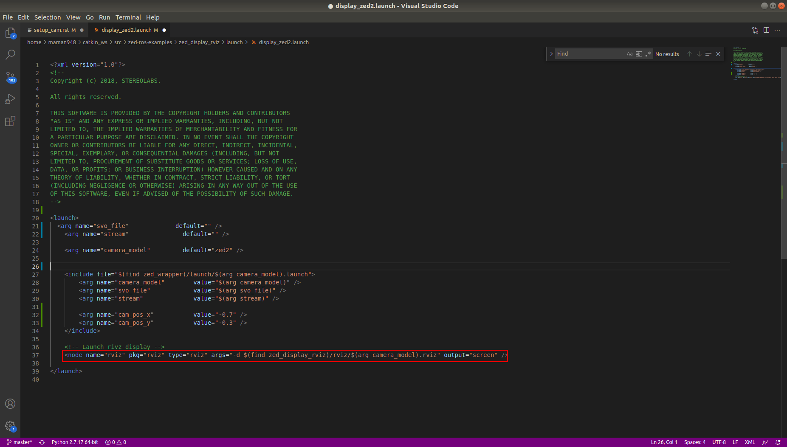

ZED 2 with ROS Integration
===========================

.. role:: raw-html(raw)
    :format: html

Getting started with ROS and ZED
---------------------------------------------

.. |Stereolabs_ZED2_ROS_integration| raw:: html

   <a href="https://www.stereolabs.com/docs/ros/" target="_blank">getting started with ROS and ZED </a>

.. |Nvidia_JetPack_ubuntu| raw:: html

   <a href="https://developer.nvidia.com/embedded/jetpack" target="_blank">JetPack 4.6</a>

.. |Nvidia_Jetson_Xavier_NX_upgrade_Ubuntu20| raw:: html

   <a href="https://carlosedp.medium.com/upgrading-your-nvidia-jetson-xavier-nx-to-latest-ubuntu-focal-fossa-20-04-5e92ccc5a66" target="_blank">this article</a>

.. |ROS_Melodic_installation| raw:: html

   <a href="http://wiki.ros.org/melodic/Installation/Ubuntu" target="_blank">ROS Melodic</a>

.. |Stereolabs_github_zed_ros_wrapper| raw:: html

   <a href="https://github.com/stereolabs/zed-ros-wrapper" target="_blank">zed-ros-wrapper</a>

.. |Stereolabs_github_zed_ros_interfaces| raw:: html

   <a href="https://github.com/stereolabs/zed-ros-interfaces" target="_blank">zed-ros-interfaces</a>

.. |Stereolabs_github_zed_ros_examples| raw:: html

   <a href="https://github.com/stereolabs/zed-ros-examples" target="_blank">zed-ros-examples</a>

.. |Stereolabs_ZED_ROS_integration_buildpackages| raw:: html

   <a href="https://www.stereolabs.com/docs/ros/#build-the-packages " target="_blank">build the packages</a>

Read and follow the |Stereolabs_ZED2_ROS_integration| tutorial.

Below you will find some extra information on top of what the tutorial explains for the **installation** on the NVIDIA Jetson Xavier NX. 

*  We have installed |Nvidia_JetPack_ubuntu| on our NVIDIA Jetson Xavier NX and because this filesystem is based on Ubuntu 18.04, 
   we will follow the ROS installation procedure for Ubuntu 18.04, as such we have to install ROS Melodic. 
   If you want to upgrade the NVIDIA Jetson Xavier NX to Ubuntu 20.04, you can read |Nvidia_Jetson_Xavier_NX_upgrade_Ubuntu20|. 
   We didn't do this upgrade and worked on Ubuntu 18.04. 
*  For the installation of the ZED SDK for JetPack 4.6, we refer to :ref:`Install the ZED SDK on NVIDIA Jetson Xavier NX <Install_ZED_SDK_JetsonXavierNX>`. 
*  Follow the ROS tutorial to install |ROS_Melodic_installation|. 
   We have installed the *Desktop Install* version instead of the *Desktop-Full Install* version. 

   .. note::
       “ROS Desktop Full” is a more complete package, however it is not recommended for embedded platforms; 
       2D/3D simulators will be installed, requiring increased storage space and compute power.

*  To build the ZED ROS packages (|Stereolabs_github_zed_ros_wrapper|, |Stereolabs_github_zed_ros_interfaces|, and |Stereolabs_github_zed_ros_examples|)
   we have followed the |Stereolabs_ZED_ROS_integration_buildpackages| section. 

   .. note::
       If you install the |Stereolabs_github_zed_ros_wrapper| package, 
       then the |Stereolabs_github_zed_ros_interfaces| package is already included as a submodule. 
       As such, you will get an error *Rosdep experienced an error: Multiple packages found with the same name "zed_interfaces"*:
       zed-ros-interfaces and zed-ros-wrapper/zed-ros-interfaces.
       So on the Jetson Xavier NX you only have to install the |Stereolabs_github_zed_ros_wrapper| and |Stereolabs_github_zed_ros_examples| packages. 

*  When you display ZED data using RViz on the Jetson Xavier NX, it is highly probable that you will get latency problems. 
   Although the Jetson Xavier NX is a powerful embedded board, it is still an *embedded* board,
   that's why it cannot handle all the tasks that you normally perform on a desktop or laptop PC.

   The main problem with RVIZ for example is that it is a highly demanding application.
   Therefore it can correctly display the data directly on the Xavier *only* by reducing the publishing rate of the point cloud and its resolution.
   You can find :download:`an example of a parameter configuration <common.yaml>` that will allow you to display a point cloud on the Jetson Xavier NX, but not at full rate.

   Go to the directory with the original common.yaml file, rename it to common-original.yaml and add the new common.yaml file.

   .. code-block:: bash

       cd path/to/catkin_ws/src/zed-ros-wrapper/zed_wrapper/params/
       mv ./common.yaml ./common-original.yaml # rename the original commong.yaml file
       mv ~/Downloads/common.yaml ~/catkin_ws/src/zed-ros-wrapper/zed_wrapper/params/common.yaml # move the newly downloaded common.yaml to the directory

   When launching again the display rviz program again, there should be less latency problems. 

Make a ROS network via an ethernet connection
---------------------------------------------------

To correctly display the point cloud data without reducing the publishing rate of the point cloud and its resolution, 
we suggest you to **run RViz on an external machine connected by an ethernet cable**.

Setup the external computer with |install-ubuntu-18| and |install-ros-melodic|.  

.. |install-ubuntu-18| raw:: html

        <a href="https://ubuntu.com/download/alternative-downloads" target="_blank">Ubuntu 18.04</a>

.. |install-ros-melodic| raw:: html

        <a href="http://wiki.ros.org/melodic/Installation/Ubuntu" target="_blank">ROS Melodic</a>

.. |ROS_MultipleMachines| raw:: html

        <a href="http://wiki.ros.org/ROS/Tutorials/MultipleMachines" target="_blank">running ROS across multiple machines</a>

.. |ROS_NetworkSetup| raw:: html

        <a href="http://wiki.ros.org/ROS/NetworkSetup" target="_blank">ROS network setup</a>

ROS can run across multiple machines via a WiFi connection or via an ethernet connection. 
We will explain the method via an ethernet connections, since it is more efficient to use an ethernet connection for data transmission. 
You can also take a look at |ROS_MultipleMachines|, |ROS_NetworkSetup|, and :download:`ROS on multiple machines<Politechnico_ROS_on_multiple_machines.pdf>`.

Use the ethernet cable to connect the Jetson Xavier NX with the external computer. 

Go to the network settings on both computers, make sure the wired connection is turned on, 
and add a new connection profile. 

Go to the IPv4 section and put the IPv4 Method to Manual on both computers. 
You can choose the IP address you want, but if you set your netmask to 255.255.255.0, 
then on both computers the three first numbers must be the same. 
For example, we have set the IP address of the external computer to 169.254.99.1 and the IP address of the Jetson to 169.254.99.2.
Don't forget to save these settings. 

.. image:: img/ipv4_computer.png
    :align: center
    :width: 500px

You can now ping both computers to see if they are correctly connected.

* Open a new terminal on the Jetson Xavier NX (with IP 169.254.99.2) and ping to the external computer (with IP 169.254.99.1)

  .. code-block:: bash

    ping 169.254.99.1

  .. image:: img/ping_jetson2external.png
      :width: 400px

* Open a new terminal on the external computer (with IP 169.254.99.1) and ping to the Jetson Xavier NX (with IP 169.254.99.2)

  .. code-block:: bash

    ping 169.254.99.2

  .. image:: img/ping_external2jetson.png
      :width: 400px

Via the terminal, you have to add the ROS_IP and ROS_MASTER_URI to the .bashrc of both computers. 

* On the Jetson Xavier NX:

  .. code-block:: bash

    echo "export ROS_IP=169.254.99.2" >> ~/.bashrc  #IP of the Jetson Xavier
    echo "export ROS_MASTER_URI=http://169.254.99.1:11311" >> ~/.bashrc # IP of the ROS master

* On the external computer:

  .. code-block:: bash

    echo "export ROS_IP=169.254.99.1" >> ~/.bashrc  #IP of the ROS master
    echo "export ROS_MASTER_URI=http://169.254.99.1:11311" >> ~/.bashrc # IP of the ROS master

.. |chrony_tuxfamily| raw:: html

        <a href="https://chrony.tuxfamily.org/" target="_blank">chrony</a>

.. |ROS_answers_chrony| raw:: html

        <a href="https://answers.ros.org/question/11180/chrony-configuration-and-limitations/ " target="_blank">this ROS issue</a>

Synchronize the clock of the Jetson and the external computer by running the following command on both devices: 

.. code-block:: bash

    sudo date -s "$(wget -qSO- --max-redirect=0 google.com 2>&1 | grep Date: | cut -d' ' -f5-8)Z"

.. note:: Another way to synchronize the time across multiple machines is to use |chrony_tuxfamily|, see also |ROS_answers_chrony|. 

Display Rviz depth map and point cloud on an external computer
------------------------------------------------------------------------

Now you should be able to display the RViz program on your external computer without having latency issues! 

Go to the *display_zed2.launch* file on the Jetson Xavier NX, which you can find at the following address

.. code-block:: bash

    cd path/to/catkin_ws/src/zed-ros-examples/zed_display_rviz/launch/

and comment the selected line such that RViz will not open on the Jetson Xavier NX

* Open a new terminal on the **external computer** and run

  .. code-block:: bash

      roscore

* Open a new terminal on the **Jetson** and run 

  .. code-block:: bash

      roslaunch zed_display_rviz display_zed2.launch

* Open another terminal on the **external computer** and run

  .. code-block:: bash

      rosrun rviz rviz

To display the depth map and the point cloud in rviz, you have to add ``Camera`` to the Displays tab.
When added, click on Image Topic and select the topic with *depth* in the name. 
Afterwards, you can add ``PointCloud2``, click on Topic and select the topic with *point_cloud* in the name. 
Finally, you should get something similar as in the figure below. 

.. image:: img/rviz_computer.png
    :align: center
    :width: 700px
