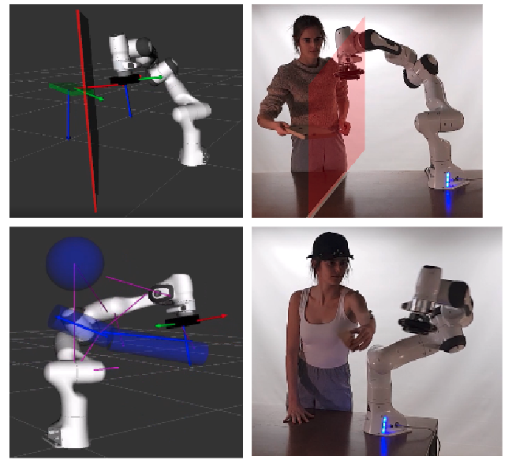
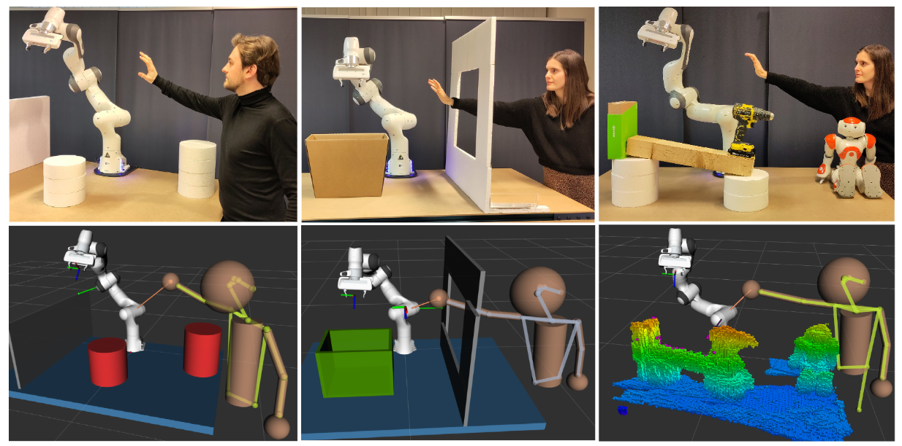

.. panda robot documentation master file, created by
   sphinx-quickstart on Tue Jun  8 09:57:25 2021.
   You can adapt this file completely to your liking, but it should at least
   contain the root `toctree` directive.

.. role:: raw-html(raw)
    :format: html

Safe Human-Robot Collaboration
===============================

We want to provide a ROS-based open source code framework that enables users to test our proposed planning and control framework for exemplary numerical and experimental validation cases on the 7DOF Franka Emika Panda robot, and in realistic Human-Robot Collaboration (HRC) scenarios with Vicon motion capture data and Stereolabs ZED2 data.

.. note:: The explanation on this website is still under construction. 
            The GitHub repository, https://github.com/panda-brubotics, we are referring to is still private, but will be made public when all relevant articles are published.  
            People from VUB and CU Boulder that are invited to the private repo may not share the content with others.
            For questions, you can always contact Kelly Merckaert: kelly.merckaert@vub.be.

We show how a robotic manipulator can reactively avoid collisions with a human by employing the trajectory-based Explicit Reference Governor (ERG) and the Vicon motion capture system. 

We show how a robotic manipulator can reactively reach its end-effector pose references and avoid collisions with the static cluttered environment and humans by employing a Rapidly-exploring Random Tree (RRT) and trajectory-based ERG algorithm, using the Stereolabs ZED2 camera to detect the obstacles. 

.. This tutorial explains different ways of safe Human-Robot Collaboration (HRC),
.. from safe human-robot coexistence to safe physical human-robot interaction.
.. We explain how to validate the experiments on a Franka Emika Panda robot arm
.. and which sensing systems can be used. For people that don't have the real robot arm, 
.. we explain how to validate the algorithms in the Gazebo simulation environment.  

.. .. |GPL-3-license| raw:: html

..    <a href="https://www.gnu.org/licenses/gpl-3.0.nl.html" target="_blank">GPL-3 license</a>

.. .. admonition:: todo

..   *  include wrap up youtube video
..   *  add |GPL-3-license| to ALL files
..   *  make the GitHub repo public
..   *  change the link to the GitHub repo in all the code block bashes 

Introduction
-------------

.. toctree::
   :maxdepth: 1

   doc/introduction/introduction

Getting Started with ROS, Gazebo, and Git
------------------------------------------

.. toctree::
   :maxdepth: 1

   doc/getting_started/getting_started

Franka Emika Panda Gazebo Simulation 
-------------------------------------

Read this if you don't have access to a Franka Emika Panda robot or if you first want to test the planning and control algorithms in Gazebo. 

.. toctree::
   :maxdepth: 1

   doc/gazebo_simulation/gazebo_simulation

Franka Emika Panda Robot Arm
-----------------------------

Here we explain how you can get acquainted with the *real* Panda robot.

.. toctree::
   :maxdepth: 1

   doc/panda_arm/panda_arm
   doc/franka_control_interface/franka_control_interface

Vicon Motion Capture System
----------------------------

Here we explain how to use the Vicon motion capture system in general, 
how to make subjects with Vicon Nexus, how to make objects with Vicon Tracker, 
and how to use the Vicon information for reference object and obstacle recognition with the Panda robot. 

.. toctree::
   :maxdepth: 1

   doc/vicon/vicon
   doc/vicon_panda/vicon_panda

Stereolabs ZED 2 Stereo Camera
------------------------------

In the *ZED 2 Stereo Camera* chapter you will learn to run the ZED 2 camera, which is a stereo camera from Stereolabs, on the Nvidia Jetson Xavier NX. 
It is also possible to use a computer which has an Nvidia graphics card and Nvidia drivers. 
Note that a real-time kernel is required for the real-time control of the Panda robot 
and that Nvidia binary drivers are not supported on real-time kernels, which is why we use these small embedded computers. 
At the end you will learn how to receive the ZED 2 camera data via ROS.

.. toctree::
   :maxdepth: 1

   doc/zed/zed
   doc/zed_ros/zed_ros
   doc/zed_panda/zed_panda
   zed_ros/octomap

.. toctree::
   :maxdepth: 1

   zed_panda/zed_panda_setup
   zed_panda/zed_panda_objects_detection
   zed_panda/zed_panda_octomap

Obstacle Avoidance
---------------------------

Explanation + reference to [1], [2], [3]. 

Physical Human-Robot Interaction
--------------------------------------

Explanation + reference to [4].

Training a Neural Network for Object Detection
----------------------------------------------

.. toctree::
   :maxdepth: 1

   AI/purpose
   AI/data
   AI/train

References
-----------

[1] K. Merckaert, B. Convens, C. Wu, A. Roncone, M. M. Nicotra, and B. Vanderborght,
**Real-time motion control of robotic manipulators for safe human-robot coexistence**,
*Robotics and Computer-Integrated Manufacturing*, vol.73, 2022, |10.1016/j.rcim.2021.102223|.

[2] paper about planning + ERG --> constraint-based planning and control

[3] paper about MPC + ERG  (+ planning) --> optimization-based planning and control

[4] paper about combining the two modes, physical interaction + obstacle avoidance 

.. |10.1016/j.rcim.2021.102223| raw:: html

    <a href="https://doi.org/10.1016/j.rcim.2021.102223" target="_blank">10.1016/j.rcim.2021.102223</a>

Attribution
-----------

Kelly Merckaert, Thomas Lefevre, Binjie Dai, Kouassi Agbetoglo.
