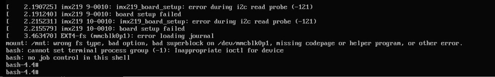

Jetson issues
=============

This section will list all the problems we encountered while using the NVIDIA Jetson NX and the ZED2 camera.

NVIDIA Jetson Xavier NX boot fail
---------------------------------

The Jetson shutdown while we were using it and when we restarted it this message appeared

The Jetson failed to boot and everything on the microSD Card has been erased. The first solution was to rewrite the image to the microSD Card but it also failed

.. image:: images/flash_failed.jpg
    :width: 300

This problem occurred when the Jetson shutdown and restart by itself. Everything was erased from the SD card. We tried to x²flash the Jetson Xavier NX Developer Kit SD Card image but it failed.
In our case it seems that the boot fail of the Jetson happened when the Flash of the Jetson Xavier NX Developer Kit SD card failed.

To solve this problem it's better to use at least a UHS-1 microSD Card.
Here a `link to the Thread <https://forums.developer.nvidia.com/t/nvidia-jetson-xavier-nx-boot-fail/182229?u=kouassi948>`_ we created on NVIDIA forum.

Note: Use a high quality microSD Card (at least 16GB UHS-1) of you want to have better performance on your Jetson.

Network Connection problems
---------------------------
Although we didn't have this problem with the NVIDIA Jetson Xavier NX, 
we couldn't connect automatically to WiFi with the NVIDIA Jetson Nano. 
As an inspiration to solve connection problems with a Jetson, we added the explanation for the |NVIDIA_Jetson_Nano_tutorial|. 

.. |NVIDIA_Jetson_Nano_tutorial| raw:: html

   <a href="https://developer.nvidia.com/embedded/learn/get-started-jetson-nano-devkit" target="_blank">NVIDIA Jetson Nano</a>

WiFi Connection
^^^^^^^^^^^^^^^
Use a |WiFi_USB_adapter| to connect to WiFi. 
If that doesn't work, check this |WiFi_USB_adapter_problem| and its |WiFi_USB_adapter_solution|. 

.. |WiFi_USB_adapter| raw:: html

   <a href="https://learn.sparkfun.com/tutorials/adding-wifi-to-the-nvidia-jetson/all#hardware-overview-and-assembly" target="_blank">WiFi USB adapter</a>

.. |WiFi_USB_adapter_problem| raw:: html

   <a href="https://forums.developer.nvidia.com/t/jetson-nano-wifi-usb-adapter/73157" target="_blank">problem</a>

.. |WiFi_USB_adapter_solution| raw:: html

   <a href="https://forums.developer.nvidia.com/t/jetson-nano-wifi/72269" target="_blank">solution</a>

Ethernet Connection
^^^^^^^^^^^^^^^^^^^   
*  Go in the system parameters then in network and find the wired option with a connection.
*  In the options of the wired connection, go to ipv4, switch the method to manual and enter the IP, submask and DNS servers.  
*  for internet connection : IP=134.184.20.129, subnet mask=24 DNS= 134.184.250.7, 134.184.15.13, Gateway=134.184.20.100
*  The jetson will also be connected directly to the main computer( franka computer). For this local connection, no DNS is needed. 
   The only constrain is that the last digits of the IP adress must be unique on the local netwwork. 
   For the rest of the tutorial the local IP will be 192.168.4.66, subnet=24. 
   The master has the IP 192.168.4.65 and will be used as gateway for the direct connection.  

SSH Connection
^^^^^^^^^^^^^^
*  Install openssh-server on the Jetson Nano. (This one is the server and doesn't need the client package). 
*  Install openssh-client and openssh-server on the Franka desktop. This computer will connect to the jetson so we need to authorize the ssh access. 
*  The parameters to modify on the Jetson are in the file:

    .. code:: bash

        sudo gedit /etc/ssh/sshd_config 

*  Find the parameter *PermitRootLogin*, uncomment the line and change the value to : yes. 
*  add the line : *AllowUsers root jetson-nano ( root + username)*. These changes allows to run administrator commands.
*  Change *PasswordAuthentication* to yes. This allows to use a password to connect. 
   For devices on internet and not on a local connection only, a key is reccomened. 
*  Restart ssh: 

    .. code:: bash

        sudo service ssh restart

If the git clone command doesn't work anymore, then reinstall git:

.. code-block:: bash

    sudo apt-get update
    sudo apt-get remove git
    sudo apt-get install git

.. warning::
    We had a core dumped error when using the old SD card. 
    You can avoid a core dumped error by adding "export OPENBLAS_CORETYPE=ARMV8" in the .bashrc file.

    .. code-block:: bash

        echo "export OPENBLAS_CORETYPE=ARMV8" >> ~/.bashrc

.. _jetson_shell_mode:

Set Jetson in Shell mode and download the IA model
--------------------------------------------------

* Set shell mode on jetson:

.. code-block:: bash

   # To disable GUI on boot, run:
   sudo systemctl set-default multi-user.target

* While in shell mode:

    * Enter the username and password, here it is:

        * username: xavier
        * password: JetsonXavier

    * Enable wifi and ethernet connection in the text mode Network Manager:

    .. code-block:: bash

        nmtui  # open network manager

    * Run rviz:

    .. code-block:: bash

        roslaunch zed_display_rviz display_zed2.launch

    * Once the AI model downloaded, come back to graphical mode:

    .. code-block:: bash

        # To enable GUI again issue the command:
        sudo systemctl set-default graphical.target

* Now you can launch rviz with object detection on graphical mode.
