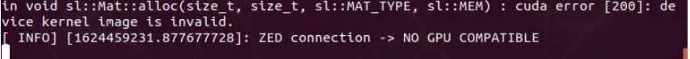

Jetson and ZED2 issues
======================

ZED2: Cuda error
----------------

This problem popped-up when we were trying to run rviz on a external computer (the Jetson and the computer were connected together).
It was impossible to use the ZED2 camera with zed-ros scripts. So to solve it we had to reinstall the :ref:`ZED SDK for Jetpack 4.5<ZED_SDK>`

