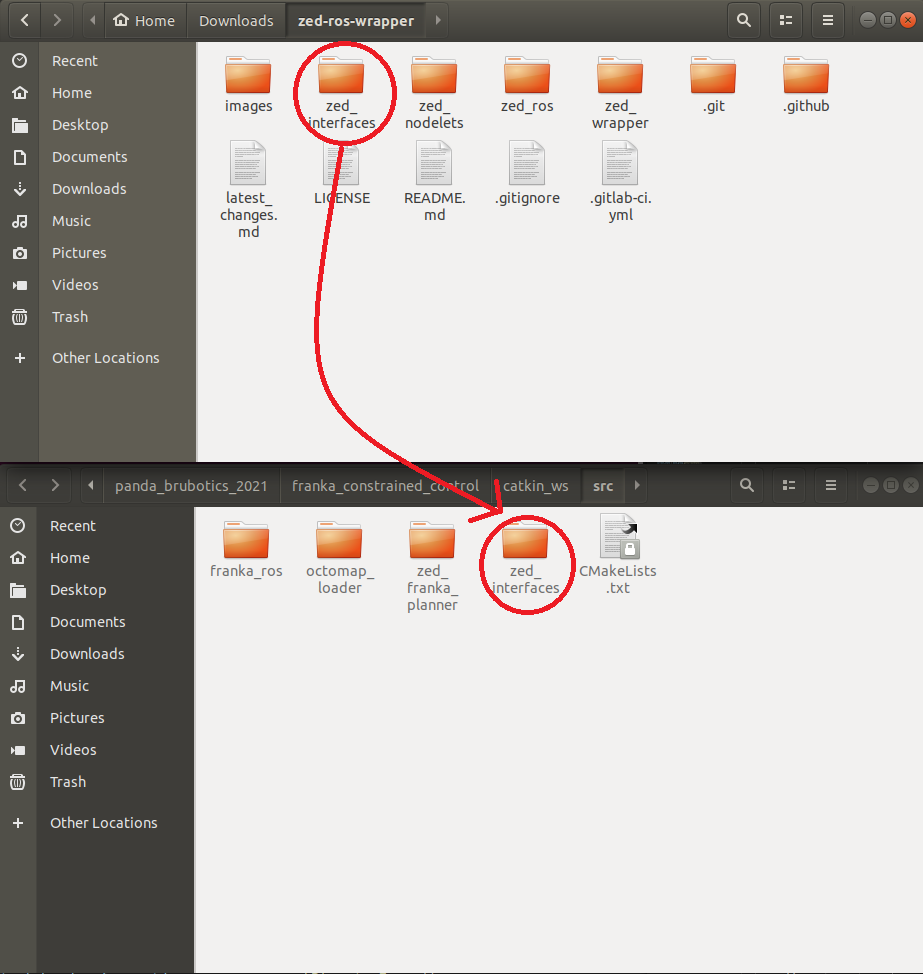

Objects detection with ZED2 and ROS
===================================

Download example code
---------------------

| NB: Do this in your catkin workspace
| If you have not done it yet, the example code for the zed camera running with ROS can be cloned with

.. _ZED_ROS_WRAPPER:
.. code-block:: bash

    git clone https://github.com/stereolabs/zed-ros-wrapper.git
    git clone https://github.com/stereolabs/zed-ros-examples.git

Add objects detection in rviz
-----------------------------

| You can find `how to add object detection in rviz in this tutorial <https://www.stereolabs.com/docs/ros/object-detection/>`_
| NB : If you launch the zed2 camera with rviz  with a new model of the object detection, it will download the AI model.
| In our case, the Jetson shutdown every time we try to download an AI model

We avoided this problem by installing the AI model with the shell mode on Jetson:

.. _jetson_shell_mode:

* Set shell mode on jetson:

.. code-block:: bash

   # To disable GUI on boot, run:
   sudo systemctl set-default multi-user.target

* While in shell mode:

    * Enter the username and password, here it is:

        * username: xavier
        * password: JetsonXavier

    * Enable wifi and ethernet connection in the text mode Network Manager:

    .. code-block:: bash

        nmtui  # open network manager

    * Run rviz:

    .. code-block:: bash

        roslaunch zed_display_rviz display_zed2.launch

    * Once the AI model downloaded, come back to graphical mode:

    .. code-block:: bash

        # To enable GUI again issue the command:
        sudo systemctl set-default graphical.target

* Now you can launch rviz with object detection on graphical mode.

.. _obj_detection_on_panda_computer:

Get the detected objects information
------------------------------------

Build Stereolabs libraries
^^^^^^^^^^^^^^^^^^^^^^^^^^

| In order to get all the information from the detected objects in a c++ program, we need to build the object library.
| This step is done when you build the `zed-ros-wrapper package <https://github.com/stereolabs/zed-ros-wrapper>`_ but on some computers this would not work since it uses CUDA and it can only be installed on a computer with nvidia.
| However you can download the zed-ros-wrapper package, move the zed_interfaces directory to your catkin_ws/src directory so you can build the needed libraries with ``catkin_make``

| You have to add the following lines into your package.xml file for using the zed library in your package:

.. code-block:: xml

    <build_depend>zed_interfaces</build_depend>
    <exec_depend>zed_interfaces</exec_depend>

Subscribe to detected objects
^^^^^^^^^^^^^^^^^^^^^^^^^^^^^
| You can now subscribe to the detected object topic which is ``/zed2/zed_node/obj_det/objects``
| The following code print the detected objects and some useful information:

.. code-block:: c++

    #include <ros/ros.h>
    #include <zed_interfaces/object_stamped.h>
    #include <zed_interfaces/objects.h>

    /**
     * Subscriber callback
     */
    void objectListCallback(const zed_interfaces::ObjectsStamped::ConstPtr& msg)
    {
      ROS_INFO("***** New object list *****");
      for (int i = 0; i < msg->objects.size(); i++)
      {
        if (msg->objects[i].label_id == -1)
          continue;

        ROS_INFO_STREAM(msg->objects[i].label << " [" << msg->objects[i].label_id << "] - Pos. ["
                                              << msg->objects[i].position[0] << "," << msg->objects[i].position[1] << ","
                                              << msg->objects[i].position[2] << "] [m]"
                                              << "- Conf. " << msg->objects[i].confidence
                                              << " - Tracking state: " << static_cast<int>(msg->objects[i].tracking_state));
      }
    }

    /**
     * Node main function
     */
    int main(int argc, char** argv) {
        ros::init(argc, argv, "zed_obj_det_sub_tutorial");

        ros::NodeHandle n;

        // Subscriber
        ros::Subscriber subObjList= n.subscribe("/zed2/zed_node/obj_det/objects", 1, objectListCallback);

        ros::spin();

        return 0;
    }

Add bunding box in rviz
^^^^^^^^^^^^^^^^^^^^^^^

* Create a new directory in your catkin workspace name it zed-ros-example
* Drag the ``zed_display_rviz`` and ``rvis-plugin-zed-od`` directories from `zed-ros-example package <https://github.com/stereolabs/zed-ros-example>`_
* Rebuild your workspace with ``catkin_make``
* Enable object detection on the Jetson:
    * Go to ~/catkin_ws/zed-ros-wrapper/zed_wrapper/params
    * Open the zed2.yaml
    * set the parameter ``od_enable`` to true

Do these steps to only visualise objects detection:

* On the computer: ``roscore``
* Launch zed-wrapper on the Jetson: ``roslaunch zed_wrapper zed2.launch``
* Launch rviz on the computer: ``rosrun rviz rviz``
* Now you can add the ``ZedOdDisplay`` plugin and select the ``/zed2/zed_node/obj_det/objects`` topic
