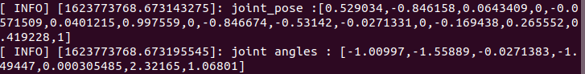
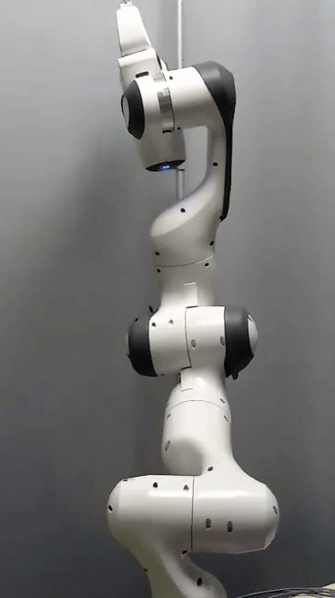

.. _Robot_Control:

Control the Robot with ROS
===========================

.. role:: raw-html(raw)
    :format: html

.. note:: This page is generally written. 
          For the *Panda 2* robot in the R&MM lab at Vrije Universiteit Brussel we replace <fci-ip> with ``192.168.2.106``

Here we will explain how to test the ``franka_ros`` examples and how to make your own controller.

Test franka_example_controllers
-------------------------------

To test that libfranka and franka_ros are installed properly, you can run the franka_example_controllers.

Open a terminal, go to the catkin_ws, source the setup.bash, and build the project.

.. code-block:: bash

   cd path/to/your_project/catkin_ws
   source devel/setup.bash
   catkin_make

You will have to source the setup.bash everytime you open a new terminal and you have to build the project everytime you change a cpp file.

model_example_controller
^^^^^^^^^^^^^^^^^^^^^^^^^^

To run the *model_example_controller* example, the robot can stay in the **interactive (white)** state,
since this example doesn't send any commands to the robot, but only gets access to e.g. measured joint data and robot dynamics.

.. code-block:: bash

   roslaunch franka_example_controllers model_example_controller.launch

After executing this line, rviz will open and will show the robot in its current configuration.
When you manually guide the robot to another configuration and release the enabling and guiding button,
you will see that the robot configuration in rviz is updated to the configuration you manually guided the robot to.
In the meanwhile you can see the updated values of e.g. the fourth joint pose and the joint angles in the terminal.

.. admonition:: todo

	Replace image below with printscreen of default output from the model_example_controller.

move_to_start
^^^^^^^^^^^^^^^^^^^^^^^^^^

To run the *move_to_start* example, put the robot in the **interactive (white)** state and manually guide the robot to an arbitrary configuration.
Then set the robot in the **activated (blue)** state before executing move_to_start.

.. code-block:: bash

   roslaunch franka_example_controllers move_to_start.launch robot_ip:=<fci-ip> load_gripper:=true

The robot should normally return in the following configuration that is required to start from for most of the franka_example_controllers.

.. admonition:: todo

	Replace gif below. Make video of move_to_start example and add gif of it in the tutorial. 

joint_impedance_example_controller
^^^^^^^^^^^^^^^^^^^^^^^^^^^^^^^^^^^

To run the *joint_impedance_example_controller*, you have to put the robot in the **activated (blue)** state and
you have to execute *move_to_start*, such that the robot is in its start configuration.
Then execute the following.

.. code-block:: bash

   roslaunch franka_example_controllers joint_impedance_example_controller.launch robot_ip:=<fci-ip> load_gripper:=true

.. admonition:: todo

	Explain what you should see with a video or gif below. Make video of joint_impedance_example_controller and add gif of it in the tutorial. 

.. note :: If the robot briskly stopts because of a problem or because you have stopped the robot with the ``CTRL+C`` command,
           you will not be able to run another program although the display lights didn't change color.
           To be able to run another program, you will have to close the external activation device (press down) and open it again (pull up).

cartesian_impedance_example_controller
^^^^^^^^^^^^^^^^^^^^^^^^^^^^^^^^^^^^^^^

To run the *cartesian_impedance_example_controller*, you have to put the robot in the **activated (blue)** state and
you have to execute *move_to_start*, such that the robot is in its start configuration.
Then execute the following.

.. code-block:: bash

   roslaunch franka_example_controllers cartesian_impedance_example_controller.launch robot_ip:=<fci-ip> load_gripper:=true

.. admonition:: todo

	Explain what you should see with a video or gif below. Make video of cartesian_impedance_example_controller and do screen capture of RViz. Trim both videos and add gif of it in the tutorial. 

Make your own controller
-------------------------

To create your own controller in an existing project, we follow the tutorial *Starting to Write a New Controller* that is written on the |frankaemika-community| website.
You have to make an account if you want to see posts in this community. We encourage you to do this!

.. |frankaemika-community| raw:: html

    <a href="https://www.franka-community.de" target="_blank">Franka Community</a>

What follows is copied from the Franka Community website and can help you whenever you want to make a new controller or want to adapt the name of an existing controller.

1) In catkin_ws/src, you will see franka_example_controllers.
   In catkin_ws/src create a new folder and name it whatever you like (new_controllers).
   This is where you will keep your new controllers.

2) Create a **src** folder in new_controllers.
   Copy an example controller into here (I copied the joint_impedance_example_controller.cpp from catkin_ws/src/franka_example_controllers/src).
   Rename it to anything you want (new_controller_1.cpp). In new_controller_1.cpp, wherever you see:

   *  franka_example_controllers, change it to new_controllers

   *  joint_impedance_example_controller, change it to new_controller_1

   *  JointImpedanceExampleController, change it to NewController1

3) Create an **include** folder in new_controllers.
   Create a new_controllers folder in include.
   Copy the joint_impedance_example_controller.h file from franka_example_controllers/include/franka_example_controller into new_controllers/include/new_controllers
   and rename it to new_controller_1.h. In new_controller_1.h, wherever you see:

   *  franka_example_controllers, change it to new_controllers

   *  JointImpedanceExampleController, change it to NewController1

4) Create a **launch** folder in new_controllers.
   Copy robot.rviz from franka_example_controller/launch into new_controllers/launch.
   Also copy joint_impedance_example_controller.launch into here and rename it to new_controller_1.launch.
   In this launch file, wherever you see:

   *  franka_example_controllers, change it to new_controllers

   *  joint_impedance_example_controller, change it to new_controller_1

5) Create a **config** folder in new_controllers. Copy the franka_example_controllers.yalm file from franka_example_controllers/config into new_controllers/config.
   Rename it to new_controllers.yaml. Only keep joint_impedance_example_controller and its parameters.
   Delete all other controllers and their parameters. Next, wherever you see:

   *  franka_example_controllers, change it to new_controllers

   *  joint_impedance_example_controller, change it to new_controller_1

   *  JointImpedanceExampleController, change it to NewController1

6) Copy these folders (and the files in them): **cfg**, **msg**, **scripts** from franka_example_controllers into new_controllers.

7) Copy the **package.xml** file from franka_example_controllers to new_controllers. Next, wherever you see:

   *  franka_example_controllers, change it to new_controllers

8) Copy the **franka_example_controllers_plugin.xml** file from franka_example_controllers to new_controllers.
   Only keep the JointImpedanceExampleController class and delete the rest. Next, wherever you see:

   *  franka_example_controllers, change it to new_controllers

   *  JointImpedanceExampleController, change it to NewController1

9) Copy the **CMakeList.txt** from franka_example_controller to new_controller. Next, wherever you see:

   *  franka_example_controllers, change it to new_controllers
   *  joint_impedance_example_controller, change it to new_controller_1
   *  In the add_library part, delete the other controllers (we only need ours).
