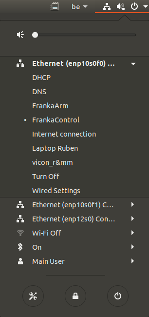

.. _Robot_Network:

Set Up the Robot Network
========================

.. role:: raw-html(raw)
    :format: html

.. note:: This page is specifically written for the use of the robot in the R&MM lab at Vrije Universiteit Brussel.
          For the general version of this documentation, we refer to |frankaemika-setting-up-robot-network| for the Franka Emika Panda robot.

.. |frankaemika-setting-up-robot-network| raw:: html

    <a href="https://frankaemika.github.io/docs/getting_started.html#setting-up-the-network" target="_blank">setting up the network</a>

Hardware connections
--------------------

In the figure below you can see the official hardware connection documentation from Franka Emika.
:raw-html:`  Is it possible to add a link to the pdf file FrankaPandaManual.pdf that is included in the source folder?  `

You can find the :download:`FrankaPandaManual pdf here <doc/FrankaPandaManual.pdf>`

.. image:: ./images/panda-set-up.png
    :align: center
    :width: 700px

In our setup we have the following connections:

*  desktop to Panda Arm with ethernet cable

*  desktop to Panda Control with ethernet cable

*  Panda Arm to Panda Control with connection cable

*  external activation device to Panda Arm

*  Panda Control to Panda Arm with earth cable

*  Panda Control to power supply

*  dekstop to an ethernet port with an ethernet cable (if there is no Wi-Fi)

Set up the network connections
------------------------------

Turn on the Panda Control via the On-Off switch at the back of the Panda Control.

After the Control has been switched on, or supplied with energy, Panda boots up.
In this process, the safety locking system is activated, movements are thus locked mechanically.
The display lights on the base and the pilot **flash yellow**.

As soon as Panda has booted up, the display lights are lit **yellow continuously**.

In case there is no Wi-Fi connection, you should see three ethernet connections:

*  a connection to ``FrankaControl``

   :raw-html:`  Please add screenshot of IPv4 settings. `

*  a connection to ``FrankaArm``

   :raw-html:`  Please add screenshot of IPv4 settings. `

*  a connection to ``Internet connection``

   :raw-html:`  Please add screenshot of IPv4 settings. `

Depending on which ethernet ports you have connected, you have to select the right ethernet connections.
In the example below we have connected port enp10s0f0 to ``FrankaControl``,
port enp10s0f1 to ``FrankaArm``, and port enp12s0 to ``Internet connection``.

