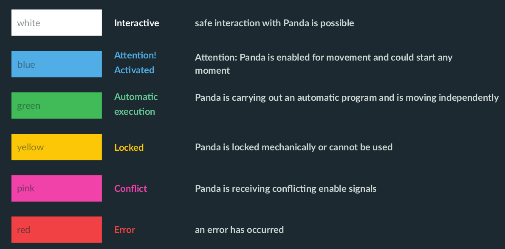
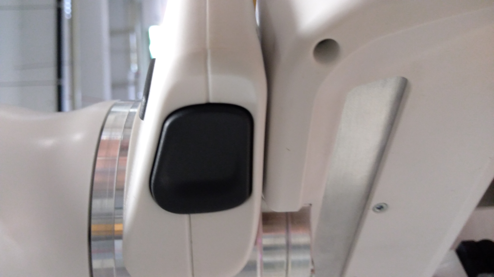

.. _Robot_operating_states:

Robot Operating States
======================

.. role:: raw-html(raw)
    :format: html
    
.. note:: This page is generally written, **not** specific for the use of the robot in the R&MM lab at Vrije Universiteit Brussel. 

There are status lights on both sides of the base which take on the corresponding color.
These status lights will only flash during boot up, 
during other processes the lights will glow continuously in the corresponding color of the status Panda is in. 

On this page we will explain the states you can get in during this work. 
For the explanation about the other states, we refer to PDF file. 
:raw-html:`  Is it possible to add a link to the pdf file FrankaPandaManual.pdf that is included in the source folder?  `

Locked 
------

After the Panda has booted up, the display lights are lit **yellow continuously**, which means that the safety locking system is activated. 

After you have unlocked the joints, the display lights should be lit **white** in case the external activation device is in a closed state (pressed down), 
the robot is now in the interactive state. 

Interactive
-----------

When the display lights are lit **white**, Panda is in the *monitored stop* state, which means that the Panda Arm is ready for interaction. 

By simultaneous pressing of the enabling button and the guiding button at the Arm’s grip, it is possible to guide the Arm manually. 
In this state, the Arm can also record the positions it passed when it was guided manually by a human.  

When the two buttons are released, Panda goes back to the *monitored stop* condition. 

.. image:: ./images/panda_arm_top_view.png
    :width: 70%

Activated
---------

When the display lights are lit **blue**, Panda is in the *activated* state, which means that an automatic program can be started. 
In other words, the robot can now be controlled with commands send by your own program. 

In what follows, we will go in detail on how to run a program on the Panda robot. 

Conflict
--------

A conflict can occur when the robot is in the activated (blue) state and you try to manually guide the arm. 
In that case, the display lights will be lit **pink**. 

To solve this conflict, you have to press down the external activation device such that it is again in the interactive (white) state. 

Error
-----

When an error occurs, the display lights will be lit **red**. 
This can occur when the robot moved close to one of its hardware limits, e.g. when it moved too fast, too brisk, or close to one of the joint angle limits.
This can happen when you are manually guiding the robot in interactive (white) state or because of the commands send by your program in the activated (blue) state. 

To solve this kind of problem you can try the following things. 
We have listed the possible solutions in chronological order, so if the first solution doesn't work, then you have to try the next solution, and so on. 

*  | If the external activation device is in the open state (pulled up), put it in the closed state (pressed down), and back in the open state (pulled up). 
   | Vice versa, if the external activation device is in the closed state (pressed down), put int in the open state (pulled up), and back in the closed state (pressed down). 

*  Lock and unlock the joints via Franka Desk.

*  Try to move a little bit the arm of it's position and then execute a move to start command.  
   :raw-html:`  THIS IS NOT POSSIBLE IN THE RED STATE!!!!!! WHY DID YOU ADD THIS TO LIST OF SOLUTIONS????  `

*  Shut down Franka Control with the On-Off switch at the back of the Panda Control, wait for a minute, and restart it. 
