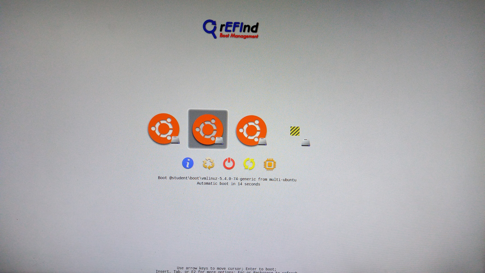

.. _Start_Desktop:

Boot Desktop with Correct Kernel
=======================================

.. role:: raw-html(raw)
    :format: html

.. note:: This page is specifically written for the use of the robot in the R&MM lab at Vrije Universiteit Brussel. 
          For the general version of this documentation, we refer to setting up the |frankaemika-real-time-kernel| for the Franka Emika Panda robot. 

:raw-html:`  How to change the color scheme of notes as is done in ` |moveit-tutorial-note-color-scheme| 

.. |frankaemika-real-time-kernel| raw:: html

    <a href="https://frankaemika.github.io/docs/installation_linux.html#setting-up-the-real-time-kernel" target="_blank">setting up a real-time kernel</a>

.. |moveit-tutorial-note-color-scheme| raw:: html

    <a href="http://moveit2_tutorials.picknik.ai/#" target="_blank">the MoveIt tutorials</a>

 

When you start up the desktop, you will get the following screen. 
Navigate with the arrow keys to the **student** boot and press ``F2`` for more boot options. 

In order to control the Panda robot later on using ``libfranka``, the controller program on the desktop must run with *real-time priority* under a ``PREEMPT_RT`` kernel. 
Since a real-time kernel is already set up on the desktop, 
we can now navigate with the arrow keys to the rt9 version as shown in the figure below and press ``Enter``. 

.. image:: ./images/start_desktop_2.jpg
    :width: 700px

Afterwards, you can choose the Main User account and enter the password ``MainUser``. 

.. image:: ./images/start_desktop_3.jpg
    :align: center
    :width: 700px
