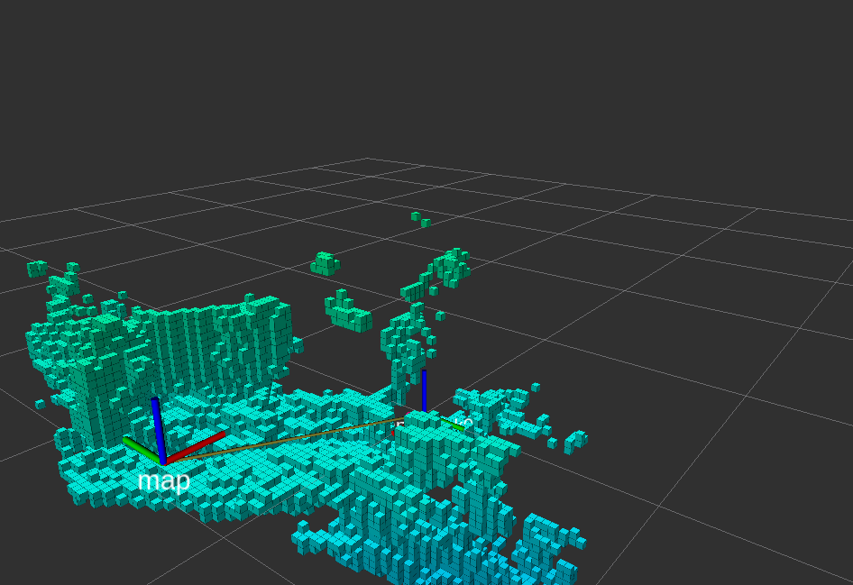

Panda arm, Point cloud and Octomap
==================================

In this section, we will see how to display in real time the octomap and the point cloud into RViz with the panda arm.
Before starting make sure you have done the :ref:`transformation between the camera and the robot frame<transformation>`.

Note: Once the octomap will be generated we will have to remove the panda arm from the octomap otherwise it will be recognized as an obstacle.

Point cloud and Panda arm
*************************

Octomap and Panda arm
*********************

Remove the Panda arm from the octomap
*************************************

In order to generate the octomap without the arm we need to filter the point cloud and publish the filtered cloud in a new topic. The filter wich we will use will remove the robot from the point cloud.

* To begin go in your config folder and create a new .yaml file

.. code:: bash

  cd "path_to_franka_constrained_control/catkin_ws/src/camera_integration/config/
  touch point_cloud.yaml

* Then open it with you favorite editor and add this:

.. code:: XML
 
  sensors:
  - sensor_plugin: occupancy_map_monitor/PointCloudOctomapUpdater
    point_cloud_topic: /zed2/zed_node/point_cloud/cloud_registered
    max_range: 1
    point_subsample: 1
    padding_offset: 0.1
    padding_scale: 1.0
    max_update_rate: 30.0
    filtered_cloud_topic: filtered_cloud

* To generate the octomap , you will need to modify the grab_detected_object_test.launch file by adding this:

.. code:: XML

  <node pkg="tf2_ros" type="static_transform_publisher" name="to_panda" args="0 0 0 0 0 0  world panda_link0" />
  <node pkg="tf2_ros" type="static_transform_publisher" name="world_link_to_map" 
    args="$(arg transfo_world2map) world map" />

  <param name="octomap_frame" type="string" value="map" />
  <param name="octomap_resolution" type="double" value="0.03" />
  <param name="max_range" type="double" value="3.0" />
  <rosparam command="load" file="$(find panda_moveit_config)/config/sensors_kinect_pointcloud.yaml"/>

Note: If there are still residuals of the robot arm left, it is because the transformation between the camera and the robot frame is not perfect.
