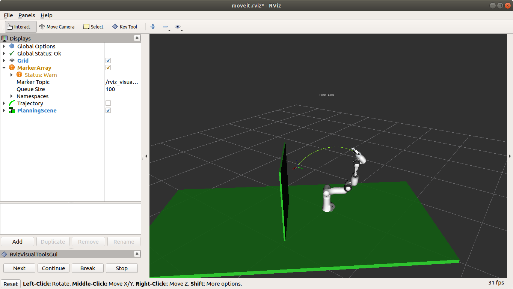
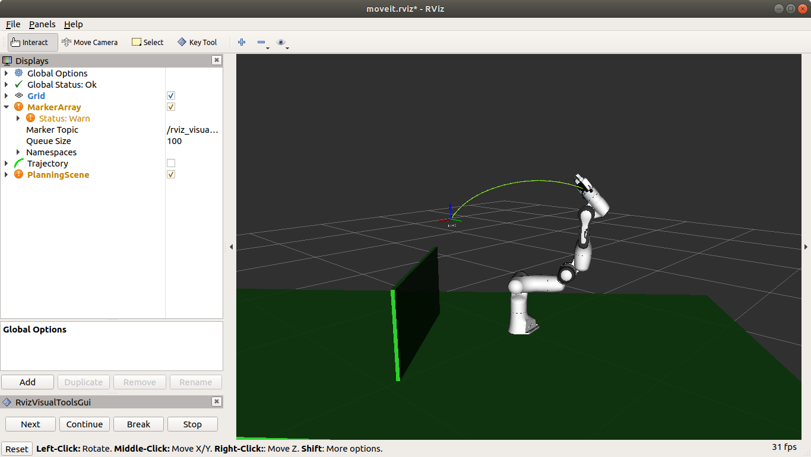
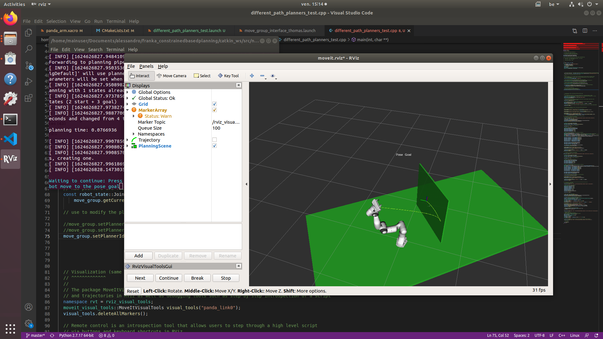
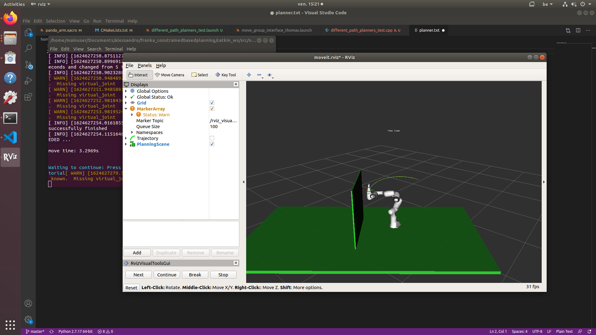
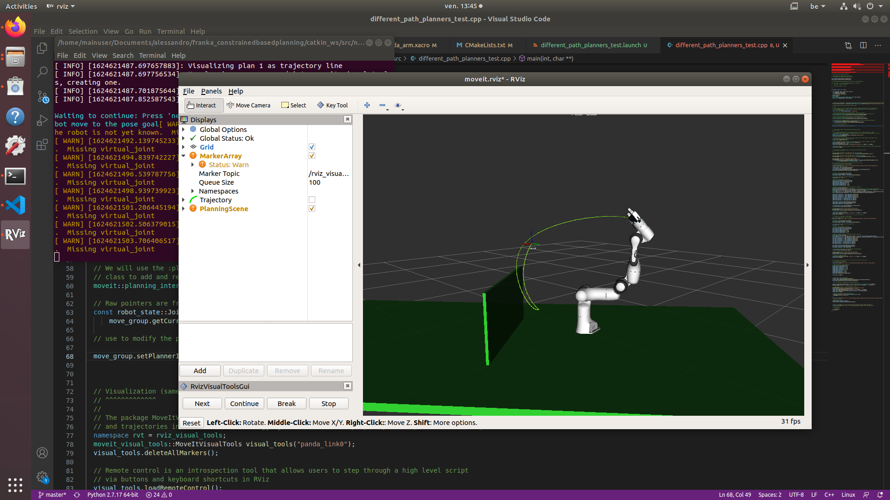
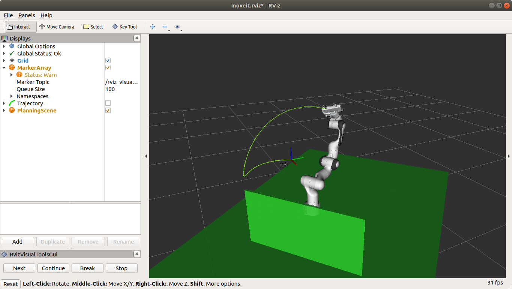
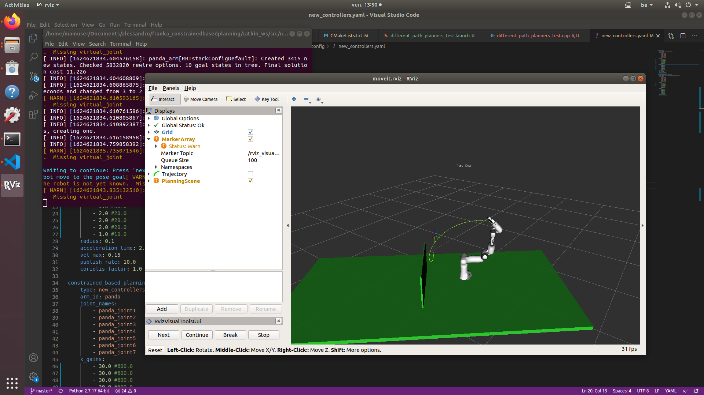
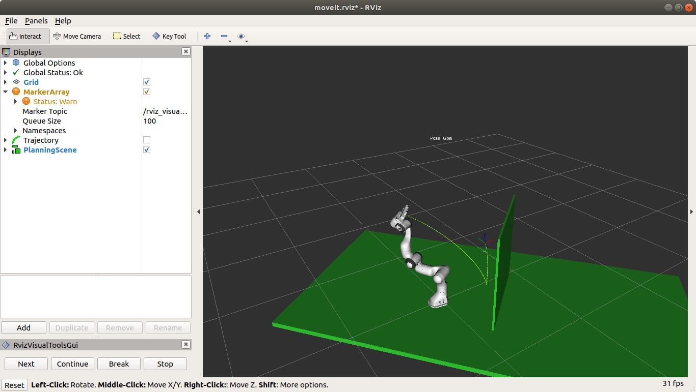
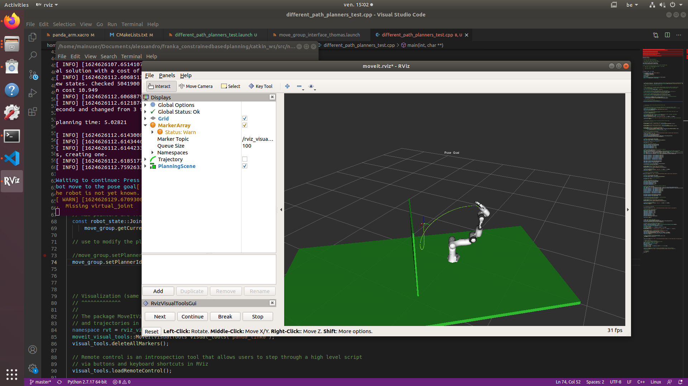

.. _Example:

Path Planning Example
===========================

.. role:: raw-html(raw)
    :format: html
    
.. note:: This page is generally written. For the robot we use in the R&MM lab at Vrije Universiteit Brussel, we replace <fci-ip> with ``192.168.2.106``

The constrained_base_planning_controller
----------------------------------------

This controller adds obstacles to the simulation. For instance, this controller adds the table on which the arm is based, and a virtual wall between the arm and the computer's screen in order to prevent the arm to hit the screen. If you want to use it, execute this line :

.. code-block:: bash

   roslaunch new_controllers constrained_base_planning_controller.launch

You have to way a little at first for the initialisation (till the terminal prints ``Ready to play !``). Then, you will have to click next on the bottom left in order to create the different obstacles and to move the arm.

You can see on the next image the wall and the table (and also an other obstacle in the middle)

.. image:: ./images/constrained.png
    :align: center

So the planner will take into account the obstacles in the environment and will create a path which avoid the obstacles if it is possible.

=========================
How to use other planners
=========================

.. _Change_planner :

Changing planner
================

The command in c++ to change the planner is :

.. code-block:: bash

    move_group.setPlannerId("PRMkConfigDefault");

Here, the planner is ``PRMkConfigDefault``, which is the PRM planner. A list of all the planner with their characteristics can be found `here <https://planners-benchmarking.readthedocs.io/en/latest/user_guide/2_motion_planners.html>`_

You can find the list of names for setPlannerId in the file located at this place : ``panda_moveit_config/config/ompl_planning.yaml``

.. _Differences :

Differences between the planners
================================

We wanted to try several planners in order to see the differences between them. So we executed the same path with different planners to see their differences. The main problem is that every planner is random, so for the same path and planner, we obtain different results.

.. _PRM :

Planner PRM
===========

    Time to find the path : undefined                Time to execute : undefined

    Time to find the path : undefined                Time to execute : undefined

.. _RRT_Connect :

Planner RRT Connect
===================

    Time to find the path : undefined                Time to execute : undefined

    Time to find the path : undefined                Time to execute : undefined

.. _RRT* :

Planner RRT*
============

    Time to find the path : undefined                Time to execute : undefined

    Time to find the path : undefined                Time to execute : undefined

    Time to find the path : undefined                Time to execute : undefined

    Time to find the path : undefined                Time to execute : undefined

    Time to find the path : undefined                Time to execute : undefined

.. _TRRT :

Planner TRRT
============

.. raw:: html

    <video width="" height="" controls>
        <source src="../../../source/robot_arm_start/videos/cup.mp4" type="video/mp4">
    Your browser does not support the video tag.
    </video>

