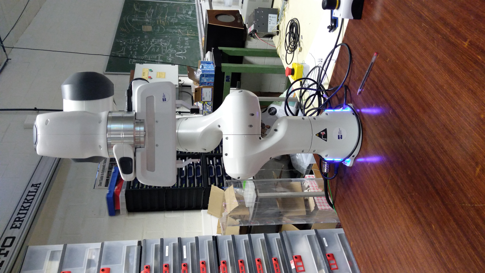
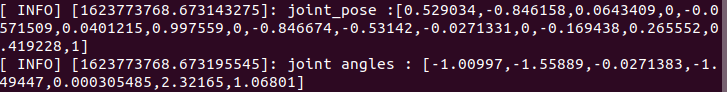
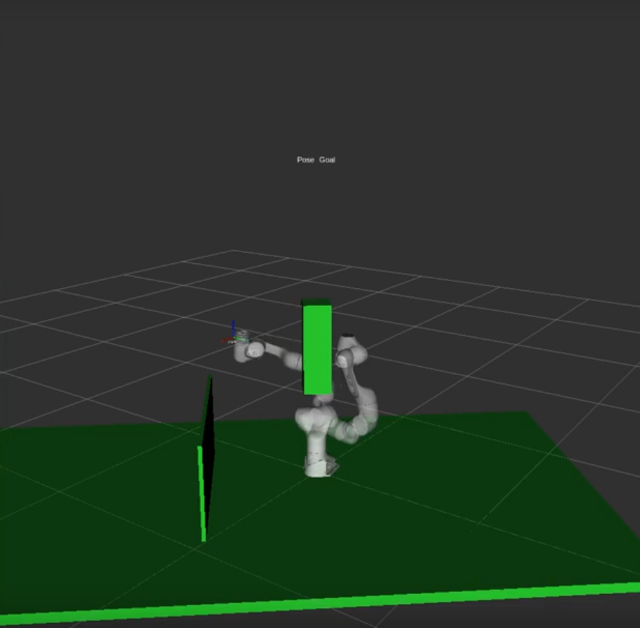

.. _Command_control:

====================================
How to control the arm via a command
====================================

The more interesting part of robotics is automation, and that's what we will see in this chapter.

.. _Command_test:

Testing command
***************

We will give a command to the arm in order to see if everything is right and if the arm has no problem. To do so, make sure that :ref:`the joints are unlocked<Unlock_joints>`. Then open a terminal in ``~/Documents/alessandro/franka_constraintedbasedplanning/catkin_ws``, and then enter :

.. code-block:: bash

   source devel/setup.bash

For every terminal you launch, you have to use this command in order to execute code with ROS

First of all, we have to make sure every project is compiled. Execute this command in ``~/Documents/alessandro/franka_constraintedbasedplanning/catkin_ws`` to compile every project :

.. code-block:: bash

   catkin_make

Now, go to :ref:`the white state<Hand>`, and put the robot in an arbitrary position. After that, go to :ref:`the blue state<Command>`, and execute the line :

.. code-block:: bash

   roslaunch franka_example_controllers move_to_start.launch robot_ip:=192.168.2.106 load_gripper:=false

The robot should normally return in his start state

.. _Example_commands:

Some commands to try
********************

The Franka library offers multiple example commands to start with. So let's see some of them.

.. _Model_example controller:

The model_example_controller
============================

This controller allows us to obtain different informations about the actual robot state. This controller especially gives the joints rotation, which is very useful.

If you want to use it, go to :ref:`the blue state<Command>` and execute :

.. code-block:: bash

   roslaunch franka_example_controllers model_example_controller.launch

After executing this line, RViz will open, but if you look into your terminal, you will see things like this :

The first ``INFO`` is the position of every joints, but it is not very useful (positions are linked by constrained). The second ``INFO`` is the angular position of every joints, and is much useful (the first angle is the angle of the lowest joint, and the last angle is the angle of the highest joint).

.. _Constrained_base_planning_controller:

The constrained_base_planning_controller
========================================

This controller adds obstacles to the simulation. For instance, this controller adds the table on which the arm is based, and a virtual wall between the arm and the computer's screen in order to prevent the arm to hit the screen. If you want to use it, execute this line :

.. code-block:: bash

   roslaunch new_controllers constrained_base_planning_controller.launch

You have to way a little at first for the initialisation (till the terminal prints ``Ready to play !``). Then, you will have to click next on the bottom left in order to create the different obstacles and to move the arm.

You can see on the next image the wall and the table (and also an other obstacle in the middle)

So the planner will take into account the obstacles in the environment and will create a path which avoid the obstacles if it is possible.
