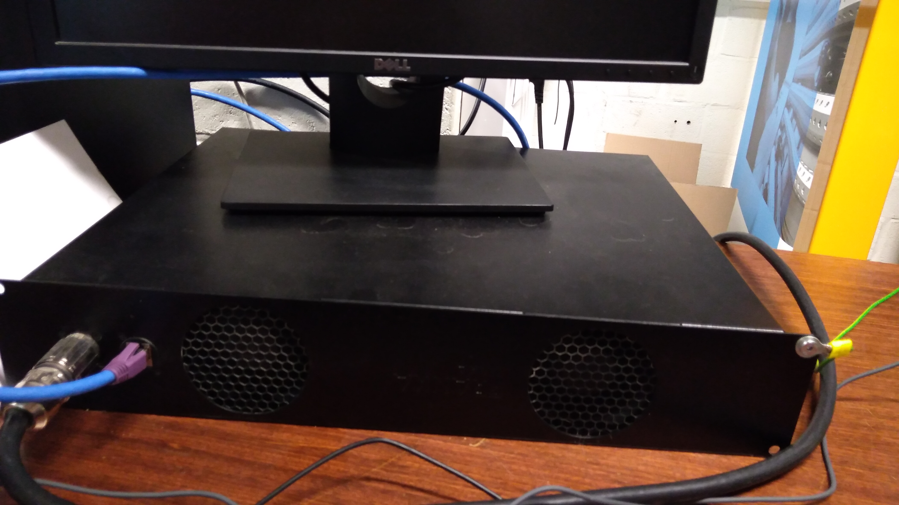
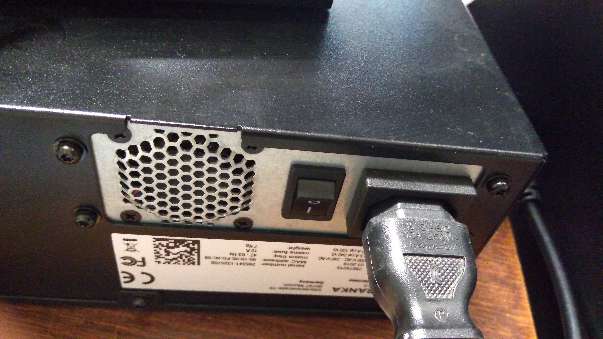
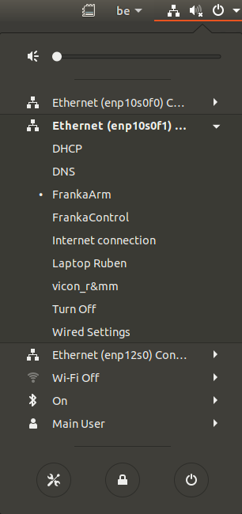
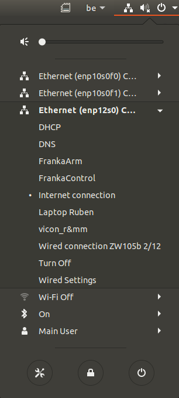

.. _Connect_the_robot:

===========================
Initialisation of the robot
===========================

After :ref:`logging in the right session<opening_session>`, we have to setup the robot.

.. _Controller:

Starting the controller
***********************

First let's start the controller. The controller is linked to the computer and to the arm. The controller is the object that sends commands to the arm. The controller is the box under the computer screen as shown on the next image :

Press the button behind the controller to start it up :

.. _Connections:

Setting up the connections
**************************

Now we have to set the connections to the computer. Click on the upper right corner of the desktop. You should see 3 Ethernet connections :

Set the first one (enp10s0f0) to ``FrankaControl`` :

.. figure:: images/frankacontrol.png
    :align: center
    :figclass: align-center

Set the second one (enp10s0f1) to ``FrankaArm`` :

Set the third one (enp12s0) to ``Internet connection`` :

Now that every connections are made, go to the :ref:`GUI of the arm<interface>`.
