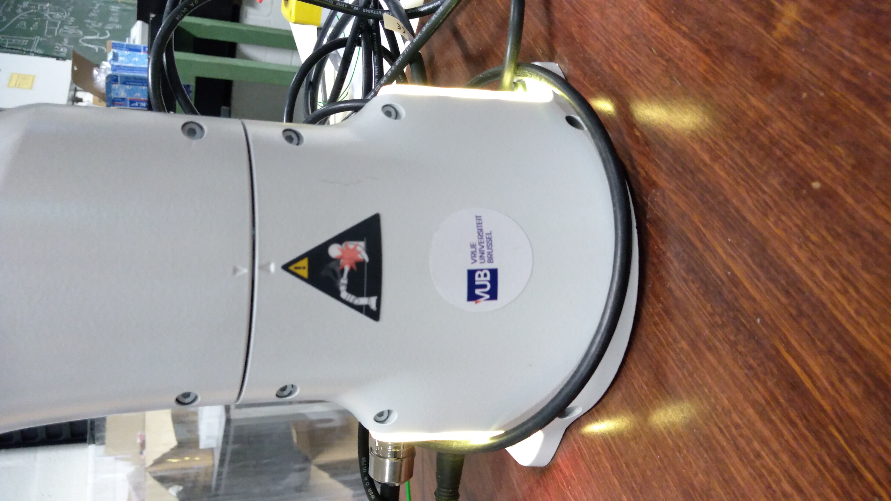

.. _Interface:

=========================
Use of the GUI of the arm
=========================

Now we will learn how to open the GUI of the robot.

.. _GUI:

Start the GUI
*************

To start the GUI, open Firefox and type ``192.168.2.106`` in the search bar. You should obtain this :

.. figure:: images/interface.png
    :align: center
    :figclass: align-center

.. _Unlock_joints:

Unlock the joints
*****************

The state color of the arm should be in ``yellow`` in the GUI (on the bottom right of the GUI and also on the bottom of the arm). This state means that the motors of the arm are locked. In order to unlock them, press the button ``Unlock Joints`` on the bottom right of the GUI. Then click ``open`` :

.. figure:: images/unlock.png
    :align: center
    :figclass: align-center

You should ear 7 'clicks' once you unlock the arm.

Now that you unlocked the arm, :ref:`let's move the robot<move_robot>` !

.. _Close_GUI:

Close the GUI
*************

When you have finish to use the robot, do not forget to put the robot in its :ref:`starting position<Command_test>`, and then lock the joints before shutting down the controller and the computer.
