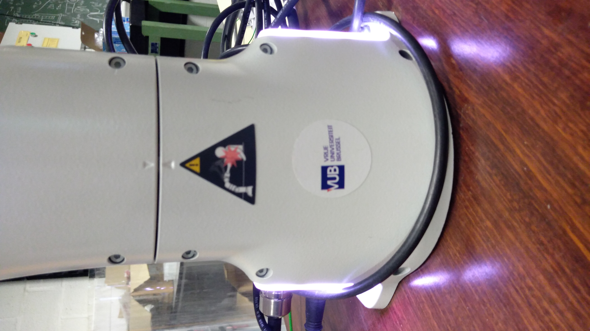
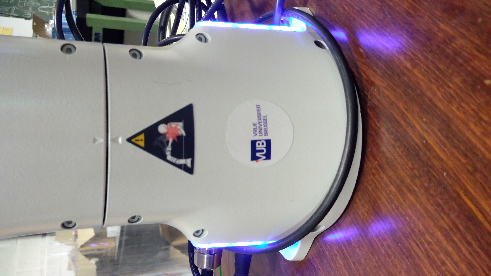
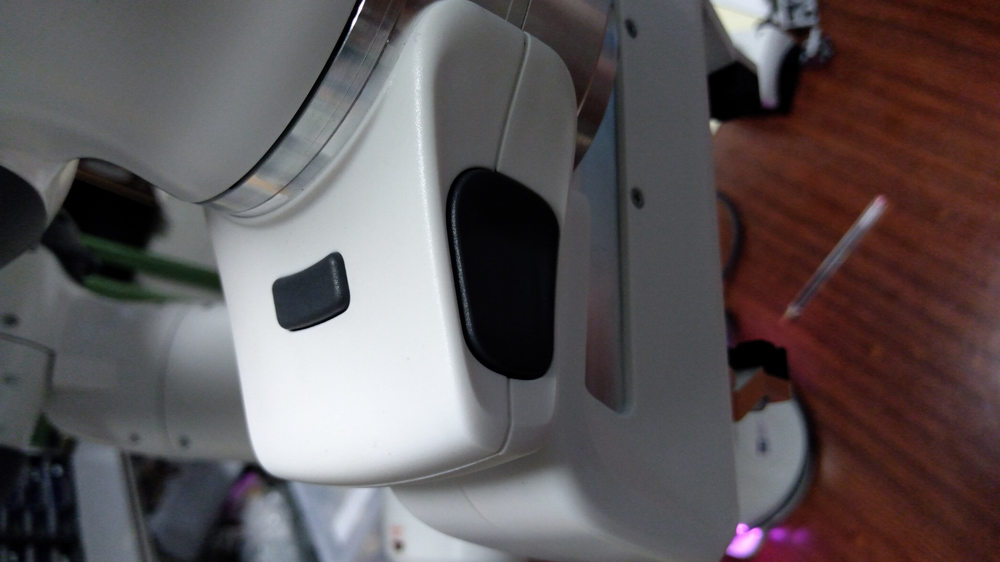
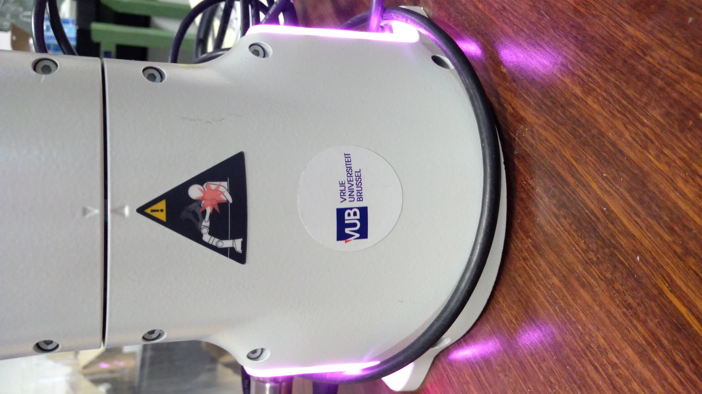

.. _Move_robot:

==============
Moving the arm
==============

In this chapter, we will see how to move the arm.

.. _Hand:

Guidance by hand
****************

When the joints of the robot are unlocked, the robot goes on ``white`` or ``blue`` state. We can change the state of the arm by pushing the black button or pulling it. When the button is pushed, the arm's state is ``white``, which means that the arm can be hand guided, and when the button is pulled, the arm's state is ``blue``, which means that the arm is controlled with commands.

In the ``white`` state, push the 2 buttons at the top of the robot (not the little one between the two) to make it move, as shown in the next photo :

.. image:: images/IMG_20210615_175002.jpg
    :width: 47%

.. _Command:

Guidance by command
*******************

Put the robot in the ``blue`` state (pull the black button). In this state, if you try to hand guide the arm, the state will turn ``pink``, with means a conflict. Just push the button to return in ``white`` state.

When in ``blue`` state, the robot will only move when a command is sent to it. We will see in the :ref:`command control's part<Command_control>` how to move the robot with commands.
