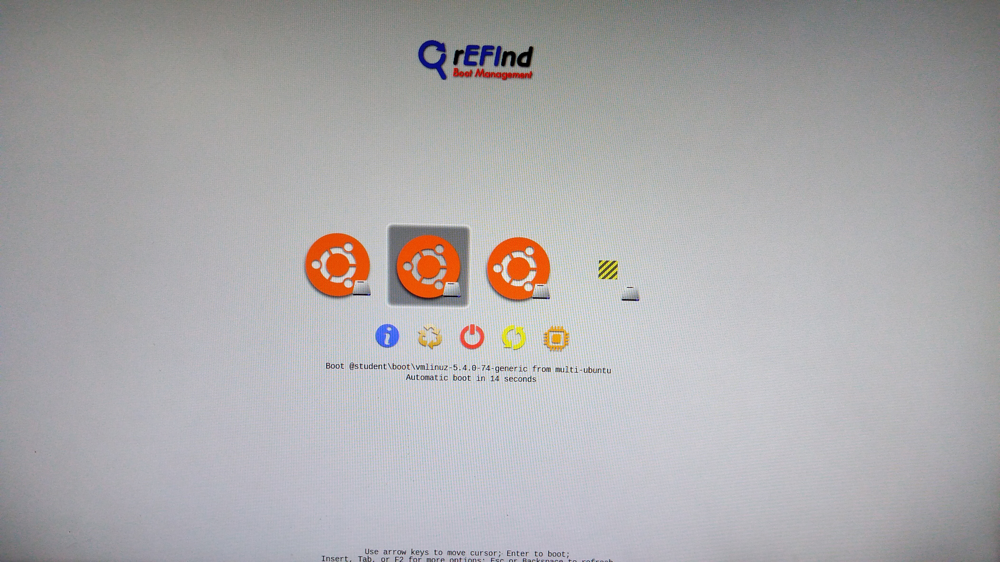

.. _Opening_session:

=====================================================
Opening the session with the computer next to the arm
=====================================================

In order to use the panda arm, we have to log on the right session. Follow these steps with the computer next to the arm.

.. _Session:

Choosing the right session
**************************

Choose the student version as shown in the next image, and then press ``F2`` :

Choose the tr9 version as shown in the next image, and then press ``Enter`` :

.. figure:: images/IMG_20210615_180656.jpg
    :align: center
    :figclass: align-center

Choose the Main User session as shown in the next image, and then press enter the password ``MainUser`` (the password is written on the paper next to the computer) :

.. figure:: images/IMG_20210615_180736.jpg
    :align: center
    :figclass: align-center

Now you're on the right session in order to start playing with the arm.
