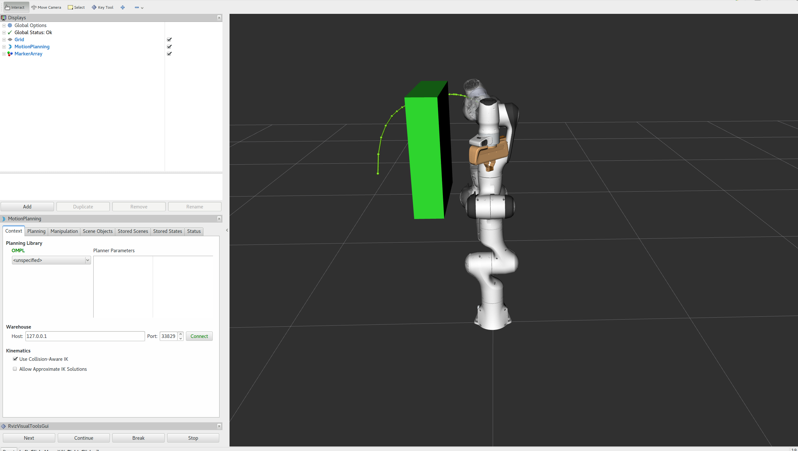
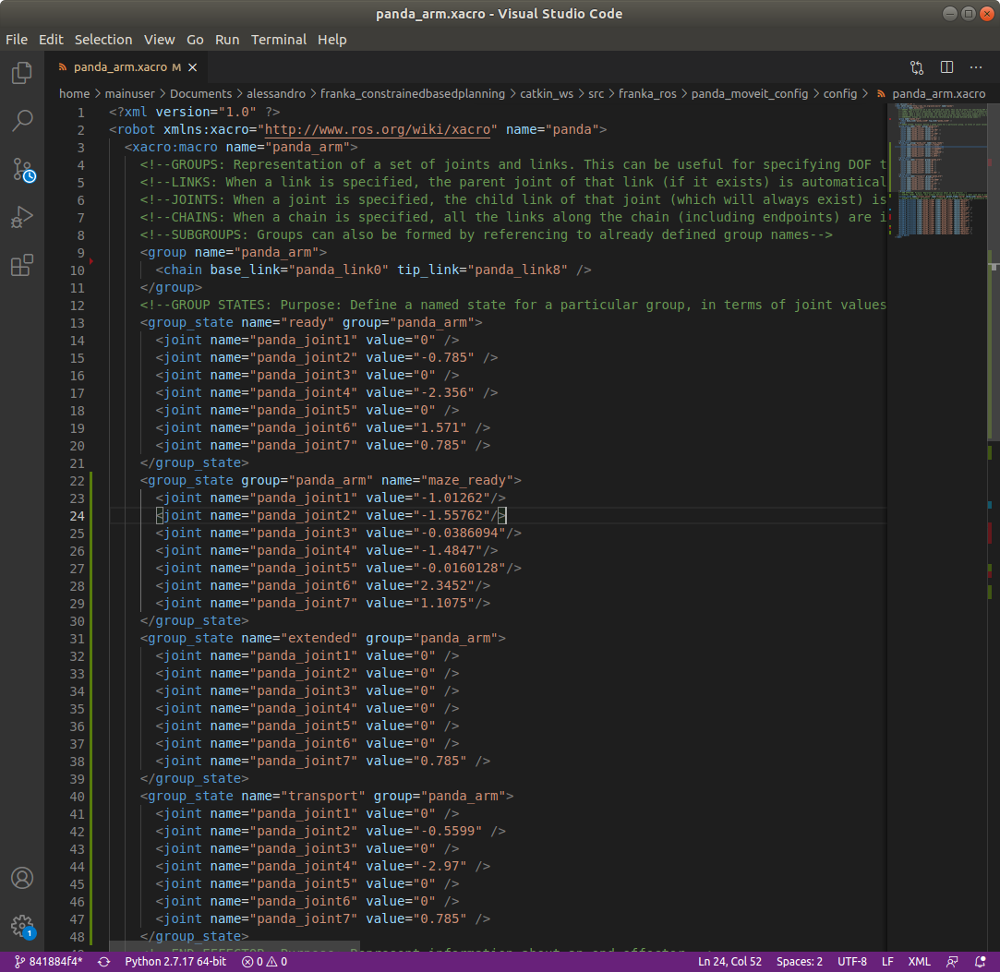

.. _Problems:

============================================
The different problems we were confronted to
============================================

During the utilisation of the panda arm, we went through different problems that we will list here.

.. _Visualisation:

Problem of visualisation of the trajectory
==========================================

This problem was discover by the fact that in the first example of the `MoveIt! tutorial <http://docs.ros.org/en/melodic/api/moveit_tutorials/html/index.html>`_, the trajectory of the robot is shown, like in the next image, but not in our projects :

In order to solve this problem, we had to update ``panda_moveit_config`` and also add the gripper on the robot. Actually, we used the robot without the gripper and that's why we did not see the trajectory.

.. _Prompt:

Problem with VisualTools.prompt function
========================================

On the :ref:`constrained_base_planning_controller example<Constrained_base_planning_controller>`,the terminal print a text and waits for you to press the ``next`` button. But when we execute the code, the terminal does not print the phrase it should. This problem was just a missing output=screen in the node of path_planner_thomas.

.. _Move_to_start_problem:

Problem with copying move_to_start
==================================

In order to test some planners, we wanted to set the arm in a defined position. So we think about copying the :ref:`move_to_start files<Command_test>`, and changing the position of the robot, but it did not work and gave us errors we can't fix. So we had to change in the move_to_start.py file the line :

.. code-block:: python

   commander.set_named_target('name_of_the_group_state')

Replace the ``'name_of_the_group_state'`` by a relevant name.

Then open the ``panda_arm.xacro`` in the ``panda_moveit_config`` folder, and then define another move_group with the name you put in the move_to_start.py (the ``'name_of_the_group_state'``), and with the joint angular position you want. Then you have just to execute :ref:`move_to_start<Command_test>`.

    You can see that ``group`` is always equal to "panda_arm" and you can choose the name of the group_state
