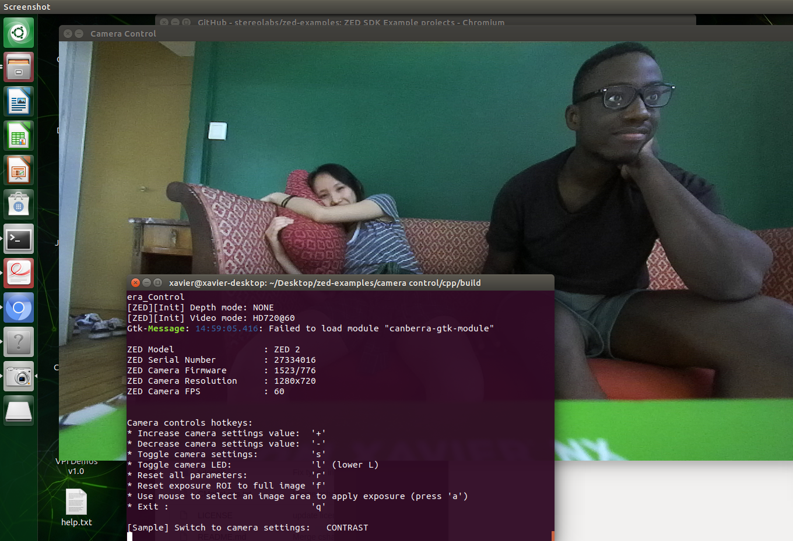
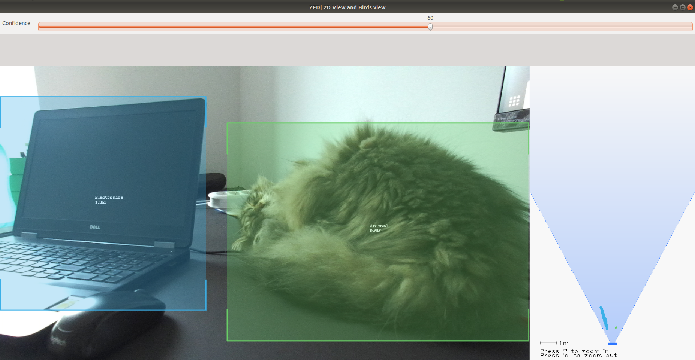

.. _Zed_Examples:

Test the ZED SDK Examples
=======================================

.. role:: raw-html(raw)
    :format: html
    
To test ZED's multiple |ZED_Code_Examples|, we first have to download the example code in a directory of your choice on the Jetson. 

.. |ZED_Code_Examples| raw:: html

    <a href="https://www.stereolabs.com/docs/code-samples/" target="_blank">code examples</a>

.. code-block:: bash

    git clone https://github.com/stereolabs/zed-examples.git

C++ sample code
-----------------

For the c++ examples, you will have to install cmake:

.. code-block:: bash

    sudo apt-get update
    sudo apt-get install build-essential cmake

Inside the **zed_examples** directory there are several c++ examples that can be built and run. 
Here we explain how to do this and the results for some examples, but for the other examples you will have to follow the same steps. 

Camera control
^^^^^^^^^^^^^^^
.. code-block:: bash

    cd path/to/zed-examples/camera control/cpp
    mkdir build  # make build directory
    cd build  # go to build directory
    cmake .. #  generate project (
    make # compile application
    ls  # check if the app is build
    ./ZED_Camera_Control # run executable

If the example starts well, it should show the terminal in which camera settings can be modified and should display the resulting image.

Depth sensing
^^^^^^^^^^^^^^^^^^^^^^^^

.. code-block:: bash

    cd path/to/zed-examples/depth sensing/cpp
    mkdir build 
    cd build 
    cmake .. 
    make
    ls  
    ./ZED_Depth_Sensing 

In this example, a camera live point cloud is retrieved and siplayed in an OpenGL window in 3D. 

:raw-html:` Add image of what you obtain.   `

Body tracking
^^^^^^^^^^^^^^^^^^^^^^^^

.. code-block:: bash

    cd path/to/zed-examples/body tracking/cpp
    mkdir build 
    cd build  
    cmake .. 
    make
    ls 
    ./ZED_Body_Tracking

In this example, camera images are displayed with human bodies as skeletons. 
The bodies are tracked across time and space. 
To display the bodies' bounding boxed, press ``b``. 

:raw-html:` Add image of what you obtain.   `

Object detection (birds eye viewer)
^^^^^^^^^^^^^^^^^^^^^^^^^^^^^^^^^^^^^^^^^

.. code-block:: bash

    cd path/to/zed-examples/object detection/birds eye viewer/cpp
    mkdir build  
    cd build  
    cmake .. 
    make 
    ls  
    ./ZED_Object_detection_birds_eye_viewer

In the object detection (birds eye viewer) example, detected objects are displayed in a 3D view with the current point cloud. 
You have to press ``c`` to clear filters such that the program can detect objects from all the available |ZED_SDK_object_classes|.  
Without clearing the filters, the program can only detect people and vehicles. 

.. |ZED_SDK_object_classes| raw:: html

   <a href="https://www.stereolabs.com/docs/api/group__Object__group.html#ga13b0c230bc8fee5bbaaaa57a45fa1177" target="_blank">object classes</a>

.. image:: ./images/zed-objectdetection-person-animal.png
    :align: center
    :width: 500px

Python sample code
--------------------

To run the python scripts you only have to go to the python directory of the example you want to run and run it with ``python3``. 
Below we have done this for the **camera control** example. 

.. code-block:: bash

    cd path/to/zed-examples/camera control/python
    python3 camera_control.py

For the other examples, we get similar results as for the c++ sample cases. 

.. note:: 
    If a module is missing, you will receive a **ModuleNotFoundError**. 
    Solve this by installing the module with pip3:

    .. code-block:: bash

        pip3 install "module name"  # replace "module name" with the module you want to install

    If you installed a module by mistake, then you can uninstall it with pip3:

    .. code-block:: bash

        pip3 uninstall "module name"  # replace "module name" with the module you want to uninstall

    For the following modules you will have to install the required module with another name than mentioned in the ModuleNotFoundError. 
    At the left you see the name that is mentioned, at the right you see the name you have to use in the pip3 install. 

    *  |OpenGL| :raw-html:`&rarr;` |PyOpenGL| 

.. |OpenGL| raw:: html

    <a href="https://pypi.org/project/opengl/" target="_blank">OpenGL</a>

.. |PyOpenGL| raw:: html

    <a href="https://pypi.org/project/PyOpenGL/" target="_blank">PyOpenGL</a>

Object detection (image viewer)
^^^^^^^^^^^^^^^^^^^^^^^^^^^^^^^^^^^^^^

For the image viewer object detection example, we tried to adapt the code such that it cannot only detect person, but for example also vehicles. 

Go to the python code

.. code-block:: bash

    cd path/to/object detection/image viewer/python/object_detection_image_viewer.py

Go to line 73, we can see that the object class filter is set to persons, whereby the program can only detect persons. 

.. code-block:: python

        obj_runtime_param.object_class_filter = [sl.OBJECT_CLASS.PERSON]  # only detect Persons

We have added the vehicle class to the filter.

.. code-block:: python

        obj_runtime_param.object_class_filter = [sl.OBJECT_CLASS.PERSON, sl.OBJECT_CLASS.VEHICLE]  # detect persons and vehicules

We also adapted the code (lines 79-87) that prints the detected objects information in such a way that 
the code prints every second the id and position of the detected objects. 

.. code-block:: python

    import time
    timer=time.time()
    while viewer.is_available():
        # Grab an image, a RuntimeParameters object must be given to grab()
        if zed.grab(runtime_parameters) == sl.ERROR_CODE.SUCCESS:
            # Retrieve left image
            zed.retrieve_image(image, sl.VIEW.LEFT)
            # Retrieve objects
            zed.retrieve_objects(objects, obj_runtime_param)
            # print detected objects information
            if time.time()-timer>1:
                print([[obj.id, obj.label, obj.position] for obj in objects.object_list])
                timer = time.time()
            # Update GL view
            viewer.update_view(image, objects)

ZED Tutorials
-----------------
You can try some |ZED_Tutorials| to familiarise with the ZED SDK.
The C++ and Python version can be launched in the same way as explained above. 
In these tutorials information will be printed in the terminal. 

.. |ZED_Tutorials| raw:: html

    <a href="https://www.stereolabs.com/docs/tutorials/" target="_blank">tutorials</a>