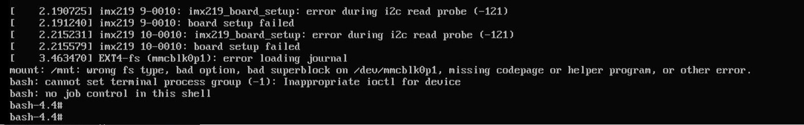
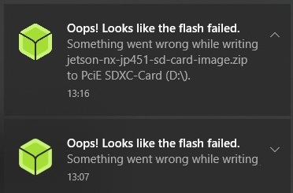

ZED and Jetson issues
=====================

This section will list all the problems we encountered while using the NVIDIA Jetson NX and the ZED2 camera.

NVIDIA Jetson Xavier NX boot fail
---------------------------------

The Jetson shutdown while we were using it and when we restarted it this message appeared

The Jetson failed to boot and everything on the microSD Card has been erased. The first solution was to rewrite the image to the microSD Card but it also failed

This problem occurred when the Jetson shutdown and restart by itself. Everything was erased from the SD card. We tried to x²flash the Jetson Xavier NX Developer Kit SD Card image but it failed.
In our case it seems that the boot fail of the Jetson happened when the Flash of the Jetson Xavier NX Developer Kit SD card failed.

To solve this problem it's better to use at least a UHS-1 microSD Card.
Here a `link to the Thread <https://forums.developer.nvidia.com/t/nvidia-jetson-xavier-nx-boot-fail/182229?u=kouassi948>`_ we created on NVIDIA forum.

Note: Use a high quality microSD Card (at least 16GB UHS-1) of you want to have better performance on your Jetson.

ZED2: Cuda error
----------------

.. image:: ./images/cuda_error.png
    :width: 600