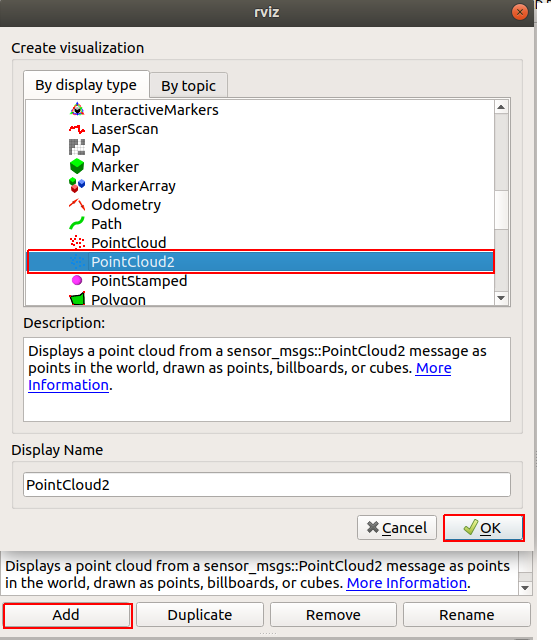
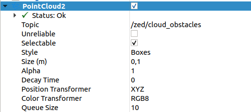
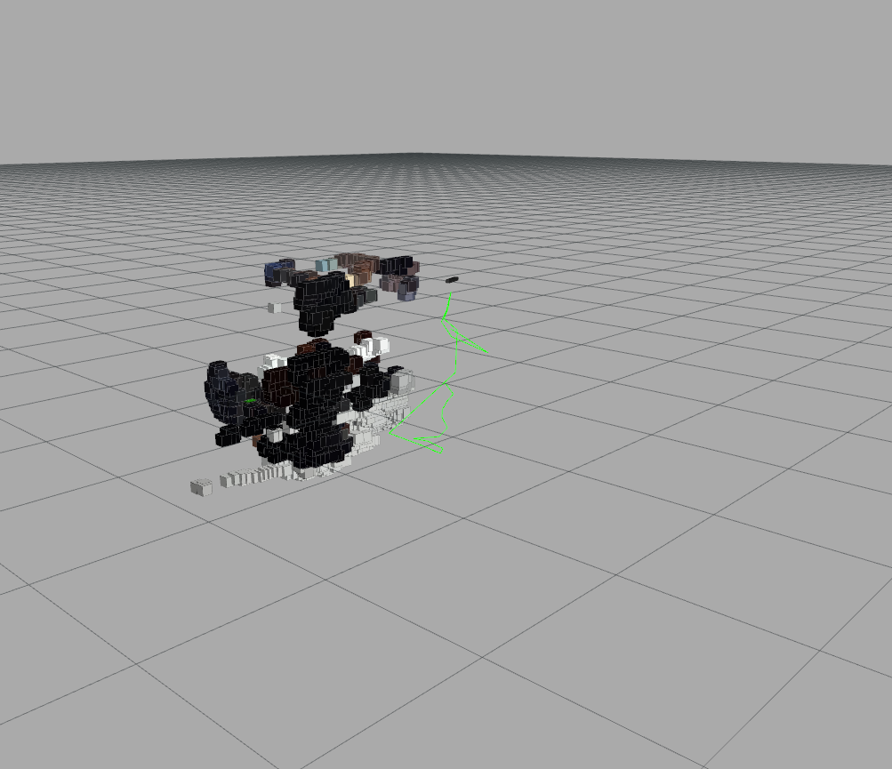
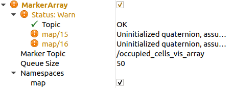
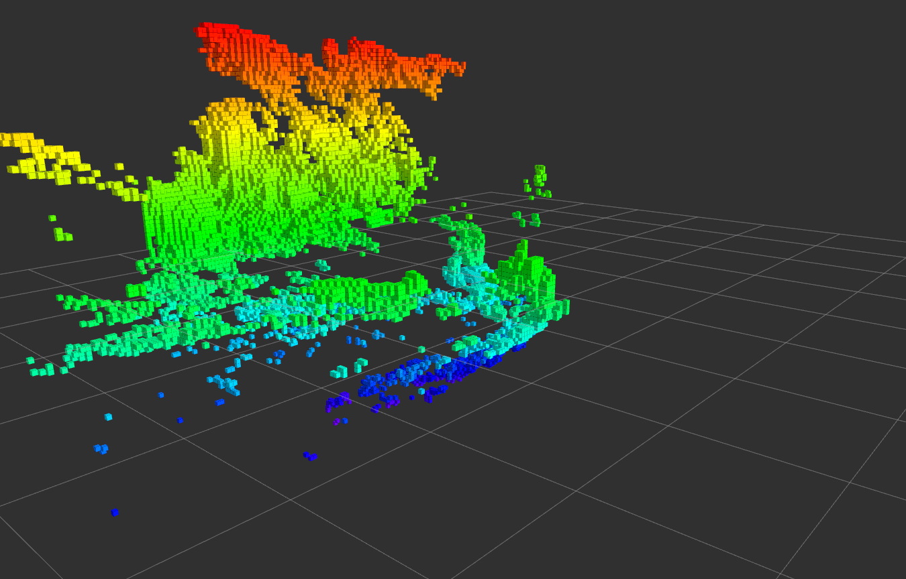

Octomap with ZED2
=================

This section will help you to visualize 3D map in RViz.
I supposed you have already cloned the :ref:`zed-ros-wrapper<ZED_ROS_WRAPPER>` example.

To display the octomap run 

.. code::

    roslaunch zed_rtabmap_example zed_rtabmap.launch 

* You will have to add the PointCloud2 display in your RViz. 

* Change the settings of the PointCloud2 to the following

If everything goes well an octomap will be generated from the point cloud

Octomap package
===============

This chapter explains how to save an octomap and load it into RViz with the panda arm. We will later use the camera to detect obstacles and 

ROS Melodic OctoMap server
**************************

OctoMap installation
--------------------

Install the octomap package.

.. code:: 

    sudo apt-get install ros-melodic-octomap ros-melodic-octomap-server ros-melodic-octomap-mapping ros-melodic-octomap-ros ros-melodic-octomap-msgs

Octomap saver
*************

Create your package
-------------------

* To save your octomap you will have to create your own octomap saver package. Here a link if you want more details on the `octomap server <http://wiki.ros.org/octomap_server>`_.

.. code:: 

    cd ~/catkin_ws/src/
    catkin_create_pkg octo_save std_msgs rospy roscpp
    cd ../
    catkin_make
    
* Now you will have to create and edit a new .launch file. This .launch file will be used later to generate the octomap and save it.

.. code:: 

    cd ~/catkin_ws/src/octo_save/
    mkdir launch
    cd launch
    gedit octomap_mapping.launch

* Once you are done, copy this in the octomap_mapping.launch file

.. code:: XML

    <launch>
    <arg name="svo_file"             default="" /> <!-- <arg name="svo_file" default="path/to/svo/file.svo"> -->
    <arg name="stream"               default="" /> <!-- <arg name="stream" default="<ip_address>:<port>"> -->

    <arg name="camera_model"         default="zed2" />

    <!-- Launch ZED camera wrapper -->
    <include file="$(find zed_wrapper)/launch/$(arg camera_model).launch">
        <arg name="camera_model"        value="$(arg camera_model)" />
        <arg name="svo_file"            value="$(arg svo_file)" />
        <arg name="stream"              value="$(arg stream)" />
    </include>

    <node pkg="octomap_server" type="octomap_server_node" name="octomap_server">
        <param name="resolution" value="0.05" />
        
        <!-- fixed map frame (set to 'map' if SLAM or localization running!) -->
        <param name="frame_id" type="string" value="odom" />
        
        <!-- maximum range to integrate (speedup!) -->
        <param name="sensor_model/max_range" value="5.0" />
        
        <!-- data source to integrate (PointCloud2) -->
        <remap from="cloud_in" to="/zed2/zed_node/point_cloud/cloud_registered" />

    </node>

    <node name="rviz" pkg="rviz" type="rviz" args="-d $(find zed_display_rviz)/rviz/$(arg camera_model).rviz" output="screen" />

    </launch>

* Launch it

.. code::

    roslaunch octo_save octomap_mapping.launch

* Add a MarkerArray display and then modify the MarkerArray topic

Once it is done , you should see this

Save the octomap
----------------

To save the octomap just use this command (RViz should be running at the same time)

.. code::

    rosrun octomap_server octomap_saver -f first_octomap.bt

Now we are done. We will use this later to detect obstacles and visualize them in RViz with the robot arm.

