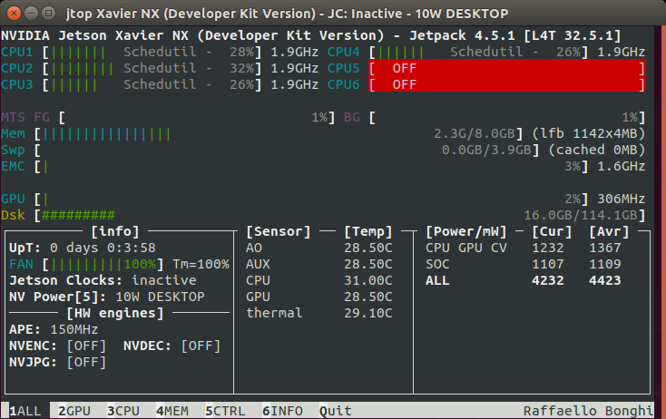
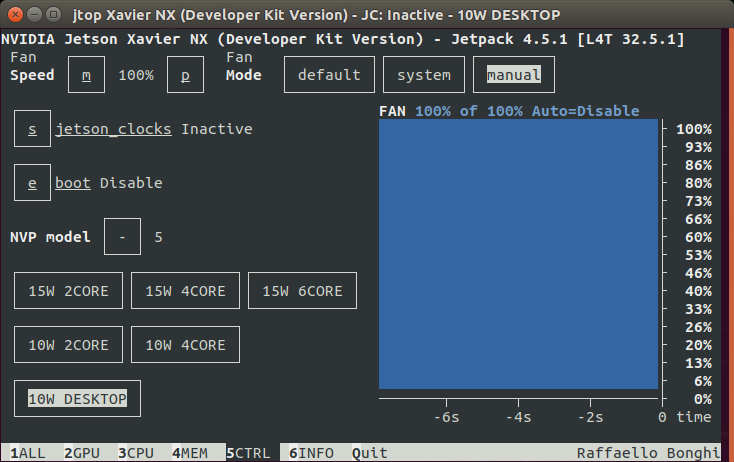

Set up the NVIDIA Jetson
========================

For this tutorial we used 2 NVIDIA Jetson Xavier NX on which Ubuntu was already installed. If you already have Ubuntu installed on your NVIDIA JetsonXavier just skip the NVIDIA Jetson Xavier part and start from :ref:`Try the ZED SDK on the NVIDIA Jetson<Try_the_ZED>`.
It's better for you if you start this tutorial from :ref:`NVIDIA Jetson Xavier<Get_Started>` with an empty SD card.

.. _Get_Started:

NVIDIA Jetson Xavier
--------------------

* Follow this step to boot on the NVIDIA Jetson Xavier for the first time: `Getting Started With Jetson Xavier NX Developer Kit <https://developer.nvidia.com/embedded/learn/get-started-jetson-xavier-nx-devkit>`_.
* If everything goes well the NVIDIA Jetson will boot on Ubuntu.
* The username and password we used to log to the session are:

    * username: **xavier**
    * password: **JetsonXavier**

Note: Make sure to have an empty micro SD card otherwise the boot can fail.

Network Connection
------------------

* WiFi

| WiFi was already setting up on the given Jetson, we only had to connect on it.
| We did not need the WiFi USB adaptater to connect ro WiFi.

Note: At this step if you are still wondering how to turn on the NVIDIA Jetson just plug in its battery and connect it on a screen.

Avoid some lags
---------------
We had some crashing and latency issues with the NVIDIA Jetson Xavier. So to avoid them switch the power mode supply of the NVIDIA Jetson to "MODE 15W 6CORE"

.. image:: ./images/power_mode.png
    :width: 300

In order to reduce lags on the Jetson turn on the fan to 100%

* Install jetson-stats:

.. code:: bash

    git clone https://github.com/rbonghi/jetson_stats
    sudo apt-get update
    sudo apt-get install python3-pip  # install pip3
    cd jetson_stats
    sudo -H pup3 install -U jetson-stats

* Restart your Jetson and run :

.. code:: bash

    jtop  # start jtop

* This window will open with all the information of the Jetson

* Go to the tab CTRL, you can set the fan methode to manual and the fan speed to 100%

NB: If you try to install something and the Jetson keeps shutting down, you can :ref:`set the Jetson in shell mode<jetson_shell_mode>`