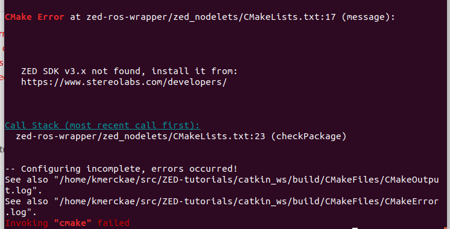

ZED 2 with ROS on Jetson Xavier NX
==================================

.. role:: raw-html(raw)
    :format: html

Install and configure ROS
--------------------------

Follow the part *How to Install ROS on Jetson Xavier NX* of |stereolabs-ros-jetsonxaviernx-tutorial| 
to install ROS and to configure your catkin workspace on the Jetson Xavier NX.

In case you get 'sudo: rosdep: command not found' after 

.. code-block:: bash

    sudo rosdep init

it means that you have not yet installed rosdep. 
To install rosdep, follow |rosdep-install-tutorial|. 

.. note::
    We installed ROS Melodic. A newer ROS version is available, ROS Noetic Ninjemys, but it targets Ubuntu 20.04 Focal Fossa. 
    Ubuntu Focal does not yet officially supports CUDA and is not available on Nvidia Jetson boards at this time.

.. |stereolabs-ros-jetsonxaviernx-tutorial| raw:: html

            <a href="https://www.stereolabs.com/blog/ros-and-nvidia-jetson-xavier-nx/" target="_blank">this tutorial</a>

.. |rosdep-install-tutorial| raw:: html

            <a href="http://wiki.ros.org/rosdep" target="_blank">this tutorial</a>

Run RVIZ on Jetson Xavier NX
----------------------------

Follow the part *Adding a 3D camera for AI on Jetson Xavier NX* of |stereolabs-ros-jetsonxaviernx-tutorial|
to download the example code in your catkin workspace and to make the package. 

You can have latency problems when launching 

.. code-block:: bash

    roslaunch zed_display_rviz display_zed2.launch

Although the Jetson Xavier NX is a powerful embedded board, it is still an *embedded* board, 
that's why it cannot handle all the tasks that you normally perform on a desktop or laptop PC.

The main problem with RVIZ for example is that it is a highly demanding application. 
Therefore it can correctly display the data directly on the Xavier *only* by reducing the publishing rate of the point cloud and its resolution.
You can find |stereolabs-zed2-display-configuration| that will allow you to display a point cloud on the Jetson Xavier NX... but not at full rate.

:raw-html:`  Is it also possible to instead of adding a link, to directly add a file? 
I'm not sure if the website you've added here (coming from the email from Walter), is a temporary link or not.  `

.. |stereolabs-zed2-display-configuration| raw:: html

            <a href="https://support.stereolabs.com/attachments/token/JVLTW39XNwuwOxVfghvc53ulq/?name=common.yaml" target="_blank">an example of a configuration</a>

Go to the directory with the original common.yaml file, rename it to common-original.yaml and add the new common.yaml file. 

.. code-block:: bash

    cd "path_to_catkin_ws/catkin_ws/src/zed-ros-wrapper/zed_wrapper/params/"   
    mv ./common.yaml ./common-original.yaml # rename the original commong.yaml file
    mv ~/Downloads/common.yaml ~/catkin_ws/src/zed-ros-wrapper/zed_wrapper/params/common.yaml # move the newly downloaded common.yaml to the directory

When launching again the display rviz program, you should see something like this:

.. image:: ./images/zed_display_rviz.png
    :width: 600

In the *Displays* panel on the left, you can also select and deselect other display types. 
For example, in *Depth* you can also select the *Depth map* to see the black and white display of the depth map.  

Run RVIZ on external computer
-----------------------------

To correctly display the point cloud data without reducing the publishing rate of the point cloud and its resolution, 
we suggest you to run RVIZ on an external machine connected by an ethernet cable.

Setup your external computer
****************************

For this step you will need a computer with |install-ubuntu-18| and |install-ros-melodic|.  
You will also have to download and install the |download-install-ZED-SDK-Ubuntu|. 

.. |install-ubuntu-18| raw:: html

            <a href="https://ubuntu.com/download/alternative-downloads" target="_blank">Ubuntu 18.04</a>

.. |install-ros-melodic| raw:: html

            <a href="http://wiki.ros.org/melodic/Installation/Ubuntu" target="_blank">ROS Melodic</a>

.. |download-install-ZED-SDK-Ubuntu| raw:: html

            <a href="https://www.stereolabs.com/docs/installation/linux/" target="_blank">ZED SDK for Ubuntu</a>

Once the download is completed, do

.. code-block:: bash

    cd /Downloads  # path where the SDK is downloaded
    chmod +x ZED_SDK_Ubuntu18_cuda11.0_v3.5.0.run  # add execution permission
    ./ZED_SDK_Ubuntu18_cuda11.0_v3.5.0.run -- silent  # install in silent mode

:raw-html:`  CONFUSED. Why do we have to install the ZED SDK on the external computer? 
The external computer is only required for the visualization of what the camera sees and for the control of the robot. 
Also, the external computer in the lab has no NVIDIA graphics card and neither does my laptop has, 
so during the installation process, also CUDA started to be installed, but stopped because I don't have NVIDIA graphics card.  `

Make a |make-catkin-workspace| or go to your existing project catkin workspace. 

.. |make-catkin-workspace| raw:: html

        <a href="http://wiki.ros.org/catkin/Tutorials/create_a_workspace" target="_blank">catkin workspace</a>

Go to your catkin workspace to get the ZED camera example if you did not do it in the tutorial above:

.. code-block:: bash

    cd ~/catkin_ws/src
    git clone https://github.com/stereolabs/zed-ros-wrapper.git
    git clone https://github.com/stereolabs/zed-ros-examples.git
    cd ~/catkin_ws
    rosdep install --from-paths src --ignore-src -r -y
    catkin_make -DCMAKE_BUILD_TYPE=Release

:raw-html:`  The last line doesn't work.   `

Running ROS accross multiple machines
*************************************

Here we will explain two ways of running ROS accross multiple machines: via a WiFi connection of via an ethernet connection. 
We will explain both ways, but remember that it is more efficient to use an ethernet connection for data transmission. 

1. ROS Network with WiFi
^^^^^^^^^^^^^^^^^^^^^^^^
:raw-html:`  Is it possible to make a part as collapsible text? For example that this section is a collapsible text? `

You can use |ros-wifi-multiplemachines-tutorial| to make a WiFi connection accross multiple machines. 

.. |ros-wifi-multiplemachines-tutorial| raw:: html

            <a href="http://wiki.ros.org/ROS/Tutorials/MultipleMachines" target="_blank">this ROS tutorial</a>

but we did not follow this. :raw-html:`  Why not? Advantages/disadvantages? Give some reasons...   `

Another way to make a WiFi connection accross multiple machines is explained below. 

* set up your computer as listener

    * find the IP address of the computer:
      
      .. code-block:: bash
        
        sudo apt-get install net-tools # if the following command is not installed
        ifconfig

      .. image:: ./images/lolo_ip.png
        :width: 600

    * set ROS_IP and ROS_MASTER_URI

      .. code-block:: bash

        export ROS_IP=192.168.0.130  # your computer IP
        export ROS_MASTER_URI=http://192.168.0.130:11311 # your computer IP

    * to run the listener script, you first have to run 'roscore' in one terminal and open another terminal to run

      .. code-block:: bash

        cd ~/catkin_ws/src  # go to catkin workspace
        mkdir -p rospy_tutorials/scripts
        cd rospy_tutorials/scripts
        wget https://raw.github.com/ros/ros_tutorials/kinetic-devel/rospy_tutorials/001_talker_listener/listener.py
        rosrun rospy_tutorials listener.py  # start listner
    
      :raw-html:`  At this moment in the tutorial, you don't have a catkin_ws yet on your computer...   `

* set up Jetson Xavier NX as talker

    * find the IP address of the computer as it is done above

      .. image:: ./images/jetson_ip.png
        :width: 600

    * set ROS_IP and ROS_MASTER_URI

      .. code-block:: bash

        export ROS_IP=192.168.0.235  # jetson computer IP
        export ROS_MASTER_URI=http://192.168.0.130:11311 # other computer IP

    * run talker script:

      .. code-block:: bash

        cd ~/catkin_ws/src  # go to catkin workspace
        mkdir -p rospy_tutorials/scripts
        cd rospy_tutorials/scripts
        wget https://raw.github.com/ros/ros_tutorials/kinetic-devel/rospy_tutorials/001_talker_listener/talker.py
        rosrun rospy_tutorials talker.py  # start talker

* if everything goes well, the master computer print the messages sent by the Jetson

    * on Jetson:

      .. image:: ./images/talker.png
        :width: 600

    * on your computer:

      .. image:: ./images/listener.png
        :width: 600

2. ROS Network with ethernet connection
^^^^^^^^^^^^^^^^^^^^^^^^^^^^^^^^^^^^^^^

Use the ethernet cable to connect the Jetson Xavier NX with the external computer. 

* Go into your Settings on both computers and then Network

.. image:: ./images/Settings.png
    :width: 600

Make sur to turn on the Wired connection.

* Add an new connection profile

.. image:: ./images/add_connection_profile.png
    :width: 600

* Go to the IPV4 section and put the IPv4 Method to Manual on both computers.

    * On the Jetson Xavier you will need to fill in all the parameters as follows:

    .. image:: ./images/ipv4_jetson.png
        :width: 600

    * And for the other computer this one

    .. image:: ./images/ipv4_computer.png
        :width: 600

| You can set the IP you want but if your mask is 255.255.255.0, on the two computers the three first numbers must be the same.
| For example here we have 169.254.99.1 and 169.254.99.2
| Once everything it's done make sure to save.
| You can now ping both computers to see if they are connected.

* On the Jetson Xavier open a new terminal and type the following command:

.. code-block:: bash

    ping 169.254.99.1

If everything work you would see this:

.. image:: ./images/ping_jetson.png
    :width: 600

* On the other computer type

.. code-block:: bash

    ping 169.254.99.2

You would see this:

.. image:: ./images/ping_jetson.png
    :width: 600

Now your Jetson and your computer are connected together.

On both computers you will have to add lines to your .bashrc

* On the Jetson Xavier:

.. code-block:: bash

    echo "export ROS_IP=169.254.99.2" >> ~/.bashrc  #IP of the Jetson Xavier
    echo "export ROS_MASTER_URI=http://169.254.99.1:11311" >> ~/.bashrc # IP of the ROS master

* On the master computer:

.. code-block:: bash

    echo "export ROS_IP=169.254.99.1" >> ~/.bashrc  #IP of the ROS master
    echo "export ROS_MASTER_URI=http://169.254.99.1:11311" >> ~/.bashrc # IP of the ROS master

Synchronize the clock of the Jetson and your external computer
**************************************************************

You will need to synchronize the clock of the Jetson and your computer.
Do this command on both computers:

.. code-block:: bash

    sudo date -s "$(wget -qSO- --max-redirect=0 google.com 2>&1 | grep Date: | cut -d' ' -f5-8)Z"

Display rviz on your external computer
**************************************

..
    * First you will have to go on your Jetson and edit the common.yaml file with this `new one <https://support.stereolabs.com/attachments/token/JVLTW39XNwuwOxVfghvc53ulq/?name=common.yaml>`_.

Here is the common.yaml path where you can modify some plotting parameters:

.. code-block:: bash

    cd ~/catkin_ws/src/zed-ros-wrapper/zed_wrapper/params/

* Then you will have to modify the display_zed2.launch file and comment this line

.. image:: ./images/zed_jetson.png
    :width: 600

* Now go on your computer, you will have to modify the same display_zed2.launch file and comment those lines

.. image:: ./images/zed_computer.png
    :width: 600

* Once it's done open a terminal on your computer:

.. code-block:: bash

    roscore

* On the Jetson and on your computer:

.. code-block:: bash

    roslaunch zed_display_rviz display_zed2.launch

If everything goes well rviz will be display on your computer

.. image:: ./images/jetson_computer_ethernet.jpg
    :width: 600

.. image:: ./images/rviz_computer.png
    :width: 600