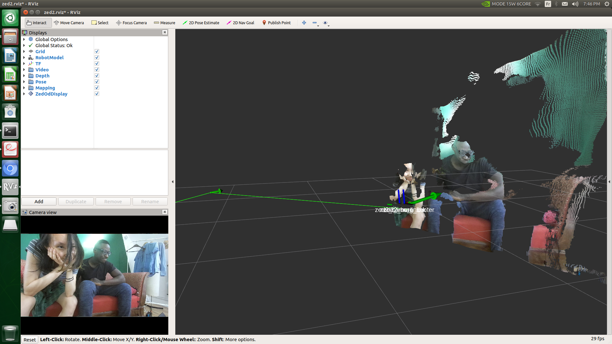
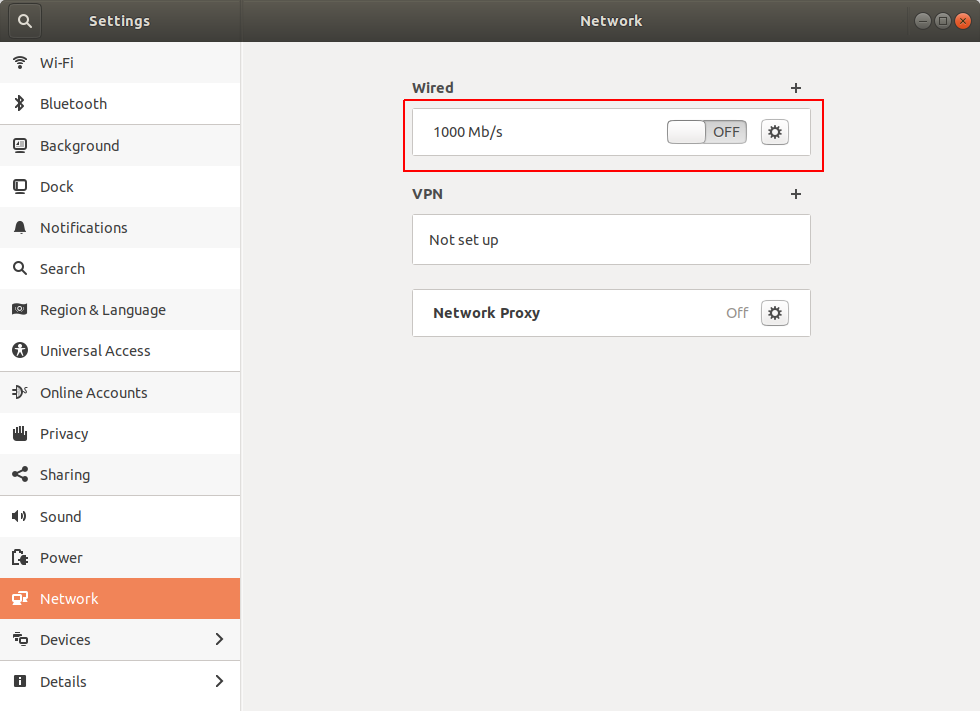
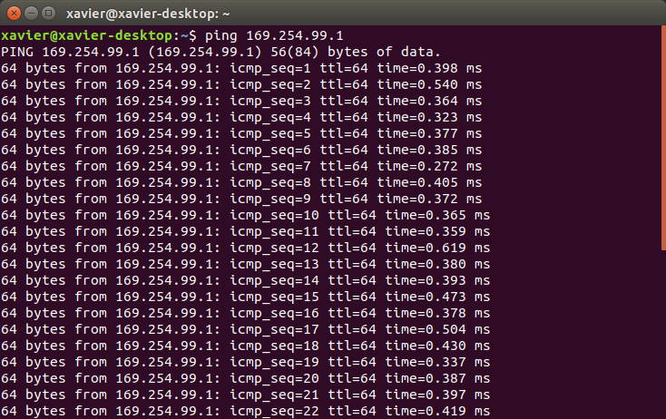
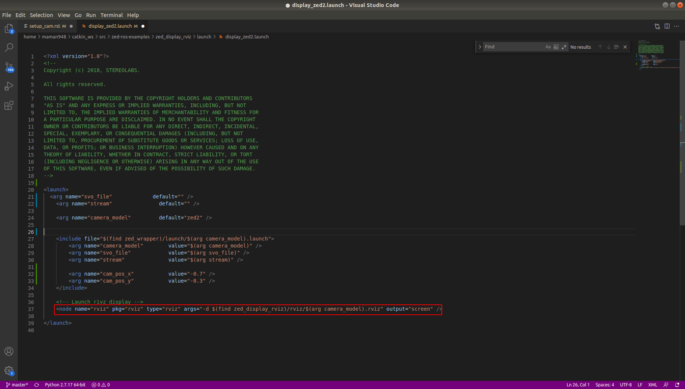

Set up the ZED camera with ROS
==============================

Installing ROS
--------------

* Follow `this tutorial to install ROS and set your catkin workspace on the Jetson Xavier <https://www.stereolabs.com/blog/ros-and-nvidia-jetson-xavier-nx/>`_
* Check that rosdep is installed, you can install it by following `rosdep on wiki ros <http://wiki.ros.org/rosdep>`_

Test rviz plotting on the Jetson
--------------------------------

* If you did not do it while installing ROS, download the example code in your catkin workspace and make the package

.. code-block:: bash

    cd ~/catkin_ws/src
    git clone https://github.com/stereolabs/zed-ros-wrapper.git
    git clone https://github.com/stereolabs/zed-ros-examples.git
    cd ~/catkin_ws
    rosdep install --from-paths src --ignore-src -r -y
    catkin_make -DCMAKE_BUILD_TYPE=Release

.. _modif_common_yaml:

* Clone and replace the common.yaml file with  `this new one <https://support.stereolabs.com/attachments/token/JVLTW39XNwuwOxVfghvc53ulq/?name=common.yaml>`_.

| The file is located in ~/catkin_ws/src/zed-ros-wrapper/zed_wrapper/params/
| It is an example of a configuration that will allow you to display point cloud on the Xavier NX since the jetson not powerful enough to handle the normal display task.

.. code-block:: bash

    cd ~/catkin_ws/src/zed-ros-wrapper/zed_wrapper/params/
    mv ./common.yaml ./common.yaml.orig
    mv ~/Downloads/common.yaml ~/catkin_ws/src/zed-ros-wrapper/zed_wrapper/params/common.yaml # move the newly download common.yaml to the directory

* Launch the display package

.. code-block:: bash

    roslaunch zed_display_rviz display_zed2.launch

* If everything goes well you would see something like this:

* You can select some parameters in rviz to visualize for example the depth map

Run rviz on an external computer
--------------------------------

| As it is mentioned :ref:`here<modif_common_yaml>` the jetson is not powerful enough, in order to plot point cloud with a good setting, we can do it on another computer.
| This section will help you to connect your Jetson to an external computer for ROS. We are doing it with an ethernet cable: :ref:`ROS Network with ethernet connection<ethernet_connection>`

ROS Network
***********

1. ROS Network with WiFi
^^^^^^^^^^^^^^^^^^^^^^^^

Alessandro suggest `the tutorial wiki ros MultipleMachines <http://wiki.ros.org/ROS/Tutorials/MultipleMachines>`_ but we did not follow this.
Here we are starting ROS Network with wifi connection but we would not use this methode since the :ref:`ethernet connection method<ethernet_connection>` is more efficient for data transmission.

* set your computer as listner
    * find the IP address of the computer:

    .. code-block:: bash

        apt-get install net-tools # if the following command is not installed
        ifconfig

    .. image:: ./images/lolo_ip.png
        :width: 600

    * set ROS_IP and ROS_MASTER_URI

    .. code-block:: bash

        export ROS_IP=192.168.0.130  # your computer IP
        export ROS_MASTER_URI=http://192.168.0.130:11311 # your computer IP

    * run listner script:

        start roscore on a terminal then open another terminal

    .. code-block:: bash

        cd ~/catkin_ws/src  # go to catkin workspace
        mkdir -p rospy_tutorials/scripts
        cd rospy_tutorials/scripts
        wget https://raw.github.com/ros/ros_tutorials/kinetic-devel/rospy_tutorials/001_talker_listener/listener.py
        rosrun rospy_tutorials listener.py  # start listner

* set Jetson as talker
    * find the IP address of the computer as it is done above

    .. image:: ./images/jetson_ip.png
        :width: 600

    * set ROS_IP and ROS_MASTER_URI

    .. code-block:: bash

        export ROS_IP=192.168.0.235  # jetson computer IP
        export ROS_MASTER_URI=http://192.168.0.130:11311 # other computer IP

    * run talker script:

    .. code-block:: bash

        cd ~/catkin_ws/src  # go to catkin workspace
        mkdir -p rospy_tutorials/scripts
        cd rospy_tutorials/scripts
        wget https://raw.github.com/ros/ros_tutorials/kinetic-devel/rospy_tutorials/001_talker_listener/talker.py
        rosrun rospy_tutorials talker.py  # start talker

* if everything goes well, the master computer print the messages sent by the Jetson

    * on Jetson:

    .. image:: ./images/talker.png
        :width: 600

    * on your computer:

    .. image:: ./images/listener.png
        :width: 600

.. _ethernet_connection:

2. ROS Network with ethernet connection
^^^^^^^^^^^^^^^^^^^^^^^^^^^^^^^^^^^^^^^

Use the ethernet cable to connect the Jetson and the computer. Once it's done:

* Go into your Settings on both computers and then Network

Make sur to turn on the Wired connection.

* Add an new connection profile

.. image:: ./images/add_connection_profile.png
    :width: 600

* Go to the IPV4 section and put the IPv4 Method to Manual on both computers.

    * On the Jetson Xavier you will need to fill in all the parameters as follows:

    .. image:: ./images/ipv4_jetson.png
        :width: 600

    * And for the other computer this one

    .. image:: ./images/ipv4_computer.png
        :width: 600

| You can set the IP you want but if your mask is 255.255.255.0, on the two computers the three first numbers must be the same.
| For example here we have 169.254.99.1 and 169.254.99.2
| Once everything it's done make sure to save.
| You can now ping both computers to see if they are connected.

* On the Jetson Xavier open a new terminal and type the following command:

.. code-block:: bash

    ping 169.254.99.1

If everything work you would see this:

* On the other computer type

.. code-block:: bash

    ping 169.254.99.2

You would see this:

Now your Jetson and your computer are connected together.

On both computers you will have to add lines to your .bashrc

* On the Jetson Xavier:

.. code-block:: bash

    echo "export ROS_IP=169.254.99.2" >> ~/.bashrc  #IP of the Jetson Xavier
    echo "export ROS_MASTER_URI=http://169.254.99.1:11311" >> ~/.bashrc # IP of the ROS master

* On the master computer:

.. code-block:: bash

    echo "export ROS_IP=169.254.99.1" >> ~/.bashrc  #IP of the ROS master
    echo "export ROS_MASTER_URI=http://169.254.99.1:11311" >> ~/.bashrc # IP of the ROS master

Setup your external computer
****************************

For this step you will need a computer with Ubuntu 18. You will also need to download `the ZED SDK for Ubuntu <https://download.stereolabs.com/zedsdk/3.5/cu110/ubuntu18>`_.
We assume you already have ROS installed on your computer if not just go on this `page  <http://wiki.ros.org/melodic/Installation/Ubuntu>`_ to do it.
Once it's done:

* Go in your catkin workspace to get the ZED camera example if you did not do it in the tutorial above:

.. code-block:: bash

    cd ~/catkin_ws/src
    git clone https://github.com/stereolabs/zed-ros-wrapper.git
    git clone https://github.com/stereolabs/zed-ros-examples.git
    cd ~/catkin_ws
    rosdep install --from-paths src --ignore-src -r -y
    catkin_make -DCMAKE_BUILD_TYPE=Release

Synchronize the clock of the Jetson and your external computer
**************************************************************

You will need to synchronize the clock of the Jetson and your computer to visualize data on it. 

Display rviz on your external computer
**************************************

..
    * First you will have to go on your Jetson and edit the common.yaml file with this `new one <https://support.stereolabs.com/attachments/token/JVLTW39XNwuwOxVfghvc53ulq/?name=common.yaml>`_.

Here is the common.yaml path where you can modify some plotting parameters:

.. code-block:: bash

    cd ~/catkin_ws/src/zed-ros-wrapper/zed_wrapper/params/

* Then you will have to modify the display_zed2.launch file and comment this line

* Now go on your computer, you will have to modify the same display_zed2.launch file and comment those lines

* Once it's done open a terminal on your computer:

.. code-block:: bash

    roscore

* On the Jetson and on your computer:

.. code-block:: bash

    roslaunch zed_display_rviz display_zed2.launch

If everything goes well rviz will be display on your computer

.. image:: ./images/jetson_computer_ethernet.jpg
    :width: 600

.. image:: ./images/rviz_computer.png
    :width: 600