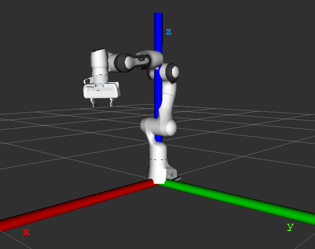

Objects detection with ZED2 in Panda arm environnement
======================================================

What does this program ?
------------------------

| This pogram uses the zed camera's object detection module, you can set the object you want to detect in the launch file.
| Once the camera detects an object it will track it and the robot can plan a trajectory to the object.
| If the object is lost, the camera will look for another same type object.

Modify parameters in the launch file
------------------------------------

* Go to the zed_franka_planner package, in the launch directory open the file ``grab_detected_object_test.launch`` with your favorite editor
* From here you can change some parameters
* The parameter ``object_to_be_detected`` can be `one of the listed here <https://www.stereolabs.com/docs/api/group__Object__group.html#ga13b0c230bc8fee5bbaaaa57a45fa1177>`_

Launch the program
------------------

* On the computer run ``roscore``
* On the jetson run ``roslaunch zed_wrapper zed2.launch``
* On the computer and in another shell source the workspace and launch the program

  .. code-block:: bash
    
    cd path/to/your/folder/franka_constrained_control/catkin_ws
    source devel/setup.sh
    roslaunch zed_franka_planner grab_detected_object_test.launch

* Once rviz is launched, load the parameters saved in the file ``path/to/the/package/zed_franka_planner/rviz/zed_panda_object_tracking.rviz``

Modify the camera transformation parameters
-------------------------------------------

* The panda robot's axis are:

* The map frame's origin is the position of the camera when you launch the zed_wrapper node on the jetson and its axis are:

.. image:: images/zed_map_axis.png
    :width: 300

* To modify the transformation between the camera and the robot:

  * Go to rviz

  * From the display ``Static Transform Publisher`` you can set the map and robot frames and the transformation parameters:
    
    .. .. image:: images/agni_tf_tools.png
    
