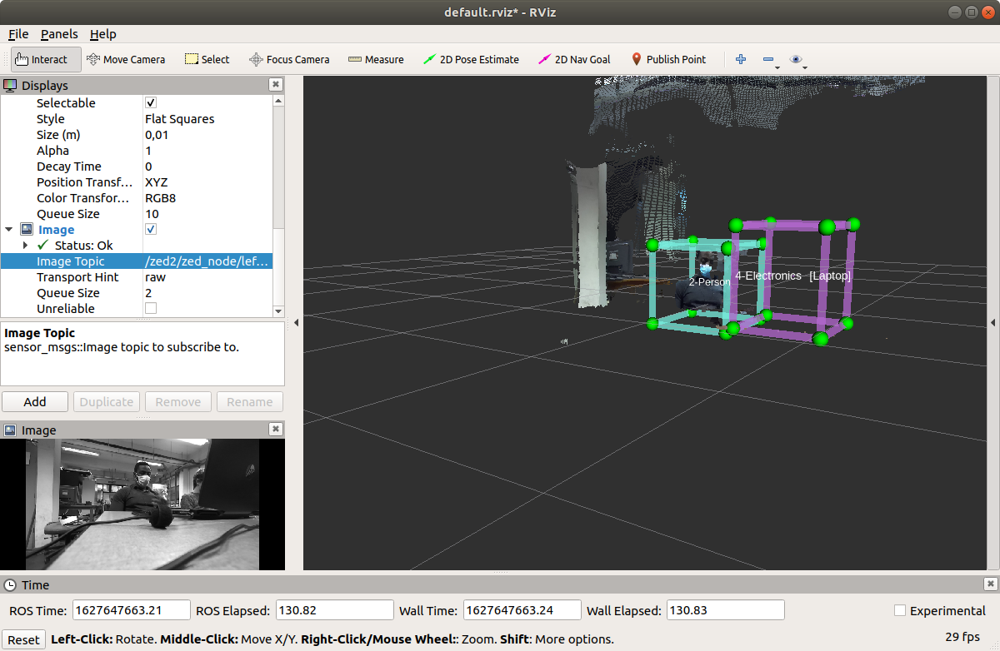

.. _ZED_ROS_Object_Detection:

Object Detection 
===================================

.. role:: raw-html(raw)
    :format: html

Here we explain how you can visualize the detected objects on your external computer. 

Requirements
------------

* Make sure you followed `this tutorial to install ros and zed packages on the Jetson <https://www.stereolabs.com/blog/ros-and-nvidia-jetson-xavier-nx/>`_

* If you do not have ROS and a catkin workspace on your external computer:

  * follow `this tutorial if you need to install ros <http://wiki.ros.org/melodic/Installation/Ubuntu>`_
  * make `your catkin workspace by following this tutorial <http://wiki.ros.org/ROS/Tutorials/InstallingandConfiguringROSEnvironment>`_

* Download required files on your external computer
  
  * Download the following zip file on your external computer

        :download:`zed_packages_for_external_computer <doc/zed_packages_for_external_computer.zip>` 

  * Unzip the files and drag them in your ``catlin_ws/src`` directory
  * Go to your catkin_ws file and build it, this will build the plugin for display bunding box around detected objects and the zed libraries

    .. code-block:: bash
        
        cd ~/catkin_ws
        catkin_make
  

Add objects detection in rviz
-----------------------------

* Enable object detection:

    * Go to the zed wrapper configuration directory on the Jetson and open the zed2.yaml file:

    .. code-block:: bash
        cd ~/catkin_ws/src/zed-ros-wrapper/zed_wrapper/params
        gedit zed2.yaml

    * At line 20 set ``od_enable`` to true 
    * At line 21 set ``model`` to 1 (to detect all kind of objects)
    * You can also change other parameters if you want
    * The parameters are listed and explained `here <https://www.stereolabs.com/docs/ros/zed-node/#object-detection-parameters-only-zed-2-and-zed-2i>`_
    * If you launch the zed2 camera with rviz  with a new model of the object detection, it will download the AI model.
    In our case, the Jetson shutdown every time we try to download an AI model.
    We avoided this problem by installing the AI model with the shell mode on Jetson see :ref:`Set the Jetson in shell mode and download the IA model <jetson_shell_mode>` 
    This problem did not occure with the new SD card.

* Make a ros network between the Jetson and the external computer
* Once the ros network established, vizualize the detected objects on rviz:

  * Do a ``roscore`` on the external computer
  * On the Jetson run ``roslaunch zed_wrapper zed2.launch``
  * Open another terminal on the external computer and source your workspace then run rviz:

  .. code-block:: bash
    cd ~/catkin_ws
    source devel/setup.sh
    rosrun rviz rviz

  * Add the display ``ZedOdDisplay`` to display bunding boxes around detected objects

  * Choose the ``/zed2/zed_node/obj_det/objects`` topic for the bunding box

  * You can also add a display for the point cloud so you can have a better idea of the detected object

    * Add a PointCloud2 display
    * Choose the topic ``/zed2/zed_node/point_cloud/cloud_registered``

* At the end of these steps you would see something like this:

