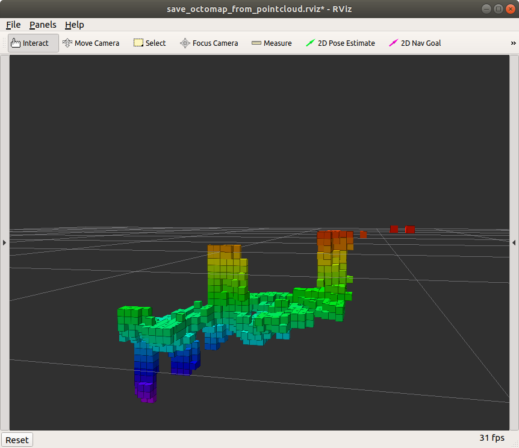

.. _ZED_ROS_Octomap:

Octomap 
=======

.. role:: raw-html(raw)
    :format: html
    
This section will help you to make and save an octomap on your external computer. 

Requirements
------------

* Install the ros octomap packages on your external computer

.. code-block:: bash

    sudo apt-get update
    sudo apt-get install ros-melodic-octomap ros-melodic-octomap-server ros-melodic-octomap-mapping ros-melodic-octomap-ros ros-melodic-octomap-msgs

* Create a package for the octomap on the external computer

  * Download the folowing zip file:

        :download:`octomap_tools package <doc/octomap_tools.zip>` 

  * Unzip and drag the files in your ``catkin_ws/src`` directory
  * build your catkin workspace

    .. code-block:: bash

            cd ~/catkin_ws
            catkin_make

Modify the octomap parameters
-----------------------------

* Go to the octomap_tools package that we just build
* Go to the launch directory
* Open the file ``save_octomap_from_pointcloud.launch`` with your favorite editor
* From here you can modify the parameter
* The parameters are listed and explained `here in the section 2.2.4 <http://wiki.ros.org/octomap_server>`_
 
Create and vizualize the Octomap
--------------------------------

* Make a ros network between the Jetson and the external computer
* Do a ``roscore`` on the external computer
* On the Jetson run ``roslaunch zed_wrapper zed2.launch``
* Open another terminal on the external computer and source your workspace then launch the octomap node:

.. code-block:: bash
  cd ~/catkin_ws
  source devel/setup.sh
  roslaunch octomap_tools save_octomap_from_pointcloud.launch

* So you can visualize the created octomap in rviz

Save the octomap
----------------
You can save the octomap vizualized in rviz while rviz is still running

* Go to the directory where you want to save the octomap on the external computer
* Open a terminal there
* Run this to save the octomap (change "first_octomap" to another name if you want it to be saved under another name)

.. code:: bash

    rosrun octomap_server octomap_saver -f first_octomap.bt

Vizualize an existing Octomap
-----------------------------

To vizualize an already saved octomap run on your external computer

.. code-block:: bash

    roslaunch octomap_tools load_octomap.launch path:=path-to-your-octomap-directory/your-octomap.bt rviz_octomap:=true