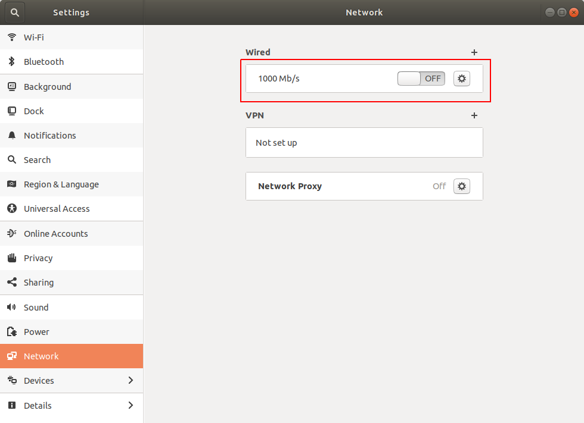

.. _Rviz_External_PC:

Run Rviz on External Computer
==================================

.. role:: raw-html(raw)
    :format: html

To correctly display the point cloud data without reducing the publishing rate of the point cloud and its resolution, 
we suggest you to run RVIZ on an external machine connected by an ethernet cable.

Setup your external computer
----------------------------

For this step you will need a computer with |install-ubuntu-18| and |install-ros-melodic|.  

Since we want to use the ZED 2 camera to generate a point cloud and for skeleton tracking 
to experimentally evaluate some planning and constrained control algorithms on the Panda robot, 
the **external computer** will be the **desktop with which we send commands to the Panda robot**. 

.. |install-ubuntu-18| raw:: html

            <a href="https://ubuntu.com/download/alternative-downloads" target="_blank">Ubuntu 18.04</a>

.. |install-ros-melodic| raw:: html

            <a href="http://wiki.ros.org/melodic/Installation/Ubuntu" target="_blank">ROS Melodic</a>

Make a ROS network
-------------------------------------

Here we will explain two ways of running ROS accross multiple machines: via a WiFi connection or via an ethernet connection. 
We will explain both ways, but remember that it is more efficient to use an ethernet connection for data transmission. 

:raw-html:`  Is it possible to make collapsible headings? 
It would improve the readability if you could open and close (collapse) the ROS Network with WiFi and with ethernet subsections.  `

1. ROS Network with WiFi
^^^^^^^^^^^^^^^^^^^^^^^^

| You can use |ros-wifi-multiplemachines-tutorial| to make a WiFi connection accross multiple machines. 
| but we did not follow this. :raw-html:`  Why not? Advantages/disadvantages? Give some reasons...   `

.. |ros-wifi-multiplemachines-tutorial| raw:: html

            <a href="http://wiki.ros.org/ROS/Tutorials/MultipleMachines" target="_blank">this ROS tutorial</a>

Another way to make a WiFi connection accross multiple machines is explained below. 

* set up your computer as listener

    * find the IP address of the computer:
      
      .. code-block:: bash
        
        sudo apt-get install net-tools # if the following command is not installed
        ifconfig

      .. image:: ./images/lolo_ip.png
        :width: 600

    * set ROS_IP and ROS_MASTER_URI

      .. code-block:: bash

        export ROS_IP=192.168.0.130  # your computer IP
        export ROS_MASTER_URI=http://192.168.0.130:11311 # your computer IP

    * to run the listener script, you first have to run 'roscore' in one terminal and open another terminal to run

      .. code-block:: bash

        cd ~/catkin_ws/src  # go to catkin workspace
        mkdir -p rospy_tutorials/scripts
        cd rospy_tutorials/scripts
        wget https://raw.github.com/ros/ros_tutorials/kinetic-devel/rospy_tutorials/001_talker_listener/listener.py
        rosrun rospy_tutorials listener.py  # start listner
    
      :raw-html:`  At this moment in the tutorial, you don't have a catkin_ws yet on your computer...   `

* set up Jetson Xavier NX as talker

    * find the IP address of the computer as it is done above

      .. image:: ./images/jetson_ip.png
        :width: 600

    * set ROS_IP and ROS_MASTER_URI

      .. code-block:: bash

        export ROS_IP=192.168.0.235  # jetson computer IP
        export ROS_MASTER_URI=http://192.168.0.130:11311 # other computer IP

    * run talker script:

      .. code-block:: bash

        cd ~/catkin_ws/src  # go to catkin workspace
        mkdir -p rospy_tutorials/scripts
        cd rospy_tutorials/scripts
        wget https://raw.github.com/ros/ros_tutorials/kinetic-devel/rospy_tutorials/001_talker_listener/talker.py
        rosrun rospy_tutorials talker.py  # start talker

* if everything goes well, the master computer print the messages sent by the Jetson

    * on Jetson:

      .. image:: ./images/talker.png
        :width: 600

    * on your computer:

      .. image:: ./images/listener.png
        :width: 600

2. ROS Network with ethernet connection
^^^^^^^^^^^^^^^^^^^^^^^^^^^^^^^^^^^^^^^

Use the ethernet cable to connect the Jetson Xavier NX with the external computer. 

Go to the network settings on both computers and make sure the wired connection is turned on.

Add a new connection profile. 

.. image:: ./images/add_connection_profile.png
    :align: center
    :width: 400px

Go to the IPv4 section and put the IPv4 Method to Manual on both computers. 
You can choose the IP address you want, but if you set your netmask to 255.255.255.0, 
then on both computers the three first numbers must be the same. 
For example, we have set the IP address of the external computer to 169.254.99.1 and the IP address of the Jetson to 169.254.99.2.
Don't forget to save these settings. 

You can now ping both computers to see if they are correctly connected.

* Open a new terminal on the Jetson Xavier NX (with IP 169.254.99.2) and ping to the external computer (with IP 169.254.99.1)

  .. code-block:: bash

    ping 169.254.99.1

  .. image:: ./images/ping_jetson.png
      :width: 400px

* Open a new terminal on the external computer (with IP 169.254.99.1) and ping to the Jetson Xavier NX (with IP 169.254.99.2)

  .. code-block:: bash

    ping 169.254.99.2

  .. image:: ./images/ping_jetson.png
      :width: 400px

On both computers you will have to add the following lines to your .bashrc 

:raw-html:`  Please add the link where you got this from. `

* On the Jetson Xavier NX:

  .. code-block:: bash

    echo "export ROS_IP=169.254.99.2" >> ~/.bashrc  #IP of the Jetson Xavier
    echo "export ROS_MASTER_URI=http://169.254.99.1:11311" >> ~/.bashrc # IP of the ROS master

* On the external computer:

  .. code-block:: bash

    echo "export ROS_IP=169.254.99.1" >> ~/.bashrc  #IP of the ROS master
    echo "export ROS_MASTER_URI=http://169.254.99.1:11311" >> ~/.bashrc # IP of the ROS master

Synchronize the clock of the Jetson and the external computer
-----------------------------------------------------------------

You will need to synchronize the clock of the Jetson and your computer.
Do this command on both computers:
:raw-html:`  1) Please add the link where you got this from. 
2) Which problem occurs when you don't execute this command? 
3) Do you have to execute this command every time you connect your computer to the Jetson? `

.. code-block:: bash

    sudo date -s "$(wget -qSO- --max-redirect=0 google.com 2>&1 | grep Date: | cut -d' ' -f5-8)Z"

Display RVIZ on external computer
---------------------------------

Go to the display_zed2.launch file on the Jetson, which you can find at the following address

.. code-block:: bash

    cd path/to/catkin_ws/src/zed_display_rviz/launch/

and comment the selected line

.. image:: ./images/zed_jetson.png
    :align: center
    :width: 700px

Open a new terminal on the external computer and run

.. code-block:: bash

    roscore

Open a new terminal on the Jetson and run 

.. code-block:: bash

    roslaunch zed_display_rviz display_zed2.launch

Open another terminal on the external computer and run

.. code-block:: bash

    rosrun rviz rviz

To display the depth map and the point cloud in RVIZ, you have to add *Camera* to the Displays tab.
When added, click on Image Topic and select the topic with *depth* in the name. 
Afterwards, you can add *PointCloud2*, click on Topic and select the topic with *point_cloud* in the name. 
Finally, you should get something similar as in the figure below. 

.. image:: ./images/rviz_computer.png
    :align: center
    :width: 700px
