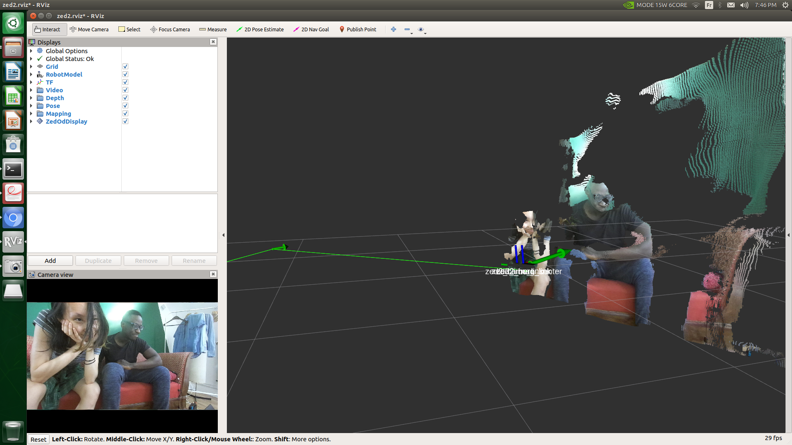

.. _Rviz_Jetson:

Run Rviz on Jetson Xavier NX
==================================

.. role:: raw-html(raw)
    :format: html

Follow the part *Adding a 3D camera for AI on Jetson Xavier NX* of |stereolabs-ros-jetsonxaviernx-tutorial|
to download the example code in your catkin workspace and to make the package. 

.. |stereolabs-ros-jetsonxaviernx-tutorial| raw:: html

            <a href="https://www.stereolabs.com/blog/ros-and-nvidia-jetson-xavier-nx/" target="_blank">this tutorial</a>

You can have latency problems when launching 

.. code-block:: bash

    roslaunch zed_display_rviz display_zed2.launch

Although the Jetson Xavier NX is a powerful embedded board, it is still an *embedded* board, 
that's why it cannot handle all the tasks that you normally perform on a desktop or laptop PC.

The main problem with RVIZ for example is that it is a highly demanding application. 
Therefore it can correctly display the data directly on the Xavier *only* by reducing the publishing rate of the point cloud and its resolution.
You can find |stereolabs-zed2-display-configuration| that will allow you to display a point cloud on the Jetson Xavier NX... but not at full rate.

:raw-html:`  Is it also possible to instead of adding a link, to directly add a file? 
I'm not sure if the website you've added here "an example of a configuration" (coming from the email of Walter), is a temporary link or not.  `

.. |stereolabs-zed2-display-configuration| raw:: html

            <a href="https://support.stereolabs.com/attachments/token/JVLTW39XNwuwOxVfghvc53ulq/?name=common.yaml" target="_blank">an example of a configuration</a>

Go to the directory with the original common.yaml file, rename it to common-original.yaml and add the new common.yaml file. 

.. code-block:: bash

    cd path/to/catkin_ws/src/zed-ros-wrapper/zed_wrapper/params/  
    mv ./common.yaml ./common-original.yaml # rename the original commong.yaml file
    mv ~/Downloads/common.yaml ~/catkin_ws/src/zed-ros-wrapper/zed_wrapper/params/common.yaml # move the newly downloaded common.yaml to the directory

When launching again the display rviz program, you should see something like this:

In the *Displays* panel on the left, you can also select and deselect other display types. 
For example, in *Depth* you can also select the *Depth map* to see the black and white display of the depth map.  
